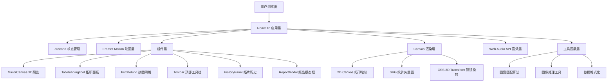

## 1. 架构设计



## 2. 技术描述

- **前端框架**：React 18 + TypeScript 5
- **构建工具**：Vite 5 + @vitejs/plugin-react
- **状态管理**：Zustand 4
- **动画库**：Framer Motion 11
- **3D实现**：CSS 3D Transform + Canvas 2D（轻量级方案，无需额外3D库）
- **渲染技术**：HTML5 Canvas API（拓印绘制）、SVG（纹饰矢量图）
- **音效**：Web Audio API（程序化生成音效，无需音频文件）
- **开发服务器**：Vite 开发服务器，端口 3000

## 3. 项目目录结构

```
src/
├── components/
│   ├── MirrorCanvas.tsx      # 铜镜3D旋转预览组件
│   ├── TabRubbingTool.tsx    # 宣纸拓印面板组件
│   ├── PuzzleGrid.tsx        # 拼图网格组件
│   ├── Toolbar.tsx           # 顶部工具栏组件
│   ├── HistoryPanel.tsx      # 拓片历史栏组件
│   ├── ReportModal.tsx       # 纹饰分析报告模态框
│   ├── GoldParticles.tsx     # 金色粒子特效组件
│   └── MirrorSelector.tsx    # 铜镜选择器组件
├── store/
│   └── useAppStore.ts        # Zustand 全局状态管理
├── hooks/
│   ├── useCanvasDrawing.ts   # Canvas 绘制 Hook
│   ├── useDraggable.ts       # 拖拽交互 Hook
│   └── useAudioEffect.ts     # 音效 Hook
├── utils/
│   ├── patternMatching.ts    # 图案匹配算法
│   ├── imageProcessing.ts    # 图像处理工具
│   └── mirrorData.ts         # 铜镜纹饰数据
├── types/
│   └── index.ts              # TypeScript 类型定义
├── App.tsx                   # 应用根组件
├── main.tsx                  # 应用入口
└── index.css                 # 全局样式
```

## 4. 数据模型

### 4.1 类型定义

```typescript
interface Mirror {
  id: string;
  name: string;
  dynasty: string;
  year: string;
  patternType: string;
  description: string;
  patternSvg: string;
  color: string;
}

interface Rubbing {
  id: string;
  mirrorId: string;
  mirrorName: string;
  dynasty: string;
  imageData: string;
  thumbnail: string;
  inkColor: string;
  paperColor: string;
  createdAt: number;
  name: string;
  edgeData: number[][];
}

interface PuzzleSlot {
  id: number;
  rubbingId: string | null;
  position: { x: number; y: number };
}

interface AlignmentResult {
  slot1Id: number;
  slot2Id: number;
  matchPercentage: number;
  isAligned: boolean;
}

interface AnalysisReport {
  totalMatchScore: number;
  mirrors: {
    name: string;
    dynasty: string;
    year: string;
    patternType: string;
  }[];
  alignmentDetails: AlignmentResult[];
  generatedAt: number;
  finalImage: string;
}
```

## 5. 状态管理设计

### Zustand Store 状态结构

```typescript
interface AppState {
  // 铜镜相关
  mirrors: Mirror[];
  selectedMirror: Mirror | null;
  showPatternDetail: boolean;
  
  // 拓印相关
  paperColor: string;
  inkLevel: number;
  inkColors: string[];
  currentRubbing: ImageData | null;
  isRubbing: boolean;
  
  // 拓片历史
  rubbings: Rubbing[];
  
  // 拼图相关
  puzzleSlots: PuzzleSlot[];
  draggedRubbing: Rubbing | null;
  alignmentResults: AlignmentResult[];
  
  // UI状态
  showReport: boolean;
  report: AnalysisReport | null;
  
  // Actions
  selectMirror: (mirror: Mirror) => void;
  setPaperColor: (color: string) => void;
  setInkLevel: (level: number) => void;
  startRubbing: () => void;
  finishRubbing: (imageData: string, edgeData: number[][]) => void;
  renameRubbing: (id: string, name: string) => void;
  deleteRubbing: (id: string) => void;
  placeRubbingToSlot: (rubbingId: string, slotId: number) => void;
  removeRubbingFromSlot: (slotId: number) => void;
  swapSlots: (slot1Id: number, slot2Id: number) => void;
  checkAlignment: () => void;
  generateReport: () => void;
  closeReport: () => void;
}
```

## 6. 核心算法说明

### 6.1 图案边缘匹配算法

用于检测两张拓片纹饰边缘的重合度：

1. **边缘特征提取**：对每张拓片的四条边进行采样，生成边缘特征向量
2. **相似度计算**：使用余弦相似度计算两条边缘的匹配程度
3. **重合度判定**：当相似度 ≥ 0.85 时判定为可吸附对齐

```typescript
function calculateEdgeMatch(edge1: number[][], edge2: number[][]): number {
  // 边缘采样与归一化
  const normalized1 = normalizeEdge(edge1);
  const normalized2 = normalizeEdge(edge2.reverse()); // 边缘需要反向匹配
  // 计算余弦相似度
  return cosineSimilarity(normalized1, normalized2);
}
```

### 6.2 墨迹扩散效果

模拟墨扑按压时的墨迹扩散：

1. **随机噪点**：每个墨点添加 ±3px 随机偏移
2. **半透明叠加**：使用 `globalAlpha = 0.3-0.6` 多层叠加
3. **压力感应**：根据鼠标移动速度调整墨点大小和浓度
4. **径向渐变**：每个墨点使用径向渐变模拟晕染效果

### 6.3 Web Audio API 音效生成

程序化生成竹纸拼接的沙沙声：

1. 创建白噪声缓冲区
2. 使用带通滤波器（band-pass）过滤出 2kHz-5kHz 频段
3. 添加包络控制（ADSR），模拟沙沙声的短暂持续
4. 播放时随机调整音量和滤波频率，增加自然感

## 7. 性能优化策略

1. **Canvas 分层渲染**：拓印画布使用离屏 Canvas 缓冲，减少重绘
2. **requestAnimationFrame 节流**：拓印轨迹采样每 16ms 一次，避免过度绘制
3. **边缘计算缓存**：已计算的边缘特征存入 Map，重复比对直接读取
4. **懒加载纹饰**：铜镜纹饰 SVG 按需加载，减少首屏体积
5. **GPU 加速**：3D 旋转使用 CSS `transform: translateZ(0)` 触发硬件加速
6. **事件委托**：拼图网格使用事件委托处理多个拓片的拖拽事件

## 8. 响应式适配方案

| 断点 | 布局方案 | 组件调整 |
|------|---------|---------|
| ≥1440px | 三栏并列 | 铜镜预览30% + 拓印面板45% + 历史栏25% |
| 1024px-1439px | 两栏 + 抽屉 | 铜镜预览与拓印面板上下排列，历史栏可折叠 |
| 768px-1023px | 单栏堆叠 | 所有区域纵向排列，拼图区改为2×2紧凑网格 |
| <768px | 移动适配 | 简化交互，触控优化按钮尺寸 |
