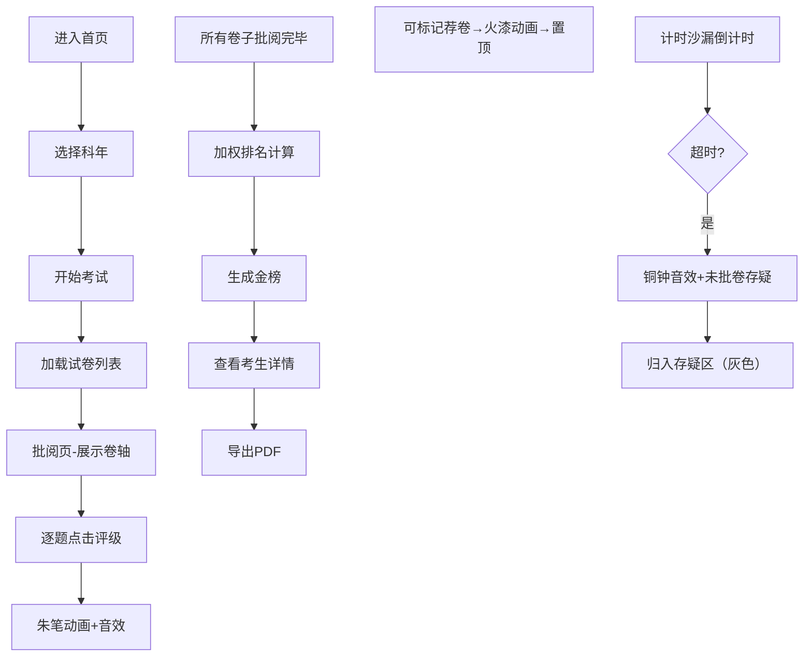

## 1. 产品概述

贡院考卷批阅司是一款模拟清代科举考试批阅流程的全栈Web应用，用户扮演顺天府贡院主考官，在仿古界面中完成考卷批阅、荐卷、排名等核心操作，体验古代科举考试的庄重氛围。

- 目标用户：对中国古代科举文化感兴趣的历史爱好者、教育工作者
- 产品价值：通过沉浸式交互体验，还原清代科举考试批阅流程，传承历史文化

## 2. 核心功能

### 2.1 用户角色

| 角色 | 注册方式 | 核心权限 |
|------|----------|----------|
| 主考官 | 无需注册，直接进入 | 批阅试卷、标记荐卷、生成金榜、查看历史记录 |

### 2.2 功能模块

1. **首页**：贡院场景入口、科年选择、开始考试
2. **批阅页**：卷轴试卷展示、逐题评级、计时沙漏、荐卷功能、未批卷管理
3. **榜单页**：金榜展示、考生详情弹窗、PDF导出、历史记录筛选

### 2.3 页面详情

| 页面名称 | 模块名称 | 功能描述 |
|----------|----------|----------|
| 首页 | 贡院入口 | 深木色背景，钦命匾额，开始考试按钮，科年选择下拉框 |
| 首页 | 历史记录 | 按科年、字号、等第筛选历史批阅记录 |
| 批阅页 | 卷轴展示 | 仿古宣纸纵向卷轴，三道四书文题+一首试帖诗，楷体字迹，朱笔批注痕迹 |
| 批阅页 | 评级系统 | 六档评级按钮（上上、上中、中上、中中、中下、下等），朱笔落墨动画，毛笔音效 |
| 批阅页 | 计时沙漏 | 12分钟倒计时，金红色沙粒，超时触发铜钟音效 |
| 批阅页 | 荐卷功能 | 点击名字旁出现火漆印章动画，自动排到最上方 |
| 批阅页 | 试卷切换 | 左右滑动动画，展开宣纸质感 |
| 榜单页 | 金榜展示 | 竖排版式，黑色楷体，榜首朱砂红加粗 |
| 榜单页 | 考生详情 | 点击名字弹出完整试卷和全部批注 |
| 榜单页 | PDF导出 | 导出单个考生试卷或完整金榜 |
| 榜单页 | 历史筛选 | 按科年、字号、等第筛选历史记录 |

## 3. 核心流程

## 4. 用户界面设计

### 4.1 设计风格

- **主色调**：深木色 #4a3728，仿古宣纸色 #f5e6c8，朱砂红 #cc3333/#d42e2e，铜色 #b87333，金色 #d4a017
- **按钮样式**：铜扣样式，圆形直径40px，悬停亮度提升，0.2秒过渡
- **字体**：楷体（KaiTi/SimKai），标题加粗，榜文字体庄重
- **布局风格**：明清公案阁楼式，侧边栏匾额，主区域卷轴，层次分明
- **动效风格**：朱笔落墨扩散动画（0.3秒），火漆印章动画，卷轴展开滑动（0.4秒ease-out），沙漏流畅动画

### 4.2 页面设计概述

| 页面名称 | 模块名称 | UI元素 |
|----------|----------|--------|
| 首页 | 贡院入口 | 深木色纹理背景，"钦命"金色匾额悬于侧边，中央卷轴式开始按钮，科年选择下拉框 |
| 批阅页 | 卷轴区域 | 仿古宣纸卷轴，毛边和褶皱纹理，竖向文字排版，朱笔圈点痕迹，铜扣评级按钮 |
| 批阅页 | 侧边栏 | 计时沙漏（半透明玻璃质），荐卷列表，未批卷计数 |
| 批阅页 | 顶部栏 | 科年标识，当前试卷字号，退出按钮 |
| 榜单页 | 金榜区域 | 金黄榜纸底色，竖排文字，榜首朱砂红加粗，铜钱状分隔符 |
| 榜单页 | 筛选栏 | 科年选择、字号输入、等第筛选下拉框 |
| 弹窗 | 考生详情 | 完整卷轴试卷展示，全部批注高亮，导出按钮 |

### 4.3 响应式

- 桌面端优先设计，适配1280px及以上分辨率
- 移动端采用单列布局，卷轴横向滚动
- 触摸操作优化，按钮最小尺寸44x44px

### 4.4 性能要求

- 朱笔落墨动画和火漆印章动画保持60FPS
- 批阅页面每次点击响应50ms内反馈
- 卷轴切换动画0.4秒平滑过渡
- 使用CSS transform和opacity实现高性能动画
