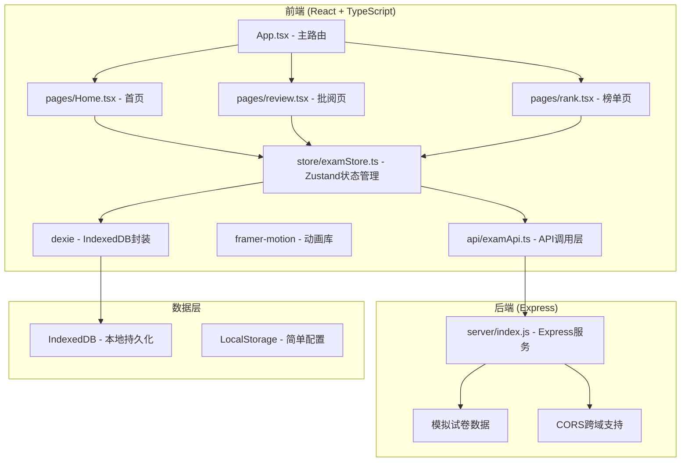
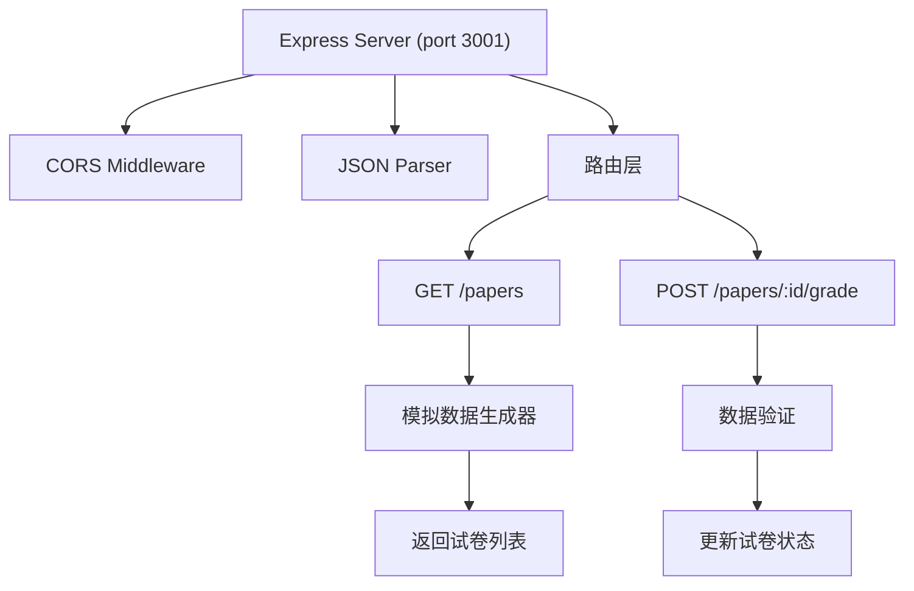
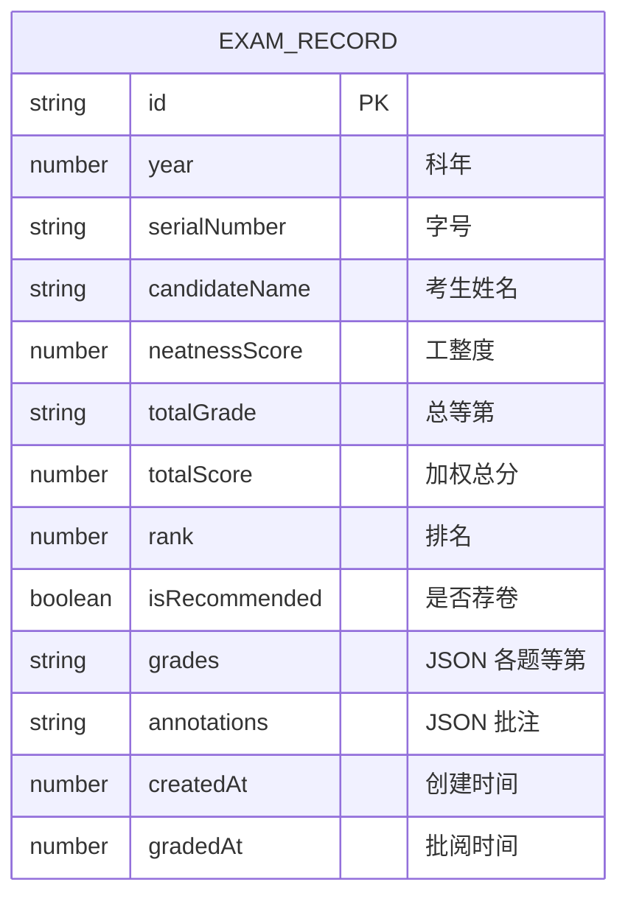

## 1. 架构设计



## 2. 技术描述

- **前端框架**：React 18 + TypeScript 5
- **构建工具**：Vite 5 + @vitejs/plugin-react
- **状态管理**：Zustand 4
- **动画库**：Framer Motion 11
- **本地数据库**：Dexie.js 4 (IndexedDB封装)
- **后端**：Express 4 + CORS
- **样式方案**：CSS Modules + CSS Variables
- **音频处理**：Web Audio API
- **PDF导出**：html2canvas + jsPDF

## 3. 路由定义

| 路由 | 用途 |
|------|------|
| / | 首页 - 贡院入口、科年选择、历史记录 |
| /review | 批阅页 - 试卷批阅、计时、荐卷功能 |
| /rank | 榜单页 - 金榜展示、详情、导出 |

## 4. API定义

```typescript
// 试卷类型定义
interface Paper {
  id: string;
  serialNumber: string; // 字号：天字第一号
  candidateName: string;
  year: number; // 科年
  questions: Question[];
  poem: Poem;
  neatnessScore: number; // 0-100 工整度
  grades: Grade[];
  isRecommended: boolean;
  isGraded: boolean;
  recommendedAt?: number;
  gradedAt?: number;
}

interface Question {
  id: number;
  title: string;
  content: string;
  grade?: '上上' | '上中' | '中上' | '中中' | '中下' | '下等';
  annotations: string[];
}

interface Poem {
  title: string;
  content: string;
  grade?: '上上' | '上中' | '中上' | '中中' | '中下' | '下等';
}

type Grade = '上上' | '上中' | '中上' | '中中' | '中下' | '下等';

// API响应
interface PapersResponse {
  papers: Paper[];
  year: number;
}

// GET /papers - 获取试卷列表
// Request: ?year=2024
// Response: PapersResponse

// POST /papers/:id/grade - 提交批阅结果
// Request: { grades: Grade[], questionAnnotations: string[][] }
// Response: { success: boolean, paper: Paper }
```

## 5. 服务端架构



## 6. 数据模型

### 6.1 数据模型定义



### 6.2 Dexie 数据库定义

```typescript
import Dexie from 'dexie';

export class ExamDatabase extends Dexie {
  examRecords: Dexie.Table<ExamRecord, string>;
  
  constructor() {
    super('ExamDB');
    this.version(1).stores({
      examRecords: 'id, year, serialNumber, totalGrade, rank, isRecommended, gradedAt'
    });
    this.examRecords = this.table('examRecords');
  }
}
```

### 6.3 等第权重配置

| 等第 | 权重分数 |
|------|----------|
| 上上 | 100 |
| 上中 | 90 |
| 中上 | 80 |
| 中中 | 70 |
| 中下 | 60 |
| 下等 | 40 |

**排名计算公式**：
`总分 = (∑各题等第分数 / 4) * 0.7 + 工整度 * 0.3`
