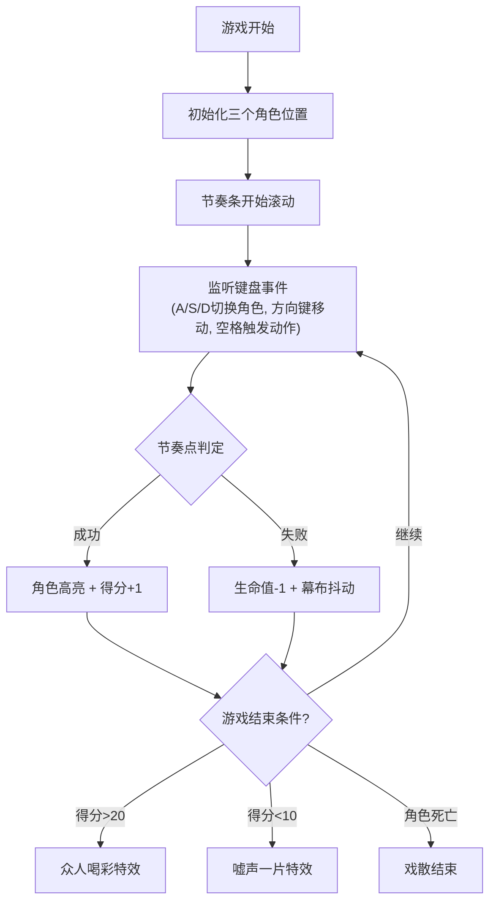

## 1. 产品概述

宋瓦舍皮影戏是一款基于浏览器的古代皮影戏多人角色操控与锣鼓节奏联动的交互游戏应用。用户扮演北宋汴京瓦舍中的皮影戏班主，通过键盘快捷键操控幕布上的皮影角色，根据锣鼓节奏在正确时间点触发动作，完成"目连救母"大戏的表演。

- **核心玩法**：三角色协同操控 + 节奏判定 + 动作连击
- **目标用户**：对传统文化和节奏游戏感兴趣的玩家
- **产品价值**：将传统皮影戏艺术与现代游戏机制结合，提供沉浸式的文化体验

## 2. 核心特性

### 2.1 用户角色

| 角色 | 操作方式 | 核心权限 |
|------|----------|----------|
| 玩家 | 键盘快捷键 | 操控三个皮影角色，触发动作，完成表演 |

### 2.2 功能模块

1. **皮影幕布系统**：Canvas 2D渲染三个皮影角色，支持骨骼关节动画
2. **锣鼓节奏系统**：顶部节奏条滚动显示鼓点，实时判定玩家操作时机
3. **角色控制系统**：键盘快捷键切换角色、移动、触发动作和变装
4. **生命值与得分系统**：角色生命值管理、得分计算、胜负判定
5. **视觉特效系统**：动作特效、变装特效、胜利/失败粒子特效

### 2.3 页面详情

| 页面名称 | 模块名称 | 功能描述 |
|---------|----------|---------|
| 游戏主界面 | 绢布幕布区域 | 800x500px Canvas渲染区，展示三个皮影角色及其实时动画 |
| 游戏主界面 | 锣鼓节奏条 | 顶部半透明条，显示滚动节奏指示器和固定鼓点标记 |
| 游戏主界面 | 生命值UI | 左上角条形图，显示三个角色的生命值（红黄绿渐变） |
| 游戏主界面 | 得分UI | 右上角大号数字，方正楷体字体显示当前得分 |
| 游戏主界面 | 结束特效层 | 幕布中央显示"众人喝彩"或"嘘声一片"特效 |

## 3. 核心流程

## 4. 用户界面设计

### 4.1 设计风格

- **主色调**：仿木板深棕色 #3e2723、米黄色绢布 #f5eedc、朱红色 #cc3333、金黄色 #ffd700
- **角色配色**：目连僧（灰 #ccc袈裟）、恶鬼（红 #cc3333皮肤）、观音（白 #f0f0f0）
- **字体**：方正楷体（标题/数字）、系统无衬线（说明文字）
- **布局风格**：中央舞台式布局，幕布居中，UI元素环绕四周
- **视觉细节**：绢布噪点纹理、水墨渐变、角色阴影、关节骨骼显示

### 4.2 页面设计概述

| 页面名称 | 模块名称 | UI元素 |
|---------|----------|--------|
| 游戏主界面 | 绢布幕布 | 米黄色背景、噪点纹理、水墨渐变、Canvas 2D渲染 |
| 游戏主界面 | 锣鼓节奏条 | 半透明黑色背景、金色鼓点标记、白色滚动指示器、余晖效果 |
| 游戏主界面 | 角色生命值条 | 红黄绿三色渐变、高度30px、角色图标标识 |
| 游戏主界面 | 得分显示 | 方正楷体大号字体、白色 #fff、右上角位置 |
| 游戏主界面 | 选中状态光圈 | 淡金色pulse动画、0.5s循环、framer-motion实现 |

### 4.3 响应式设计

- **桌面优先**：最小宽度900px，幕布原始尺寸800x500px
- **自适应缩放**：屏幕宽度大于1200px时幕布保持原尺寸，否则等比缩放
- **触控优化**：桌面端键盘操作，无移动端触控需求

### 4.4 动画与特效

- **角色选中**：淡金色光圈pulse动画，0.5s循环
- **动作成功**：角色彩绘短暂高亮变白色，0.2秒
- **动作失败**：幕布阴影抖动，transform: translateX(3px) 3次，共0.3秒
- **变装特效**：目连僧灰袈裟变金红喇嘛袍，持续2秒
- **粒子特效**：挥杖金色粒子（5个，3px，向上飘散）、胜利烟花（40个，8px，2秒）
- **动画库**：framer-motion，缓动函数easeInOut，动作持续0.3-0.6秒

## 5. 游戏规则与胜利条件

### 5.1 角色与按键

| 角色 | 切换键 | 默认动作 | 特殊动作 |
|------|--------|----------|----------|
| 目连僧 | A | 走步（空格） | W=挥杖，E=变装 |
| 恶鬼 | S | 扑击（空格） | W=怒吼（眩晕目连僧） |
| 观音 | D | 降幅（空格） | 可打断恶鬼动作 |

### 5.2 节奏判定

- 共16拍/轮回，每拍间隔0.8秒，共3轮回（36个节奏点）
- 判定区间：指示器与鼓点重叠前后各20px
- 成功触发：得分+1，角色高亮
- 失败触发：生命值-1，幕布抖动

### 5.3 胜负判定

- **胜利**：得分超过20分 → 众人喝彩特效
- **失败**：得分低于10分 → 嘘声一片特效
- **提前结束**：任一角色生命值归零 → 显示"戏散"

### 5.4 派系对抗

- 恶鬼扑击击中目连僧（距离<20px）：目连僧生命-2
- 观音降幅在恶鬼动作期间使用：打断并僵直1秒
- 目连僧挥杖击中恶鬼：恶鬼生命-3
