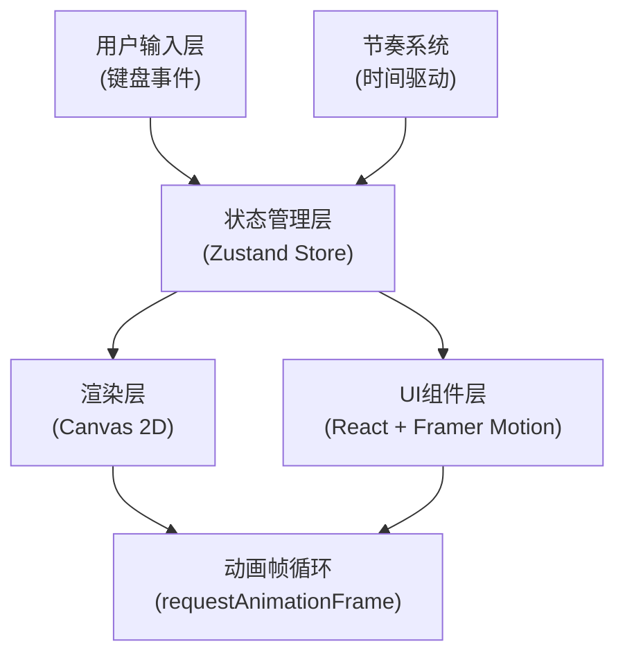

## 1. 架构设计



## 2. 技术描述

- **前端框架**：React 18 + TypeScript
- **构建工具**：Vite 5（端口3000）
- **状态管理**：Zustand
- **动画库**：Framer Motion
- **渲染技术**：Canvas 2D API
- **CSS方案**：原生CSS + CSS变量
- **性能优化**：requestAnimationFrame、GPU加速（transform/opacity）

## 3. 目录结构

```
├── package.json
├── vite.config.js
├── tsconfig.json
├── index.html
└── src/
    ├── main.tsx
    ├── App.tsx
    ├── components/
    │   ├── ShadowScreen.tsx
    │   ├── RhythmBar.tsx
    │   ├── HealthBar.tsx
    │   ├── ScoreDisplay.tsx
    │   └── GameEffects.tsx
    ├── store/
    │   └── gameStore.ts
    ├── hooks/
    │   ├── useKeyboard.ts
    │   └── useGameLoop.ts
    ├── types/
    │   └── game.ts
    └── utils/
        ├── canvasRenderer.ts
        ├── rhythmEngine.ts
        └── characterAnimations.ts
```

## 4. 类型定义

### 4.1 角色类型

```typescript
type CharacterType = 'mulian' | 'ghost' | 'guanyin';

type Faction = 'buddha' | 'ghost' | 'god';

interface BoneJoint {
  name: string;
  x: number;
  y: number;
  angle: number;
  parent?: string;
}

interface Character {
  id: CharacterType;
  faction: Faction;
  name: string;
  x: number;
  y: number;
  health: number;
  maxHealth: number;
  action: string;
  actionProgress: number;
  isSelected: boolean;
  isHighlighted: boolean;
  isStunned: boolean;
  stunTimer: number;
  isTransformed: boolean;
  transformTimer: number;
  speedMultiplier: number;
  joints: BoneJoint[];
  color: string;
  outlineColor: string;
}

interface Particle {
  id: number;
  x: number;
  y: number;
  vx: number;
  vy: number;
  life: number;
  maxLife: number;
  size: number;
  color: string;
}
```

### 4.2 游戏状态

```typescript
interface GameState {
  characters: Record<CharacterType, Character>;
  selectedCharacter: CharacterType;
  score: number;
  currentBeat: number;
  totalBeats: number;
  rhythmPosition: number;
  beatMarkers: number[];
  gamePhase: 'idle' | 'playing' | 'ended';
  resultType: 'cheer' | 'boo' | 'gameover' | null;
  screenShake: boolean;
  particles: Particle[];
  fps: number;
  lowFpsWarning: boolean;
  currentCycle: number;
  totalCycles: number;
}

interface GameActions {
  selectCharacter: (char: CharacterType) => void;
  moveCharacter: (char: CharacterType, dx: number, dy: number) => void;
  triggerAction: (char: CharacterType, actionName: string) => void;
  switchAction: (char: CharacterType, actionName: string) => void;
  triggerTransform: (char: CharacterType) => void;
  hitBeat: () => void;
  missBeat: () => void;
  updateRhythm: (deltaTime: number) => void;
  addParticles: (particles: Particle[]) => void;
  updateParticles: (deltaTime: number) => void;
  damageCharacter: (char: CharacterType, damage: number) => void;
  stunCharacter: (char: CharacterType, duration: number) => void;
  endGame: (result: 'cheer' | 'boo' | 'gameover') => void;
  triggerScreenShake: () => void;
  setFps: (fps: number) => void;
  resetGame: () => void;
}
```

## 5. 核心数据结构

### 5.1 鼓点序列

```typescript
const RHYTHM_BPM = 75;
const BEAT_INTERVAL = 0.8;
const BEATS_PER_CYCLE = 16;
const TOTAL_CYCLES = 3;
const HIT_WINDOW = 20;
const SCROLL_SPEED = 1.2;

// 鼓点位置（像素）
const generateBeatMarkers = (): number[] => {
  const markers: number[] = [];
  for (let cycle = 0; cycle < TOTAL_CYCLES; cycle++) {
    for (let beat = 0; beat < BEATS_PER_CYCLE; beat++) {
      const position = 100 + cycle * 800 + beat * (SCROLL_SPEED * 60 * BEAT_INTERVAL);
      markers.push(position);
    }
  }
  return markers;
};
```

### 5.2 角色初始骨骼配置

```typescript
const createInitialJoints = (charType: CharacterType): BoneJoint[] => {
  // 每个角色5-7个关节点
  return [
    { name: 'head', x: 0, y: -45, angle: 0 },
    { name: 'neck', x: 0, y: -30, angle: 0, parent: 'head' },
    { name: 'torso', x: 0, y: 0, angle: 0, parent: 'neck' },
    { name: 'leftArm', x: -25, y: -15, angle: 0, parent: 'torso' },
    { name: 'rightArm', x: 25, y: -15, angle: 0, parent: 'torso' },
    { name: 'leftLeg', x: -12, y: 35, angle: 0, parent: 'torso' },
    { name: 'rightLeg', x: 12, y: 35, angle: 0, parent: 'torso' },
  ];
};
```

## 6. 状态管理设计

### 6.1 Zustand Store 结构

```typescript
// src/store/gameStore.ts
import { create } from 'zustand';

export const useGameStore = create<GameState & GameActions>((set, get) => ({
  // 初始状态
  characters: initialCharacters,
  selectedCharacter: 'mulian',
  score: 0,
  currentBeat: 0,
  totalBeats: 36,
  rhythmPosition: 0,
  beatMarkers: generateBeatMarkers(),
  gamePhase: 'idle',
  resultType: null,
  screenShake: false,
  particles: [],
  fps: 60,
  lowFpsWarning: false,
  currentCycle: 0,
  totalCycles: 3,

  // Action 方法
  selectCharacter: (char) => set({ selectedCharacter: char }),
  moveCharacter: (char, dx, dy) => set(/* ... */),
  triggerAction: (char, action) => set(/* ... */),
  switchAction: (char, action) => set(/* ... */),
  triggerTransform: (char) => set(/* ... */),
  hitBeat: () => set(/* ... */),
  missBeat: () => set(/* ... */),
  updateRhythm: (dt) => set(/* ... */),
  addParticles: (particles) => set(/* ... */),
  updateParticles: (dt) => set(/* ... */),
  damageCharacter: (char, damage) => set(/* ... */),
  stunCharacter: (char, duration) => set(/* ... */),
  endGame: (result) => set(/* ... */),
  triggerScreenShake: () => set(/* ... */),
  setFps: (fps) => set(/* ... */),
  resetGame: () => set(/* ... */),
}));
```

## 7. 核心组件设计

### 7.1 ShadowScreen.tsx

- **职责**：Canvas 2D渲染、角色骨骼动画、粒子特效
- **Props**：接收键盘事件
- **渲染循环**：requestAnimationFrame @ 60fps
- **关键方法**：
  - `renderCharacter(ctx, char)` - 绘制单个角色
  - `renderJoints(ctx, joints)` - 绘制骨骼关节
  - `renderParticles(ctx, particles)` - 绘制粒子
  - `updateJointAnimations(char, deltaTime)` - 更新关节动画

### 7.2 RhythmBar.tsx

- **职责**：节奏条渲染、鼓点判定、FPS警告
- **Props**：当前节奏位置、鼓点数组、FPS值
- **关键逻辑**：
  - 计算指示器与鼓点的距离
  - 判定命中区间（±20px）
  - 渲染滚动余晖效果

### 7.3 App.tsx

- **职责**：全局布局、键盘事件监听、游戏循环控制
- **生命周期**：
  - `useEffect` 初始化键盘监听
  - `useGameLoop` 自定义Hook驱动游戏循环
  - 数据流向：键盘事件 → Store → 组件重渲染

## 8. 性能优化

### 8.1 Canvas 渲染优化

- 使用 `requestAnimationFrame` 而非 `setInterval`
- 离屏Canvas预渲染静态元素（绢布纹理）
- 角色变换使用 `ctx.save()` / `ctx.restore()` 减少状态切换

### 8.2 CSS 动画优化

- 所有动画使用 `transform` 和 `opacity` 属性
- 强制GPU加速：`will-change: transform`
- 幕布抖动使用 `transform: translateX()`

### 8.3 帧率监控

- 每10帧计算平均FPS
- FPS < 50 时在节奏条显示红色警告
- 粒子数量上限控制（最大同时100个）

## 9. 动画配置

### 9.1 Framer Motion 配置

```typescript
const pulseAnimation = {
  scale: [1, 1.05, 1],
  opacity: [0.3, 0.6, 0.3],
  transition: {
    duration: 0.5,
    repeat: Infinity,
    ease: 'easeInOut',
  },
};

const shakeAnimation = {
  x: [0, 3, -3, 3, -3, 0],
  transition: {
    duration: 0.3,
    ease: 'easeInOut',
  },
};
```

## 10. 键盘事件映射

```typescript
const KEYBOARD_MAP: Record<string, Action> = {
  'KeyA': { type: 'select', character: 'mulian' },
  'KeyS': { type: 'select', character: 'ghost' },
  'KeyD': { type: 'select', character: 'guanyin' },
  'Space': { type: 'action' },
  'KeyW': { type: 'switchAction' },
  'KeyE': { type: 'transform' },
  'ArrowLeft': { type: 'move', dx: -5, dy: 0 },
  'ArrowRight': { type: 'move', dx: 5, dy: 0 },
  'ArrowUp': { type: 'move', dx: 0, dy: -5 },
  'ArrowDown': { type: 'move', dx: 0, dy: 5 },
};
```
