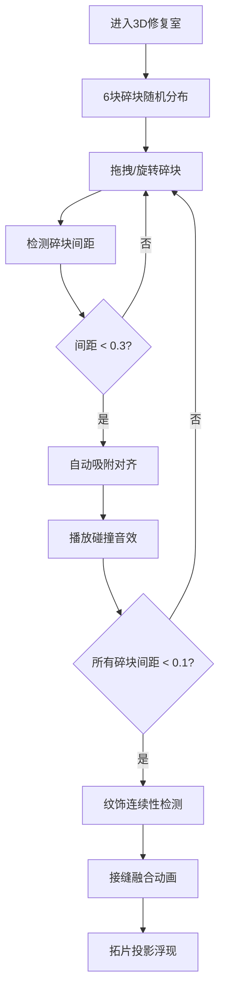

## 1. 产品概述

汉代画像石拓片虚拟拼合与纹饰复原3D交互应用，让用户在虚拟考古修复室内体验文物修复师的工作，通过拖拽拼合散落的汉代画像石碎块，还原完整的汉代墓门画像石。

- **核心目标**：提供沉浸式的文物修复体验，教育用户了解汉代画像石艺术
- **目标用户**：文化爱好者、学生、博物馆访客
- **市场价值**：创新的文化遗产数字化展示方式，提升文物教育的互动性

## 2. 核心功能

### 2.1 用户角色
| 角色 | 注册方式 | 核心权限 |
|------|----------|----------|
| 普通用户 | 无需注册 | 体验完整的拼合复原流程 |

### 2.2 功能模块
1. **3D修复室场景**：虚拟考古修复室环境，包含工作台、光照系统
2. **碎块交互系统**：6块画像石碎块的拖拽、旋转、微调功能
3. **智能吸附系统**：碎块边缘检测、自动吸附对齐、金属碰撞音效
4. **纹饰匹配验证**：拼合完成后的纹饰连续性检测、还原动画
5. **辅助功能**：复位按钮、提示功能、历史记录与撤销
6. **进度展示**：左侧圆形进度条、移动端适配提示

### 2.3 页面详情
| 页面名称 | 模块名称 | 功能描述 |
|----------|----------|----------|
| 主场景 | 3D修复室 | 深灰色背景、浅灰色工作台、穹顶光照系统 |
| 主场景 | 碎块交互 | 鼠标拖拽、滚轮旋转、键盘微调、投影辅助 |
| 主场景 | 吸附系统 | 边缘检测点、自动吸附、金色高亮、碰撞音效 |
| 主场景 | 纹饰验证 | 边缘颜色对比、接缝融合动画、拓片投影 |
| 主场景 | 辅助功能 | 复位按钮、提示箭头、Ctrl+Z撤销 |
| UI层 | 进度展示 | 左侧圆形进度条、底部移动端提示 |

## 3. 核心流程

用户进入虚拟修复室 → 看到6块随机分布的画像石碎块 → 拖拽碎块到工作台拼合 → 系统自动检测相邻碎块并吸附 → 拼合完成后验证纹饰连续性 → 触发完整画像还原动画 → 可随时复位或使用提示功能

## 4. 用户界面设计

### 4.1 设计风格
- **主色调**：深灰色背景 (#2a2827)、浅灰色工作台 (#b0a89a)
- **强调色**：金色 (#ffd700, #d4a017)、朱红色 (#c04040)、拓片色 (#c8b88a)
- **按钮样式**：圆形按钮，朱红色背景，金色描边，40px直径
- **字体**：使用传统与现代结合的字体，标题使用具有古典感的字体
- **布局风格**：沉浸式3D场景为主，UI元素悬浮于场景边缘
- **动效**：平滑过渡动画，吸附闪烁效果，扫入式投影

### 4.2 页面设计概述
| 页面名称 | 模块名称 | UI元素 |
|----------|----------|----------|
| 主场景 | 3D环境 | 深灰色墙面、石板纹理工作台、穹顶光晕 |
| 主场景 | 碎块 | 2x1.5x0.3单位石块、浮雕normalMap、0.02单位倒角、半透明投影 |
| 主场景 | 光照 | 环境光强度0.4、主光源从左上照射强度0.8 |
| UI层 | 进度条 | 左侧圆形进度条，直径80px，金色渐变，白色数字 |
| UI层 | 控制按钮 | 右下角复位按钮（朱红）、提示按钮（左侧） |
| UI层 | 提示箭头 | 半透明金色箭头，三轴向旋转，2秒周期 |
| UI层 | 移动端提示 | 屏幕宽度<768px时底部显示提示 |

### 4.3 响应式设计
- **桌面端**：标准鼠标交互，碎块尺寸2x1.5x0.3
- **移动端**：touch事件替代鼠标，碎块尺寸放大1.2倍，触摸响应延迟<50ms
- **自适应布局**：UI元素根据屏幕尺寸调整位置和大小

### 4.4 3D场景设计
- **环境**：深灰色修复室墙面，营造专业考古氛围
- **光照**：半透明穹顶环境光 + 左上方向主光源，模拟工作室顶灯
- **相机**：PerspectiveCamera，角度适合观察工作台，支持OrbitControls缩放旋转
- **材质**：MeshStandardMaterial配合normalMap实现浮雕凹凸感
- **后处理**：轻微抗锯齿，保持60FPS以上性能
- **性能优化**：吸附检测每10帧执行一次，useFrame高效更新
