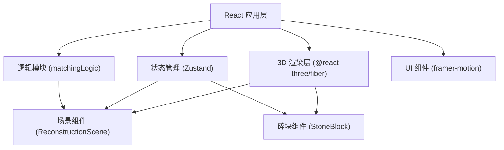

## 1. 架构设计



## 2. 技术描述

- **前端框架**：React@18 + TypeScript
- **构建工具**：Vite@5
- **3D引擎**：Three.js + @react-three/fiber + @react-three/drei
- **状态管理**：Zustand
- **动画库**：framer-motion
- **初始化方式**：Vite React TypeScript 模板

## 3. 路由定义

| 路由 | 用途 |
|------|------|
| / | 主应用页面，包含3D场景和所有交互功能 |

## 4. 数据模型

### 4.1 碎块状态定义

```typescript
interface StoneBlockState {
  id: string;
  position: [number, number, number];
  rotation: [number, number, number];
  textureUrl: string;
  pattern: string; // 纹饰类型：车马出行、门吏、瑞兽、宴饮、乐舞、建筑
  isLocked: boolean;
  edgeColors: number[][]; // 四条边的颜色值，用于纹饰匹配
}

interface HistoryState {
  blocks: StoneBlockState[];
  timestamp: number;
}

interface AppState {
  blocks: StoneBlockState[];
  history: HistoryState[];
  isComplete: boolean;
  progress: number;
  showHint: boolean;
  hintBlockId: string | null;
}
```

### 4.2 核心数据结构

```typescript
// 匹配检测结果
interface MatchPair {
  blockId1: string;
  blockId2: string;
  distance: number;
  edgeIndex1: number;
  edgeIndex2: number;
}

// 吸附目标位置
interface SnapTarget {
  blockId: string;
  targetPosition: [number, number, number];
  targetRotation: [number, number, number];
}
```

## 5. 核心模块说明

### 5.1 matchingLogic.ts

```typescript
// 检测碎块间距，返回距离小于阈值的碎块对
export function checkProximity(
  blocks: StoneBlockState[],
  threshold: number = 0.3
): MatchPair[];

// 对匹配对执行吸附动画，返回新位置数组
export function autoSnap(
  blocks: StoneBlockState[],
  matchPairs: MatchPair[],
  duration: number = 0.2
): Promise<StoneBlockState[]>;

// 检测纹饰连续性
export function checkPatternContinuity(
  block1: StoneBlockState,
  block2: StoneBlockState,
  edgeIndex1: number,
  edgeIndex2: number
): boolean;

// 生成边缘检测点
export function generateEdgePoints(
  position: [number, number, number],
  rotation: number,
  size: [number, number, number]
): [number, number, number][];
```

### 5.2 reconstructionScene.tsx

```typescript
// 主场景组件
export function ReconstructionScene(): JSX.Element;

// 核心功能：
// - 3D场景搭建（相机、光照、工作台）
// - useFrame每帧更新，每10帧执行一次吸附检测
// - 调用matchingLogic的检测和吸附函数
// - 管理拼合进度和完成状态
// - 触发还原动画
```

### 5.3 stoneBlock.tsx

```typescript
interface StoneBlockProps {
  id: string;
  position: [number, number, number];
  rotation: [number, number, number];
  textureUrl: string;
  pattern: string;
  isDragging: boolean;
  isLocked: boolean;
  onDragStart: (id: string) => void;
  onDragEnd: (id: string, position: [number, number, number]) => void;
  onRotate: (id: string, delta: number) => void;
  onPositionChange: (id: string, position: [number, number, number]) => void;
}

export function StoneBlock(props: StoneBlockProps): JSX.Element;

// 核心功能：
// - DragControls实现拖拽
// - 键盘方向键微调（每次0.05单位）
// - 滚轮旋转（每次15度）
// - 半透明投影辅助对齐
// - 边缘倒角和normalMap浮雕效果
// - 吸附时金色高亮边框
```

## 6. 状态管理 (Zustand)

```typescript
import { create } from 'zustand';

interface StoreState {
  blocks: StoneBlockState[];
  history: HistoryState[];
  progress: number;
  isComplete: boolean;
  showHint: boolean;
  hintBlockId: string | null;
  
  // Actions
  updateBlockPosition: (id: string, position: [number, number, number]) => void;
  updateBlockRotation: (id: string, rotation: [number, number, number]) => void;
  lockBlock: (id: string) => void;
  saveHistory: () => void;
  undo: () => void;
  resetBlocks: () => void;
  setProgress: (progress: number) => void;
  setComplete: (complete: boolean) => void;
  showHintForBlock: (blockId: string) => void;
  hideHint: () => void;
}
```

## 7. 性能优化策略

1. **帧优化**：吸附检测每10帧执行一次，而非每帧
2. **状态更新**：使用Zustand的选择性订阅减少重渲染
3. **对象复用**：Three.js几何体和材质复用，避免重复创建
4. **事件节流**：拖拽事件节流，移动端触摸响应优化
5. **检测优化**：空间分区检测，减少O(n²)复杂度
6. **动画优化**：使用线性插值(LERP)实现平滑动画

## 8. 项目文件结构

```
.
├── package.json
├── vite.config.js
├── tsconfig.json
├── index.html
├── src/
│   ├── main.tsx
│   ├── App.tsx
│   ├── reconstructionScene.tsx
│   ├── stoneBlock.tsx
│   ├── matchingLogic.ts
│   ├── store/
│   │   └── useStore.ts
│   ├── components/
│   │   ├── ProgressRing.tsx
│   │   ├── ResetButton.tsx
│   │   ├── HintButton.tsx
│   │   ├── HintArrow.tsx
│   │   └── MobileNotice.tsx
│   ├── hooks/
│   │   ├── useDragControls.ts
│   │   ├── useKeyboardControls.ts
│   │   └── useAudio.ts
│   ├── utils/
│   │   ├── textureGenerator.ts
│   │   └── lerp.ts
│   └── types/
│       └── index.ts
```
