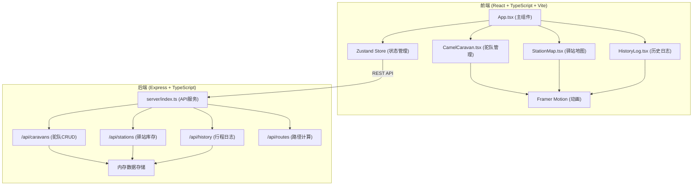
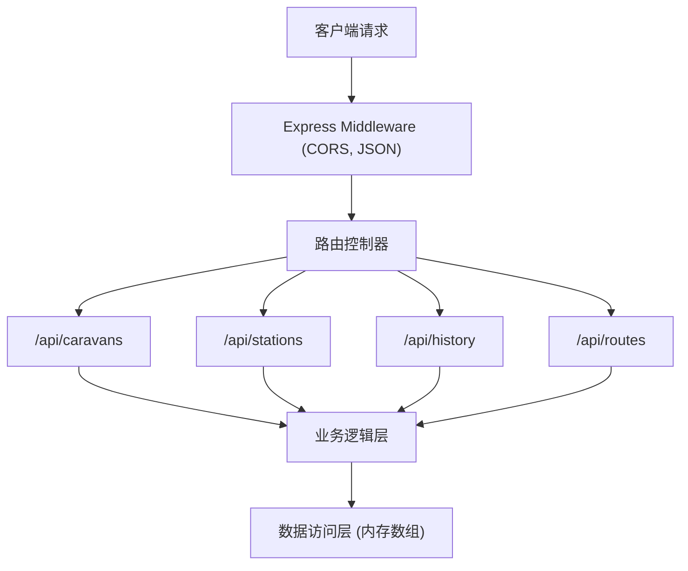
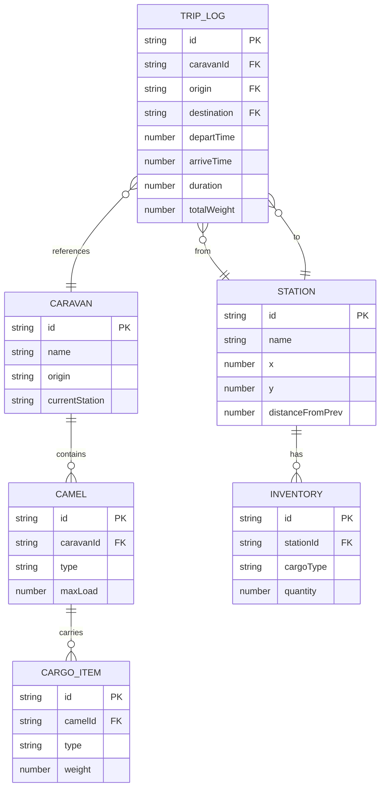

## 1. 架构设计



## 2. 技术说明

- **前端**：React 18 + TypeScript 5 + Vite 5
- **状态管理**：Zustand 4
- **动画库**：Framer Motion 11
- **后端**：Express 4 + TypeScript 5
- **CORS处理**：cors 2.8.5
- **数据存储**：内存数组（开发环境）
- **构建工具**：Vite 5，开发服务器端口3000
- **样式方案**：CSS Modules + CSS Variables

## 3. 路由定义

| 路由 | 用途 |
|------|------|
| / | 主界面（三栏布局） |

## 4. API定义

### 4.1 类型定义

```typescript
// 货物类型
type CargoType = 'silk' | 'tea' | 'porcelain' | 'spice' | 'gem';

// 骆驼类型
type CamelType = 'bactrian' | 'dromedary';

// 骆驼接口
interface Camel {
  id: string;
  type: CamelType;
  cargo: { type: CargoType; weight: number }[];
  maxLoad: number;
}

// 驼队接口
interface Caravan {
  id: string;
  name: string;
  camels: Camel[];
  origin: string;
  currentStation: string;
}

// 驿站接口
interface Station {
  id: string;
  name: string;
  x: number;
  y: number;
  distanceFromPrev: number;
  inventory: Record<CargoType, number>;
  supplies: { water: number; forage: number; horseshoes: number };
}

// 行程记录接口
interface TripLog {
  id: string;
  caravanId: string;
  caravanName: string;
  origin: string;
  destination: string;
  departTime: number;
  arriveTime: number;
  duration: number;
  totalWeight: number;
  suppliesConsumed: { water: number; forage: number; horseshoes: number };
  remainingCargo: Record<CargoType, number>;
}

// 路径接口
interface Route {
  stations: string[];
  totalDistance: number;
}
```

### 4.2 端点说明

| 方法 | 端点 | 请求参数 | 响应 | 说明 |
|------|------|----------|------|------|
| GET | /api/caravans | - | Caravan[] | 获取所有驼队 |
| POST | /api/caravans | Omit<Caravan, 'id'> | Caravan | 创建驼队 |
| PUT | /api/caravans/:id | Partial<Caravan> | Caravan | 更新驼队 |
| DELETE | /api/caravans/:id | - | { success: boolean } | 删除驼队 |
| GET | /api/stations | - | Station[] | 获取所有驿站 |
| PUT | /api/stations/:id | Partial<Station> | Station | 更新驿站库存 |
| GET | /api/history | - | TripLog[] | 获取历史日志 |
| POST | /api/history | Omit<TripLog, 'id'> | TripLog | 创建行程记录 |
| GET | /api/routes | origin, destination | Route | 计算最短路径 |

## 5. 服务器架构图



## 6. 数据模型

### 6.1 数据模型定义



### 6.2 初始化数据

```typescript
// 12个驿站初始化数据（长安至撒马尔罕）
const initialStations: Station[] = [
  { id: '1', name: '长安', x: 50, y: 50, distanceFromPrev: 0, 
    inventory: { silk: 50, tea: 40, porcelain: 30, spice: 20, gem: 10 },
    supplies: { water: 100, forage: 80, horseshoes: 20 } },
  { id: '2', name: '兰州', x: 120, y: 80, distanceFromPrev: 500,
    inventory: { silk: 30, tea: 50, porcelain: 20, spice: 15, gem: 5 },
    supplies: { water: 80, forage: 60, horseshoes: 15 } },
  // ... 其余驿站数据
];
```
