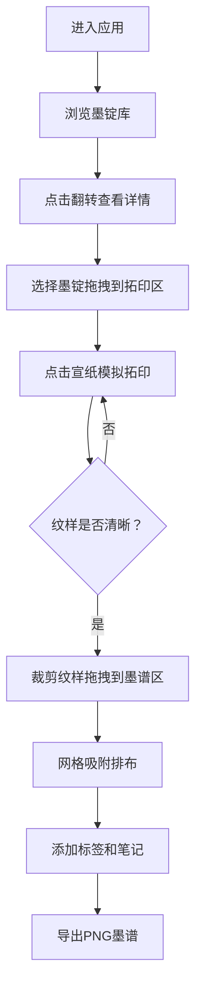

## 1. 产品概述

徽墨墨谱编纂是一款沉浸式的古代墨锭纹样拓印交互工具，用户可以在虚拟明代徽州歙县墨坊中，体验从墨锭选择、朱砂拓印到墨谱编纂的完整制墨文化流程。

- 主要目的：传承徽墨非物质文化遗产，通过交互式体验让用户了解古代墨锭制作工艺与纹样艺术
- 目标用户：传统文化爱好者、艺术研究者、教育工作者以及对中国古代工艺感兴趣的大众用户
- 产品价值：将传统文化与现代Web技术结合，创造兼具教育性与趣味性的文化体验工具

## 2. 核心功能

### 2.1 用户角色
| 角色 | 注册方式 | 核心权限 |
|------|----------|----------|
| 访客用户 | 无需注册 | 浏览墨锭、进行拓印操作、编纂墨谱、导出墨谱图像 |

### 2.2 功能模块
1. **墨锭库浏览区**：墨锭卡片展示、3D翻转查看详情、墨锭选择
2. **拓印操作区**：墨锭拖拽放置、拓包点击拓印、纹样逐渐显现、进度展示
3. **墨谱编纂区**：纹样拖拽排布、9x9网格吸附、标签编辑、笔记添加、PNG导出

### 2.3 页面详情
| 页面名称 | 模块名称 | 功能描述 |
|----------|----------|----------|
| 主界面 | 墨锭库浏览区 | 以卡片形式展示数十枚墨锭，支持3D翻转查看背面配方信息，点击选中墨锭 |
| 主界面 | 拓印操作区 | 中央宣纸区域，支持墨锭拖拽放置，鼠标点击模拟拓包拍打，朱砂圆斑累积显形纹样 |
| 主界面 | 墨谱编纂区 | 右侧编辑区域，支持纹样拖拽布局、网格吸附、标签笔记编辑、图像导出 |
| 主界面 | 顶部导航栏 | 项目标题、操作提示、帮助按钮 |

## 3. 核心流程

用户进入徽墨墨谱编纂工具后，首先浏览左侧墨锭库中的各式墨锭卡片，点击卡片可3D翻转查看墨锭背面的配方与年份信息。选择心仪的墨锭后，将其拖拽到中央拓印区的仿古宣纸上。此时用户通过连续点击宣纸模拟拓包拍打的动作，每次点击留下半透明朱砂圆斑，随着点击次数增加（5-8次），墨锭纹样从模糊逐渐变得清晰。拓印完成后，用户可将完整纹样裁剪下来，拖拽到右侧墨谱编辑区，按照9x9网格进行自由布局排列，并为每枚墨锭添加仿宋字体的标签和便签式笔记。最后，用户可将编纂完成的墨谱导出为PNG图像保存。

## 4. 用户界面设计

### 4.1 设计风格
- **主色调**：米白 #faf0e6（主背景）、紫檀色 #4a3728（导航栏）、铜绿色 #5d7a56（按钮）、仿古宣纸色 #f5e6c8（拓印区）
- **辅助色**：朱砂红 #c41e3a（拓印色）、仿宋字色 #5c4033（文字）、浅灰 #d3d3d3（网格线）、米黄 #fff8dc（笔记背景）
- **按钮风格**：圆角矩形，轻微阴影，悬停时1.05倍缩放（0.2s缓动），铜绿色填充配白色文字
- **字体**：标题使用楷体/宋体，正文使用仿宋，标签使用仿宋 #5c4033
- **布局风格**：三栏式布局（桌面端），卡片式墨锭展示，中央拓印区为视觉焦点
- **视觉细节**：宣纸纹理、木纹背景、轻微噪点质感、传统纹样装饰元素

### 4.2 页面设计概述
| 页面名称 | 模块名称 | UI元素 |
|----------|----------|--------|
| 主界面 | 顶部导航栏 | 紫檀色背景，左侧项目标题（楷体大字），右侧操作按钮 |
| 主界面 | 墨锭库浏览区 | 左侧区域，网格布局展示墨锭卡片，每张卡片带微妙阴影，悬停微缩放 |
| 主界面 | 拓印操作区 | 中央区域，仿古宣纸背景带网格纹理，拓印进度条，操作提示文字 |
| 主界面 | 墨谱编纂区 | 右侧区域，9x9浅灰虚线网格，底部导出按钮 |

### 4.3 响应式
- **桌面端（1280px以上）**：三列布局，墨锭库（左）+ 拓印区（中）+ 墨谱区（右）
- **平板端（768px-1280px）**：两列布局，墨锭库（上左）+ 拓印区（上右/下方），墨谱区（下）
- **移动端（375px-768px）**：单列布局，顶部导航，依次排列墨锭库、拓印区、墨谱区，支持垂直滚动
- **触控优化**：拖拽区域增大，点击热区不小于44x44px，支持触摸事件

### 4.4 交互细节
- **墨锭卡片翻转**：CSS 3D翻转动画0.6s，翻转时伴随纸张翻动音效
- **拓印交互**：鼠标点击拖拽模拟拓包拍打，朱砂圆斑直径8-20px随机，透明度0.4-0.6
- **纹样显现**：模糊滤镜从blur(4px)过渡到blur(0px)，需5-8次点击完成
- **拖拽吸附**：墨谱区支持9x9网格吸附，网格线为浅灰色虚线1px
- **悬停效果**：所有交互元素悬停时0.2s缓动缩放至1.05倍
- **性能要求**：点击响应延迟≤50ms，帧率≥30fps，单帧卡顿≤16ms
