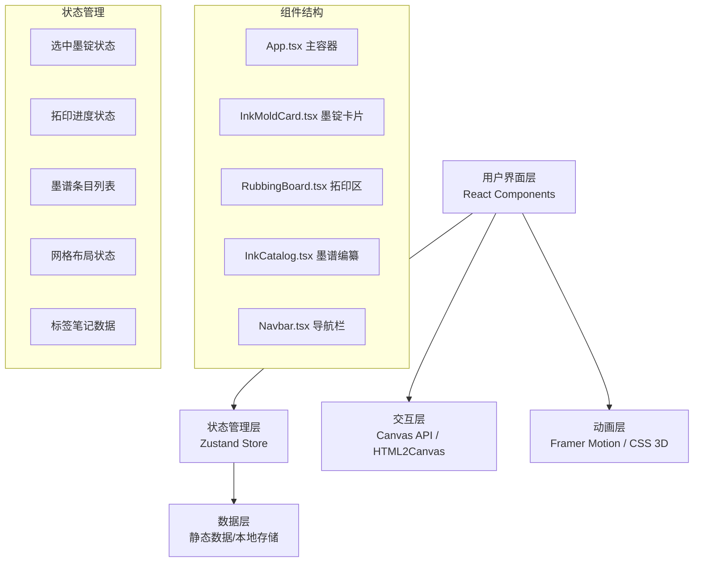

## 1. 架构设计



## 2. 技术描述

- **前端框架**：React 18 + TypeScript 5
- **构建工具**：Vite 5
- **状态管理**：Zustand 4
- **动画库**：Framer Motion 11
- **图像导出**：html2canvas 1.4
- **样式方案**：CSS Modules + CSS Variables
- **音频处理**：Web Audio API（翻页音效）
- **Canvas API**：用于朱砂圆斑绘制

### 2.1 核心依赖说明
- `react` / `react-dom`：React核心库
- `typescript`：类型安全
- `vite` / `@vitejs/plugin-react`：构建工具与React支持
- `framer-motion`：流畅动画与拖拽交互
- `zustand`：轻量级状态管理
- `html2canvas`：DOM转PNG导出
- `@types/*`：TypeScript类型定义

## 3. 目录结构

```
project/
├── index.html                 # 入口HTML
├── package.json               # 项目配置
├── tsconfig.json              # TypeScript配置
├── vite.config.js             # Vite配置
├── public/
│   └── assets/                # 静态资源（音效等）
└── src/
    ├── main.tsx               # 应用入口
    ├── App.tsx                # 主应用组件
    ├── styles/
    │   ├── global.css         # 全局样式与CSS变量
    │   └── variables.css      # 主题变量
    ├── data/
    │   └── molds.ts           # 墨锭静态数据
    ├── store/
    │   └── store.ts           # Zustand状态管理
    ├── components/
    │   ├── InkMoldCard.tsx    # 墨锭卡片组件
    │   ├── RubbingBoard.tsx   # 拓印区组件
    │   ├── InkCatalog.tsx     # 墨谱编纂组件
    │   └── Navbar.tsx         # 导航栏组件
    ├── hooks/
    │   ├── useAudio.ts        # 音效Hook
    │   └── useCanvas.ts       # Canvas操作Hook
    └── types/
        └── index.ts           # TypeScript类型定义
```

## 4. 数据模型

### 4.1 TypeScript类型定义

```typescript
// 墨锭形制
type MoldShape = 'rectangle' | 'circle' | 'guitar';

// 纹样类别
type PatternCategory = 'auspicious' | 'landscape' | 'figure' | 'text';

// 墨锭数据
interface InkMold {
  id: string;
  name: string;
  shape: MoldShape;
  category: PatternCategory;
  patternDescription: string;
  year: string;
  formula: string;
  patternSvg: string;
}

// 拓印进度
interface RubbingProgress {
  moldId: string;
  clickCount: number;
  requiredClicks: number;
  isComplete: boolean;
}

// 墨谱条目
interface CatalogEntry {
  id: string;
  moldId: string;
  x: number;
  y: number;
  width: number;
  height: number;
  label: string;
  note: string;
}

// 应用状态
interface AppState {
  selectedMold: InkMold | null;
  rubbingProgress: RubbingProgress | null;
  catalogEntries: CatalogEntry[];
  gridSnapEnabled: boolean;
  gridSize: number;
}
```

### 4.2 状态管理设计

**Zustand Store 核心方法**：
- `selectMold(mold: InkMold)`：选中墨锭
- `updateRubbingProgress(clickCount: number)`：更新拓印进度
- `completeRubbing()`：完成拓印
- `addCatalogEntry(entry: CatalogEntry)`：添加墨谱条目
- `updateCatalogEntry(id: string, updates: Partial<CatalogEntry>)`：更新条目
- `removeCatalogEntry(id: string)`：删除条目
- `toggleGridSnap()`：切换网格吸附
- `setGridSize(size: number)`：设置网格大小

## 5. 核心组件设计

### 5.1 InkMoldCard.tsx
- **功能**：3D翻转展示墨锭正反两面，点击选中，拖拽支持
- **Props**：`mold: InkMold`, `isSelected: boolean`, `onSelect: () => void`
- **动画**：CSS 3D翻转（transform-style: preserve-3d，perspective: 1000px）
- **音效**：翻转时播放纸张翻动音效

### 5.2 RubbingBoard.tsx
- **功能**：管理拓印交互，Canvas绘制朱砂圆斑，纹样渐变显示
- **核心逻辑**：
  - 监听鼠标/触摸事件，计算点击位置
  - Canvas绘制半透明朱砂圆斑（直径8-20px随机，透明度0.4-0.6）
  - 点击计数达到阈值后，纹样模糊滤镜从blur(4px)过渡到blur(0px)
  - 显示拓印进度条
- **性能优化**：Canvas分层，requestAnimationFrame优化

### 5.3 InkCatalog.tsx
- **功能**：9x9网格布局，拖拽吸附，标签笔记编辑，PNG导出
- **核心逻辑**：
  - CSS Grid布局展示9x9虚线网格
  - Framer Motion实现拖拽与网格吸附（snapToGrid）
  - 内联编辑标签（仿宋字体 #5c4033）
  - 笔记气泡（背景 #fff8dc，阴影效果）
  - html2canvas导出PNG

## 6. 性能优化策略

### 6.1 拓印性能
- **Canvas分层**：背景层（宣纸纹理）+ 绘制层（朱砂圆斑）+ 纹样层（SVG）
- **requestAnimationFrame**：批量处理绘制请求
- **离屏Canvas**：预渲染纹样图案
- **点击防抖**：快速连续点击合并处理

### 6.2 动画性能
- **CSS 3D加速**：使用transform和opacity属性触发GPU加速
- **will-change**：对动画元素预声明
- **避免布局抖动**：批量读取/写入DOM属性

### 6.3 响应式优化
- **CSS Container Queries**：组件级响应式
- **图像自适应**：SVG矢量图形无损缩放
- **懒加载**：墨锭数据按需加载

## 7. 关键算法

### 7.1 拓印进度算法
```typescript
// 根据点击次数计算模糊度
function calculateBlur(clickCount: number, requiredClicks: number): number {
  const progress = Math.min(clickCount / requiredClicks, 1);
  return 4 * (1 - progress); // 从4px线性递减到0px
}

// 每次点击的目标区域偏移
function getRandomOffset(radius: number): { x: number; y: number } {
  const angle = Math.random() * Math.PI * 2;
  const distance = Math.random() * radius * 0.5;
  return {
    x: Math.cos(angle) * distance,
    y: Math.sin(angle) * distance
  };
}
```

### 7.2 网格吸附算法
```typescript
// 坐标吸附到最近网格点
function snapToGrid(value: number, gridSize: number): number {
  return Math.round(value / gridSize) * gridSize;
}

// 9x9网格计算
const GRID_SIZE = 9;
const CELL_SIZE = containerWidth / GRID_SIZE;
const snappedX = snapToGrid(dragX, CELL_SIZE);
const snappedY = snapToGrid(dragY, CELL_SIZE);
```
