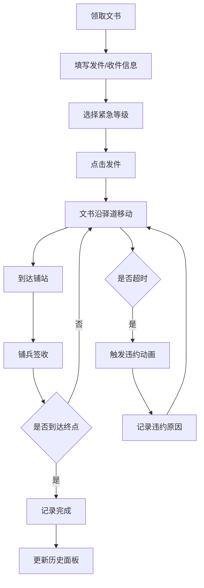

## 1. 产品概述

急递铺文书跟踪系统是一个模拟明代驿传体系的全栈Web应用，让用户在虚拟的明代驿道上扮演铺兵，负责从京师会同馆到边镇九边的文书递送管理。

- **主要用途**：模拟古代文书传递流程，管理急递铺交接记录和时限稽核
- **目标用户**：历史爱好者、教育工作者、游戏玩家
- **产品价值**：通过沉浸式互动体验，让用户了解明代驿传制度的运作机制

## 2. 核心功能

### 2.1 用户角色

| 角色 | 注册方式 | 核心权限 |
|------|----------|----------|
| 铺兵 | 自动分配 | 领取文书、逐站递送、签收登记、查看历史记录 |

### 2.2 功能模块

1. **驿道地图模块**：展示从京师到边镇的驿道，标记沿途急递铺站位置，显示文书实时位置动画
2. **文书管理模块**：文书创建、状态跟踪、时限倒计时、违约预警
3. **签收操作模块**：铺站签收、签名生成、交接记录
4. **历史记录模块**：递送记录列表、日期筛选、超时标记

### 2.3 页面详情

| 页面名称 | 模块名称 | 功能描述 |
|----------|----------|----------|
| 主页面 | 驿道地图 | 显示北京到嘉峪关的驿道，10个急递铺站标记，文书位置动画，悬停显示铺站详情 |
| 主页面 | 文书卡片 | 仿竹简样式，显示发件地、收件地、紧急等级、已用时限、签收按钮 |
| 主页面 | 历史面板 | 已完成递送记录列表，日期筛选，超时记录高亮 |

## 3. 核心流程

用户从会同馆领取文书，选择收件地和紧急等级后发件，文书沿驿道逐站传递。每到达一个铺站，铺兵点击签收，文书继续传往下一站，直至送达收件地。系统全程跟踪时限，超时则触发违约预警。

## 4. 用户界面设计

### 4.1 设计风格

- **主色调**：古纸色#f5f0e6（背景）、墨色#3c3c3c（文字/边框）
- **状态色**：朱红#c04040（紧急/违约）、翠绿#2e8b57（已签收）、赭色#8b5e3c（驿道）
- **字体**：楷体（KaiTi）作为主要字体，营造古风氛围
- **布局**：上中下结构，上方为地图（4:3宽高比），左侧为文书卡片（仿竹简竖向排列），右侧为历史面板
- **动画**：铺站旗标颜色渐变（0.5秒）、文书平滑移动（0.5秒/站）、违约闪烁震动（2秒）

### 4.2 页面设计概述

| 页面名称 | 模块名称 | UI元素 |
|----------|----------|---------|
| 主页面 | 驿道地图 | 米黄色背景、赭色虚线驿道、红色三角旗铺站标记、金色闪烁圆点文书位置、悬停工具条 |
| 主页面 | 文书卡片 | 竹简样式、竖向排列、楷体字、墨色边框、纸张色#faebd7背景、倒计时红色渐变条 |
| 主页面 | 历史面板 | 灰白底、分隔线、超时记录浅红背景、日期筛选控件 |

### 4.3 响应式设计

- 桌面端（720px以上）：左右布局，地图在上，文书卡片在左，历史面板在右
- 移动端（720px以下）：上下堆叠布局，地图、文书卡片、历史面板依次排列
- 触控优化：按钮最小尺寸44px，滑动操作支持

## 5. 性能要求

- 动画帧率：保持60fps流畅动画
- 并发跟踪：地图上最多同时跟踪5份文书移动轨迹
- API响应：后端接口响应时间不超过200ms
