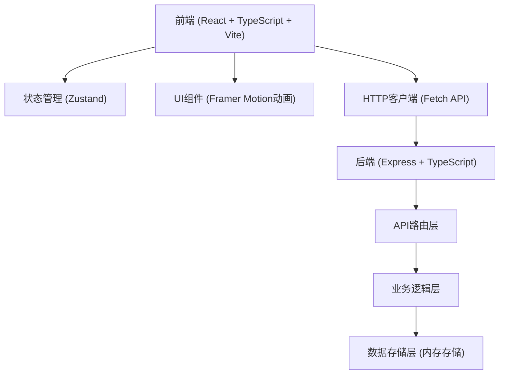
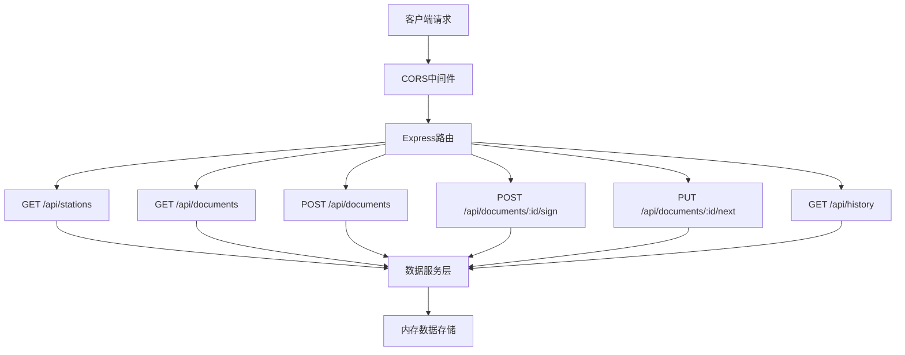
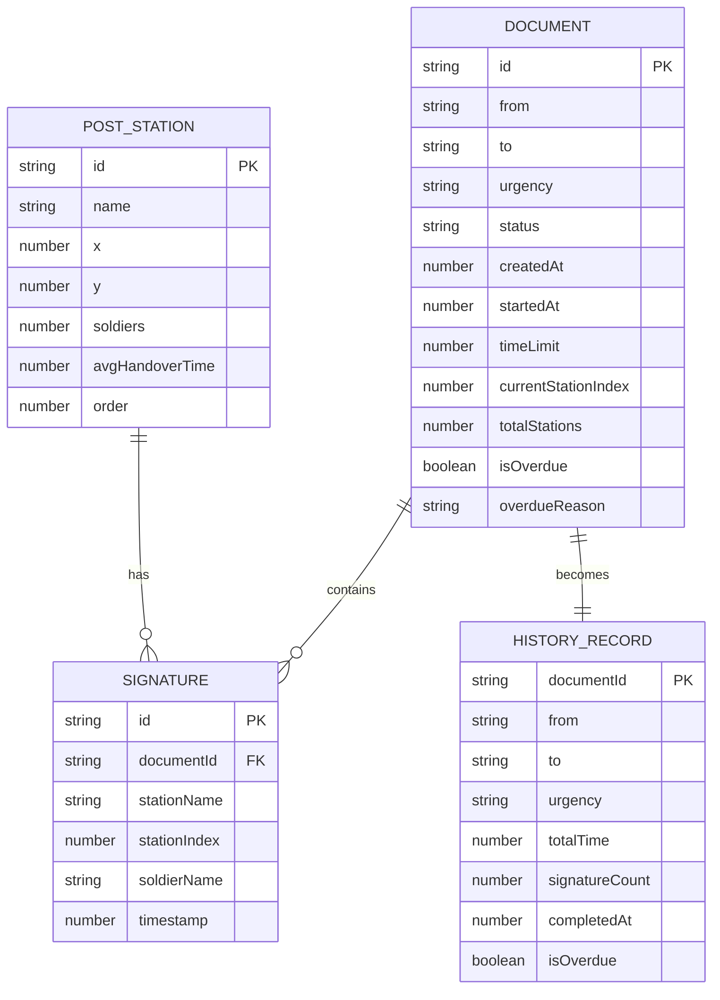

## 1. 架构设计



## 2. 技术描述

- **前端框架**：React 18 + TypeScript
- **构建工具**：Vite（开发服务器端口5173）
- **状态管理**：Zustand
- **动画库**：Framer Motion
- **后端框架**：Express 4 + TypeScript
- **跨域处理**：CORS
- **数据存储**：内存存储（模拟数据）
- **包管理器**：npm

## 3. 路由定义

| 路由 | 用途 |
|-------|---------|
| / | 主应用页面，包含地图、文书卡片和历史面板 |

## 4. API 定义

### 4.1 类型定义

```typescript
// 急递铺站
interface PostStation {
  id: string;
  name: string;
  position: { x: number; y: number };
  soldiers: number;
  avgHandoverTime: number;
  order: number;
}

// 紧急等级
type UrgencyLevel = 'normal' | 'urgent' | 'express600';

// 文书状态
type DocumentStatus = 'pending' | 'transiting' | 'arrived' | 'completed' | 'overdue';

// 文书
interface Document {
  id: string;
  from: string;
  to: string;
  urgency: UrgencyLevel;
  status: DocumentStatus;
  createdAt: number;
  startedAt: number;
  timeLimit: number;
  currentStationIndex: number;
  totalStations: number;
  signatures: Signature[];
  isOverdue: boolean;
  overdueReason?: string;
}

// 签收记录
interface Signature {
  id: string;
  documentId: string;
  stationName: string;
  stationIndex: number;
  soldierName: string;
  timestamp: number;
}

// 历史记录
interface HistoryRecord {
  documentId: string;
  from: string;
  to: string;
  urgency: UrgencyLevel;
  totalTime: number;
  signatureCount: number;
  completedAt: number;
  isOverdue: boolean;
}
```

### 4.2 接口定义

| 方法 | 路径 | 描述 | 请求 | 响应 |
|------|------|------|------|------|
| GET | /api/stations | 获取所有急递铺站列表 | - | `PostStation[]` |
| GET | /api/documents/:id | 获取文书详情 | - | `Document` |
| GET | /api/documents | 获取所有文书 | - | `Document[]` |
| POST | /api/documents | 创建新文书 | `{ from, to, urgency }` | `Document` |
| POST | /api/documents/:id/sign | 签收文书 | `{ stationIndex, stationName }` | `Signature` |
| PUT | /api/documents/:id/next | 文书传往下一站 | - | `Document` |
| GET | /api/history | 获取历史记录 | `?startDate=&endDate=` | `HistoryRecord[]` |

## 5. 服务器架构图



## 6. 数据模型

### 6.1 数据模型定义



### 6.2 初始数据

急递铺站数据（10个，从北京到嘉峪关）：
1. 京师会同馆 - 北京
2. 通州驿
3. 保定驿
4. 真定驿
5. 太原驿
6. 平阳驿
7. 西安驿
8. 平凉驿
9. 兰州驿
10. 肃州嘉峪关

时限配置：
- 普通：5天（432000秒）
- 加急：3天（259200秒）
- 六百里加急：1天（86400秒）

## 7. 项目文件结构

```
.
├── package.json
├── vite.config.js
├── tsconfig.json
├── index.html
├── src/
│   ├── App.tsx              # 主应用组件
│   ├── store.ts             # Zustand状态管理
│   ├── server.ts            # Express后端
│   ├── components/
│   │   ├── MapView.tsx      # 驿道地图组件
│   │   ├── DocumentCard.tsx # 文书卡片组件
│   │   └── HistoryPanel.tsx # 历史面板组件
│   └── types/
│       └── index.ts         # 类型定义
```

## 8. 前端状态管理（Zustand Store）

```typescript
interface AppState {
  stations: PostStation[];
  documents: Document[];
  history: HistoryRecord[];
  activeDocument: Document | null;
  timer: number;
  isTimerRunning: boolean;
  
  // Actions
  fetchStations: () => Promise<void>;
  fetchDocuments: () => Promise<void>;
  fetchHistory: (startDate?: number, endDate?: number) => Promise<void>;
  createDocument: (from: string, to: string, urgency: UrgencyLevel) => Promise<Document>;
  signDocument: (documentId: string, stationIndex: number, stationName: string) => Promise<void>;
  moveToNextStation: (documentId: string) => Promise<void>;
  setActiveDocument: (doc: Document | null) => void;
  startTimer: () => void;
  stopTimer: () => void;
  resetTimer: () => void;
}
```
