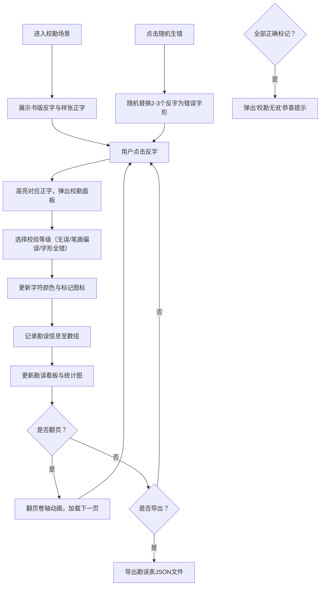

## 1. 产品概述

本产品是一个模拟南宋临安御街书坊雕版校勘场景的交互式浏览器工具，让用户体验古代雕版匠人校对《梦粱录》书版的过程。通过将木雕版反字与印刷样张正字逐字比对，用户可以标注字形与笔画偏误，记录每处刊刻错误的坐标与严重等级，并生成勘误表。

- 核心价值：寓教于乐的文化体验工具，让用户在互动中了解古代雕版印刷技艺
- 目标用户：对中国传统文化、古籍印刷感兴趣的学习者和爱好者

## 2. 核心功能

### 2.1 用户角色

| 角色 | 注册方式 | 核心权限 |
|------|----------|----------|
| 校勘匠人 | 无需注册，直接进入 | 浏览书版、逐字校勘、标记错误、导出勘误表 |

### 2.2 功能模块

1. **书版显示区**：木雕版反字展示，CSS镜像翻转模拟反字效果，木纹纹理背景
2. **样张比对区**：正字印刷样张展示，宣纸色背景，楷体字形
3. **校勘交互区**：点击反字弹出校勘面板，三种校验选项（无误/笔画偏误/字形全错）
4. **勘误记录看板**：可折叠的勘误表格，统计饼图，实时更新
5. **翻页控制区**：上/下页翻转动画，导出JSON功能
6. **模拟生错功能**：随机注入错误字形，自动校验并触发恭喜提示

### 2.3 页面详情

| 页面名称 | 模块名称 | 功能描述 |
|----------|----------|----------|
| 主校勘页面 | 书版显示模块 | 木雕版反字渲染，支持点击交互，朱笔标记显示 |
| 主校勘页面 | 样张比对模块 | 正字同步显示，与反字滚动同步，高亮联动 |
| 主校勘页面 | 校勘面板模块 | 半透明浮层，仿古卷轴样式，三个校勘选项按钮 |
| 主校勘页面 | 勘误看板模块 | 可折叠表格，等级渐变色背景，CSS饼图统计 |
| 主校勘页面 | 翻页控制模块 | 翻页卷轴动画，纸张摩擦音效，JSON导出下载 |
| 主校勘页面 | 模拟生错模块 | 随机错误注入，自动校验，"校勘无讹"提示动画 |

## 3. 核心流程

用户打开应用后进入校勘场景，左栏显示木雕版反字，右栏显示正字样张。用户逐字比对，点击反字进行校勘，选择校验等级后系统记录并显示标记。完成一页后可翻页或导出勘误表。使用"随机生错"功能可进行模拟练习。

## 4. 用户界面设计

### 4.1 设计风格

- **主色调**：棕色系（背景#f5f0e1，标题栏#5d4037，字体#3e2723），米色系，朱红色（强调色#cc3333）
- **按钮样式**：仿古卷轴样式，圆角边框，悬停时有水墨渍扩散动画
- **字体**：标题用古典书法字体，正文用楷体，反字区用等宽宋体
- **布局风格**：古书卷设计，左右分栏（桌面端）或上下布局（移动端），卷轴装饰边框
- **图标风格**：简约线描风格，朱笔标记（✔、△、✘），书卷图标

### 4.2 页面设计概述

| 页面名称 | 模块名称 | UI元素 |
|----------|----------|--------|
| 主校勘页面 | 标题栏 | 棕色背景，白色标题文字，朱红印章装饰 |
| 主校勘页面 | 书版区 | 浅棕木纹背景（CSS渐变模拟年轮），深褐反字（镜像翻转），字间距行距模拟雕版 |
| 主校勘页面 | 样张区 | 宣纸色背景（#f5e6c8），楷体正字，轻微纸张纹理 |
| 主校勘页面 | 校勘面板 | 半透明米白浮层，仿古卷轴边框，三个选项按钮带渐变背景 |
| 主校勘页面 | 勘误看板 | 可折叠区域，表格行按等级渐变色（绿→黄→红），CSS占比环图 |
| 主校勘页面 | 控制栏 | 翻页按钮（书卷样式），导出按钮，随机生错按钮 |
| 主校勘页面 | 恭喜提示 | 金色边框（#ffd700），卷轴展开动画，"校勘无讹"书法字体 |

### 4.3 响应式设计

- **桌面端（≥960px）**：左右分栏布局，书版在左，样张在右，横向同步滚动
- **移动端（<960px）**：上下布局，书版在上，样张在下，两栏高度自适应
- **触摸优化**：增大点击区域至48x48px，支持长按查看详情

### 4.4 动画与交互

- **高亮闪烁**：选中反字朱红色半透明蒙层，0.5s间隔闪烁
- **水墨渍扩散**：点击反馈用径向渐变实现，0.2秒扩散至30px圆
- **翻页动画**：从左向右卷动过渡0.4s，伴随轻微纸张摩擦音效
- **折叠动画**：勘误看板0.3s平滑展开/收起
- **恭喜动画**：卷轴展开动画0.5s，金色边框包裹
