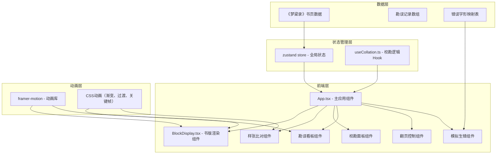

## 1. 架构设计



## 2. 技术描述

- **前端框架**：React@18 + TypeScript + Vite
- **构建工具**：Vite@5（开发服务器端口3000）
- **状态管理**：Zustand@4
- **动画库**：Framer Motion@11
- **样式方案**：CSS Modules + 全局CSS变量
- **开发语言**：TypeScript@5（严格模式启用）

## 3. 项目结构

```
auto109/
├── package.json
├── vite.config.js
├── tsconfig.json
├── index.html
└── src/
    ├── App.tsx
    ├── main.tsx
    ├── index.css
    ├── components/
    │   ├── BlockDisplay.tsx
    │   ├── ProofDisplay.tsx
    │   ├── CollationPanel.tsx
    │   ├── ErrorBoard.tsx
    │   ├── PaginationControl.tsx
    │   └── RandomErrorButton.tsx
    ├── hooks/
    │   └── useCollation.ts
    ├── store/
    │   └── useCollationStore.ts
    ├── data/
    │   └── bookPages.ts
    ├── types/
    │   └── index.ts
    └── utils/
        ├── exportJson.ts
        └── soundEffects.ts
```

## 4. 数据模型

### 4.1 类型定义

```typescript
// 字符位置坐标
interface CharPosition {
  row: number;
  col: number;
}

// 校验等级
type CollationGrade = 'correct' | 'stroke_error' | 'char_error';

// 单个字符信息
interface CharInfo {
  id: string;
  reversedChar: string;
  correctChar: string;
  position: CharPosition;
  grade: CollationGrade | null;
  isInjectedError: boolean;
}

// 勘误记录
interface CollationRecord {
  id: string;
  position: CharPosition;
  reversedChar: string;
  correctChar: string;
  grade: CollationGrade;
  timestamp: number;
  pageNumber: number;
}

// 页面数据
interface BookPage {
  pageNumber: number;
  title: string;
  chars: CharInfo[];
  rows: number;
  cols: number;
}

// 全局状态
interface CollationState {
  currentPage: number;
  totalPages: number;
  pages: BookPage[];
  records: CollationRecord[];
  selectedCharId: string | null;
  showCongratulations: boolean;
  setCurrentPage: (page: number) => void;
  selectChar: (charId: string | null) => void;
  setCharGrade: (charId: string, grade: CollationGrade) => void;
  injectRandomErrors: () => void;
  exportRecords: () => void;
  validateAllMarked: () => boolean;
  getStatistics: () => { correct: number; strokeError: number; charError: number };
}
```

### 4.2 数据流

1. **初始化**：从 `bookPages.ts` 加载《梦粱录》书页数据，存入 Zustand store
2. **字符选择**：用户点击 `BlockDisplay` 中的反字，触发 `selectChar` 更新选中状态
3. **校勘提交**：用户在 `CollationPanel` 选择等级，调用 `setCharGrade` 更新字符状态并添加记录
4. **看板更新**：`ErrorBoard` 从 store 订阅 `records` 变化，实时更新表格和统计图
5. **翻页逻辑**：`PaginationControl` 调用 `setCurrentPage`，触发页面数据切换和动画
6. **错误注入**：`RandomErrorButton` 调用 `injectRandomErrors`，随机替换2-3个反字
7. **自动校验**：`validateAllMarked` 检查所有注入错误是否被正确标记，触发恭喜提示

## 5. 核心模块设计

### 5.1 useCollation Hook

负责校勘核心逻辑：
- 正反字坐标映射算法
- 字符比对逻辑
- 勘误记录数组管理
- 统计信息计算
- 错误注入与校验逻辑

### 5.2 BlockDisplay 组件

负责木雕版渲染：
- 从 store 读取当前页反字和标记
- CSS 镜像翻转实现反字效果
- 木纹纹理背景（重复线性渐变模拟年轮）
- 响应点击事件，触发字符选择
- 显示朱笔标记图标（✔、△、✘）
- 水墨渍扩散点击反馈

### 5.3 动画实现方案

| 动画效果 | 实现方式 | 性能考量 |
|----------|----------|----------|
| 字符高亮闪烁 | CSS `@keyframes` + `opacity` | 使用 `transform` 和 `opacity` 触发合成层 |
| 水墨渍扩散 | CSS 径向渐变 + `requestAnimationFrame` | 控制扩散半径，避免重排 |
| 翻页卷轴动画 | framer-motion `animate` + `AnimatePresence` | 使用 `transform: translateX` 实现高性能动画 |
| 看板折叠动画 | CSS `transition: max-height` | 固定高度范围，避免布局抖动 |
| 恭喜卷轴展开 | framer-motion 关键帧动画 | 预加载资源，避免动画卡顿 |

## 6. 性能优化

### 6.1 渲染性能

- 使用 `React.memo` 包装字符组件，避免不必要重渲染
- 使用 Zustand 的选择器语法 `useStore(state => state.chars)` 精确订阅
- 勘误表格使用虚拟滚动（如记录超过100条）
- 动画使用 `will-change` 提示浏览器优化

### 6.2 交互响应

- 点击校勘记录更新目标：16ms 以内完成
- 统计图重绘使用 CSS `conic-gradient`，避免 Canvas 重绘开销
- 翻页动画帧率：≥50fps，使用 `transform` 而非 `left/top`

### 6.3 资源加载

- 字体文件按需加载，使用 `font-display: swap`
- 音效使用 Web Audio API，预加载轻量级音频
- 无第三方图片资源，全部用 CSS 实现纹理效果

## 7. 构建与部署

- **开发命令**：`npm run dev`（端口3000）
- **构建命令**：`npm run build`
- **类型检查**：`npm run check`
- 生产构建输出至 `dist/` 目录
