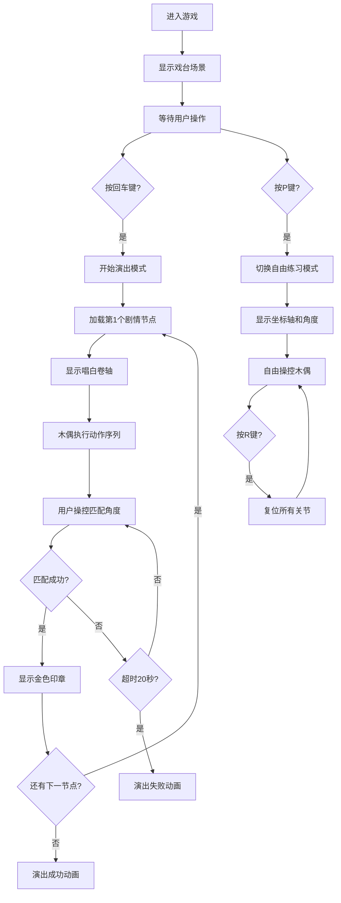

## 1. 产品概述
"傀儡戏台"是一款基于浏览器的宋代傀儡戏提线木偶操控与剧情演出交互游戏。用户在虚拟的宋代临安瓦舍戏棚中扮演傀儡戏艺人，通过提线控制木偶完成指定动作和唱白，按剧情顺序演出折子戏。

- **核心目的**：还原古代傀儡戏的艺术魅力，让用户体验提线木偶操控的乐趣
- **目标用户**：对中国传统文化、戏曲艺术感兴趣的游戏玩家
- **市场价值**：以数字化形式传承非物质文化遗产，寓教于乐

## 2. 核心功能

### 2.1 用户角色
| 角色 | 注册方式 | 核心权限 |
|------|----------|----------|
| 傀儡戏艺人 | 无需注册，直接进入 | 操控木偶、演出折子戏、自由练习 |

### 2.2 功能模块
1. **戏台场景模块**：木质戏棚背景、朱红帷幕、灯笼照明、提线交互热区
2. **木偶操控模块**：6关节骨骼系统、键盘操控、角度调整、快速抖动
3. **剧情演出模块**：8节点折子戏、唱白卷轴展示、动作序列调度、进度判定
4. **评分反馈模块**：金色印章、成功/失败动画、完成度统计
5. **自由练习模块**：无剧本约束、坐标轴显示、角度实时显示、一键复位

### 2.3 页面详情
| 页面名称 | 模块名称 | 功能描述 |
|----------|----------|----------|
| 主戏台页面 | 戏台场景渲染 | 木质戏棚背景、帷幕开合动画、灯笼粒子效果、木偶表演区域 |
| 主戏台页面 | 木偶渲染 | 6关节骨骼结构、提线连接、肢体旋转动画、摆动惯性模拟 |
| 主戏台页面 | 键盘操控 | 数字键选关节、方向键调角度、空格键抖动、回车开始、P切换模式、R复位 |
| 主戏台页面 | 剧情演出 | 8节点剧本执行、唱白卷轴展示、动作匹配判定、超时检测 |
| 主戏台页面 | 评分反馈 | 完成印章动画、成功/失败动画、完成度和耗时统计 |
| 主戏台页面 | 自由练习 | 坐标轴显示、角度实时显示、自由操控 |

## 3. 核心流程
用户进入游戏后，首先看到宋代瓦舍戏棚场景。按回车键开始演出模式，系统从剧本读取第一个剧情节点，以仿古卷轴形式显示唱白文本，同时木偶需执行预设动作序列。用户通过键盘1-6选择关节，方向键调整角度，精确匹配目标角度（±5度误差）后触发下一节点。累计完成8枚印章触发成功动画。超时20秒则演出失败。按P键可切换自由练习模式，任意调整关节角度。

## 4. 用户界面设计

### 4.1 设计风格
- **主色调**：深棕#5d4037、朱红#c62828、暖黄#ffb300、浅肤色#ffccbc、深蓝#1565c0
- **整体风格**：宋代瓦舍戏棚的暖色调复古风格，营造古典戏曲氛围
- **字体**：唱白使用楷体，其他使用系统无衬线字体
- **动画**：所有交互反馈均带0.3s~0.8s缓动动画，使用cubic-bezier(0.25,0.1,0.25,1)
- **质感**：木质纹理、宣纸质感、金色光泽

### 4.2 页面设计概述
| 页面名称 | 模块名称 | UI元素 |
|----------|----------|--------|
| 主戏台页面 | 戏台区域 | 深棕木质背景#5d4037，占屏幕中央60%，四周4px木纹边框#4e342e |
| 主戏台页面 | 帷幕系统 | 朱红色#c62828左右半幅帷幕，开合动画0.8s |
| 主戏台页面 | 灯光系统 | 顶部暖黄#ffb300灯笼，亮度渐变，20个光粒子（低帧率降至10） |
| 主戏台页面 | 木偶 | 高120px，6关节可旋转（-45°~45°），提线细白线，悬停高亮金色 |
| 主戏台页面 | 唱白卷轴 | 仿古宣纸色#f5e6c8，毛边纹理，楷体深褐#3e2723，字号16px |
| 主戏台页面 | 顶部横幅 | 朱红#c62828底白字，显示当前模式和得分 |
| 主戏台页面 | 操作提示 | 半透明深色#1a1a1a，圆角8px，显示选中关节和角度 |
| 主戏台页面 | 金色印章 | 圆形直径20px，#ffb300，pop-in动画0.5s |

### 4.3 响应式设计
- **桌面端**：戏台占屏幕中央60%区域，横向布局
- **移动端（<768px）**：戏台缩小50%，整体纵向布局，操作面板移到底部，木偶大小不变
- **触摸优化**：支持触屏点击关节进行选择

### 4.4 视觉特效
- **关节选中**：半透明圆环#ffb300，半径10px，闪烁0.2s
- **成功反馈**：金色印章pop-in动画，木偶作揖0.8s
- **失败反馈**：戏台背景闪红3次（每次0.2s间隔0.1s）
- **提线高亮**：鼠标悬停关节时，提线变为金色#ffd700，线宽2px
- **帷幕开合**：0.8s平滑过渡动画
