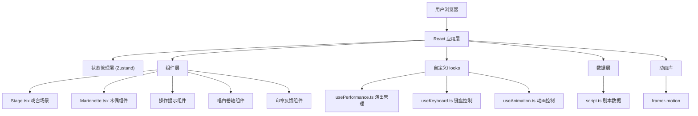

## 1. 架构设计



## 2. 技术描述

- **前端框架**：React@18 + TypeScript@5
- **构建工具**：Vite@5 + @vitejs/plugin-react@4
- **状态管理**：Zustand@4
- **动画库**：framer-motion@11
- **样式方案**：CSS Modules + CSS Variables + CSS Transform
- **性能优化**：requestAnimationFrame、CSS Transform 避免重排、帧率自适应粒子数量

## 3. 核心文件结构

| 文件路径 | 用途 |
|----------|------|
| `/package.json` | 项目依赖配置，启动脚本 |
| `/vite.config.js` | Vite 构建配置，React 插件 |
| `/tsconfig.json` | TypeScript 严格模式配置 |
| `/index.html` | 入口页面，标题"傀儡戏台" |
| `/src/main.tsx` | React 应用入口 |
| `/src/App.tsx` | 根组件，整合所有模块 |
| `/src/components/Stage.tsx` | 戏台场景组件，背景、帷幕、灯光、表演区域 |
| `/src/components/Marionette.tsx` | 木偶组件，6关节骨骼系统、提线、动画 |
| `/src/hooks/usePerformance.ts` | 演出管理Hook，剧情节点、动作序列、按键映射 |
| `/src/data/script.ts` | 剧本数据，8个剧情节点、动作、唱白 |
| `/src/store/usePuppetStore.ts` | Zustand 状态管理，关节角度、选中状态、模式 |
| `/src/styles/global.css` | 全局样式，CSS变量定义 |

## 4. 数据模型

### 4.1 关节数据结构

```typescript
interface Joint {
  id: number;           // 1-6: 头、躯干、左臂、右臂、左腿、右腿
  name: string;
  angle: number;        // -45 ~ 45 度
  targetAngle?: number; // 目标角度（演出模式）
  position: { x: number; y: number }; // 相对木偶中心的位置
}
```

### 4.2 剧情节点结构

```typescript
interface ScriptNode {
  id: number;
  actionName: string;
  duration: number;     // 秒
  nextNode: number;     // 下一节点ID
  triggerCondition: string;
  dialogue: string;     // 唱白文本
  actionSequence: {
    jointId: number;
    targetAngle: number;
  }[];
}
```

### 4.3 演出状态结构

```typescript
interface PerformanceState {
  mode: 'idle' | 'performing' | 'free';
  currentNode: number;
  completedNodes: number;
  startTime: number;
  elapsedTime: number;
  isFailed: boolean;
  timeRemaining: number;
}
```

## 5. 核心技术实现

### 5.1 木偶骨骼系统
- 6个骨骼点采用层级结构：躯干为根节点，头、四肢为子节点
- 使用 CSS `transform: rotate()` 和 `transform-origin` 实现关节旋转
- 提线使用 SVG `<line>` 元素连接头顶控制点与各关节
- 摆动惯性：通过 `requestAnimationFrame` 实现缓动跟随，阻尼系数0.85

### 5.2 键盘操控系统
- 数字键1-6：选择对应关节
- 方向键上/下：每次增减5度，范围限制-45~45度
- 空格键：快速抖动动画（幅度10度，频率8Hz，持续0.3s）
- 回车键：开始演出模式
- P键：切换自由/演出模式
- R键：一键复位所有关节到0度

### 5.3 演出调度系统
- `usePerformance` Hook 管理剧情状态机
- 动作匹配判定：当前关节角度与目标角度误差在±5度内判定成功
- 超时检测：每个节点20秒倒计时，使用 `setInterval` 实现
- 动作过渡动画：CSS `transition` 使用 `cubic-bezier(0.25,0.1,0.25,1)`，持续0.6s

### 5.4 性能优化
- 所有动画使用 CSS Transform 和 opacity，避免触发重排
- 帧率检测：使用 `performance.now()` 计算帧率，低于30fps时减少粒子数量
- 防抖/节流：键盘事件使用节流，防止快速按键导致的性能问题
- 组件 memo 优化：使用 `React.memo` 避免不必要的重渲染

### 5.5 响应式适配
- 使用 CSS 媒体查询 `@media (max-width: 768px)` 适配移动端
- 戏台尺寸使用 `clamp()` 和 `vw/vh` 单位实现自适应
- 移动端操作面板移到底部，布局改为纵向

## 6. 状态管理设计

```typescript
// usePuppetStore.ts
import { create } from 'zustand';

interface PuppetState {
  joints: Joint[];
  selectedJoint: number | null;
  mode: 'idle' | 'performing' | 'free';
  performance: PerformanceState;
  setJointAngle: (id: number, angle: number) => void;
  selectJoint: (id: number | null) => void;
  setMode: (mode: 'idle' | 'performing' | 'free') => void;
  resetJoints: () => void;
}
```

## 7. 动画实现方案

| 动画效果 | 实现方式 | 持续时间 |
|----------|----------|----------|
| 帷幕开合 | framer-motion animate | 0.8s |
| 关节旋转 | CSS transition | 0.6s |
| 关节抖动 | framer-motion keyframes | 0.3s |
| 印章弹出 | framer-motion scale + bounce | 0.5s |
| 失败闪烁 | CSS animation keyframes | 0.2s * 3 |
| 灯光渐变 | CSS opacity transition | 1-2s 循环 |
| 关节复位 | CSS transition | 0.3s |
| 木偶作揖 | framer-motion sequence | 0.8s |
