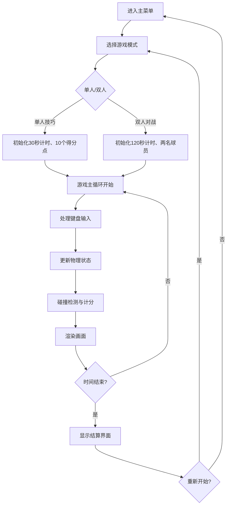

## 1. 产品概述

基于浏览器的古代蹴鞠比赛对抗与技巧演练交互游戏应用，让用户在虚拟的北宋汴京宝津楼御苑中，扮演齐云社蹴鞠高手，体验单人技巧挑战或双人对战模式。

- 核心目的：通过游戏化方式还原古代蹴鞠运动，提供寓教于乐的交互体验
- 目标用户：对中国传统文化、古代体育运动感兴趣的游戏玩家
- 市场价值：传承中华传统文化，打造具有文化特色的HTML5游戏

## 2. 核心功能

### 2.1 用户角色
| 角色 | 注册方式 | 核心权限 |
|------|----------|----------|
| 玩家1 | 键盘操作 | 单人模式游戏、双人模式红方控制 |
| 玩家2 | 键盘操作 | 双人模式蓝方控制 |

### 2.2 功能模块
1. **主菜单模块**：游戏模式选择、操作说明、开始游戏
2. **单人技巧模式**：30秒限时得分挑战、随机得分点、活动靶球门
3. **双人对战模式**：120秒对战、抢球规则、球门大小调整
4. **游戏引擎模块**：60fps主循环、物理碰撞、计分系统
5. **音效系统模块**：Web Audio API生成踢球、跑动、进球音效
6. **场地渲染模块**：Canvas绘制古代御苑场地、球员、球

### 2.3 页面详情
| 页面名称 | 模块名称 | 功能描述 |
|----------|----------|----------|
| 主菜单 | 模式选择 | 选择单人技巧/双人对战模式，显示游戏标题和操作说明 |
| 游戏界面 | 场地渲染 | Canvas绘制2:1比例蹴鞠场地、球门、球员、球 |
| 游戏界面 | HUD显示 | 倒计时、得分、游戏模式显示 |
| 游戏界面 | 输入处理 | 键盘映射、蓄力踢球、移动控制 |
| 结算界面 | 结果展示 | 显示最终得分、胜负判定、重新开始选项 |

## 3. 核心流程

用户进入主菜单后选择游戏模式，游戏初始化场地和球员，开始倒计时。玩家通过键盘控制球员移动和踢球，系统实时检测碰撞和计分。时间结束后显示结算界面，可选择重新开始或返回主菜单。

## 4. 用户界面设计

### 4.1 设计风格
- **主色调**：朱红色#c04040、竹黄色#d4a76a、青砖色#d4c9a3、深褐色#5c3a1e
- **按钮风格**：仿古绢布纹理（线性渐变#f5deb3到#d2b48c），圆角8px，点击缩放动画0.15s
- **字体**：标题使用Ma Shan Zheng毛笔楷体，正文使用宋体
- **布局风格**：主菜单居中卡片式布局，游戏界面Canvas全屏，HUD四角分布
- **视觉元素**：云纹装饰、仿古羊皮纸计分板、青砖纹理背景

### 4.2 页面设计概述
| 页面名称 | 模块名称 | UI元素 |
|----------|----------|--------|
| 主菜单 | 标题区 | "齐云社蹴鞠"毛笔大字，金色描边，宝津楼渐变背景 |
| 主菜单 | 按钮区 | 两个模式选择按钮，操作说明文本 |
| 游戏界面 | 场地 | Canvas绘制2:1场地，青砖纹理，朱红栅栏，竹制球门 |
| 游戏界面 | HUD | 左上角倒计时+得分，右上角模式标识，云纹装饰 |
| 游戏界面 | 球员 | 红/蓝交领短褐像素小人，脚下半透明白色圆影 |
| 结算界面 | 结果卡 | 羊皮纸背景，3D翻转动画，得分数字，重新开始按钮 |

### 4.3 响应式
- 桌面端：场地原尺寸，按钮横排
- 移动端（<768px）：场地缩小70%，球员和球等比例缩放，按钮竖排
- 触摸优化：移动端显示虚拟摇杆和按键

### 4.4 动画与过渡
- 开球动画：球从左边界外滚入开球点，耗时约1秒
- 进球动画：球门上方红旗展开0.3秒，计分板数字3D翻转0.4秒
- 球员动画：跑动时身体左右摆动±0.05弧度，双脚交替动画
- 踢球动画：蓄力条显示，释放时仰角15度飞出
- 碰撞反馈：球与球员碰撞后退3px缓冲0.1秒
