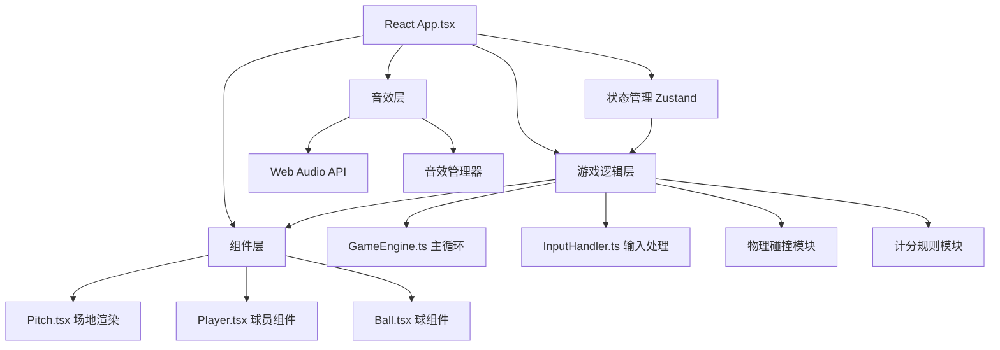

## 1. 架构设计



## 2. 技术描述

- **前端框架**：React 18 + TypeScript 5 + Vite 5
- **状态管理**：Zustand 4
- **动画库**：Framer Motion 11
- **渲染方式**：HTML5 Canvas 2D
- **音效**：Web Audio API（程序化生成，无外部音频文件）
- **构建工具**：Vite + @vitejs/plugin-react
- **样式方案**：CSS Modules + CSS Variables

## 3. 目录结构

```
├── package.json
├── vite.config.js
├── tsconfig.json
├── index.html
├── src/
│   ├── App.tsx              # 根组件，模式管理，状态路由
│   ├── components/
│   │   ├── Pitch.tsx        # 场地Canvas渲染
│   │   ├── Player.tsx       # 球员定义与渲染
│   │   ├── Ball.tsx         # 球定义与渲染
│   │   ├── ScoreBoard.tsx   # 计分板组件
│   │   ├── GameMenu.tsx     # 主菜单组件
│   │   └── GameResult.tsx   # 结算界面组件
│   ├── game/
│   │   ├── GameEngine.ts    # 游戏主循环
│   │   ├── InputHandler.ts  # 键盘输入处理
│   │   ├── physics.ts       # 物理碰撞检测
│   │   ├── rules.ts         # 游戏规则逻辑
│   │   └── audio.ts         # Web Audio音效管理
│   ├── store/
│   │   └── useGameStore.ts  # Zustand状态管理
│   ├── types/
│   │   └── index.ts         # TypeScript类型定义
│   └── utils/
│       └── constants.ts     # 游戏常量配置
```

## 4. 核心数据结构

### 4.1 类型定义

```typescript
// 游戏模式
type GameMode = 'menu' | 'single' | 'double' | 'result';
type GameStatus = 'idle' | 'playing' | 'paused' | 'ended';

// 球员状态
interface Player {
  id: number;
  x: number;
  y: number;
  vx: number;
  vy: number;
  angle: number;           // 朝向角度（弧度）
  color: string;           // '#c04040' | '#3060b0'
  action: 'idle' | 'run' | 'kick' | 'jump';
  kickCharge: number;      // 蓄力值 0-1
  touchCount: number;      // 连续触球次数
  hasBall: boolean;        // 是否控球
  bufferTime: number;      // 碰撞缓冲时间
}

// 球状态
interface Ball {
  x: number;
  y: number;
  vx: number;
  vy: number;
  mass: number;            // 1单位
  elasticity: number;      // 弹性系数0.8
  friction: number;        // 摩擦力0.02
  radius: number;          // 7px
}

// 得分点
interface ScorePoint {
  id: number;
  x: number;
  y: number;
  active: boolean;
}

// 球门
interface Goal {
  x: number;
  y: number;
  width: number;           // 60px 或 40px
  height: number;          // 40px
  side: 'left' | 'right';
}

// 游戏输入状态
interface PlayerInput {
  left: boolean;
  right: boolean;
  up: boolean;
  down: boolean;
  kick: boolean;
  kickHold: number;        // 按住时间 ms
}

// 游戏状态
interface GameState {
  mode: GameMode;
  status: GameStatus;
  timeRemaining: number;   // 剩余时间（秒）
  score1: number;          // 红方/玩家得分
  score2: number;          // 蓝方得分（双人模式）
  players: Player[];
  ball: Ball;
  scorePoints: ScorePoint[];
  goals: Goal[];
  goalWidth: 'normal' | 'narrow';
  lastTouchPlayerId: number | null;
}
```

## 5. 游戏引擎核心流程

### 5.1 主循环（60fps）
```
每一帧执行：
1. 输入采样（InputHandler）
2. 更新球员位置和状态
3. 更新球的物理位置
4. 碰撞检测
   - 球 vs 球员
   - 球 vs 边界
   - 球 vs 球门
   - 球 vs 得分点（单人模式）
5. 应用游戏规则
   - 计分判定
   - 球权交换
   - 得分点刷新
6. 状态更新（Zustand）
7. Canvas渲染
```

### 5.2 碰撞检测算法
- **球与球员**：圆形碰撞检测，距离 < 球员半径 + 球半径
- **球与边界**：AABB碰撞，触边后速度分量反转
- **球与球门**：球完全越过门线判定进球
- **反射角**：碰撞法线 = 入射角，速度 *= 弹性系数

### 5.3 输入映射
| 按键 | 玩家1 | 玩家2 |
|------|-------|-------|
| A | 左转 | - |
| D | 右转 | - |
| W | 加速 | - |
| S | 减速 | - |
| 空格 | 踢球 | - |
| ← | - | 左转 |
| → | - | 右转 |
| ↑ | - | 加速 |
| ↓ | - | 减速 |
| Shift | - | 踢球 |

## 6. 性能指标

- **帧率**：目标60fps，平均帧耗时 ≤ 16.7ms
- **输入延迟**：按键到动作更新 ≤ 50ms
- **绘制调用**：Canvas每帧 ≤ 1200次draw call
- **内存**：音效缓冲实例 ≤ 5个
- **响应式**：<768px时自动缩放70%

## 7. 音效设计（Web Audio API）

| 音效 | 技术参数 |
|------|----------|
| 踢球声 "砰" | 200Hz方波，0.05秒，快速衰减 |
| 跑动沙声 | 200-400Hz白噪声，循环，低通滤波 |
| 球门柱 "咚" | 80Hz正弦波，0.2秒，指数衰减 |
| 进球小调 | C(262Hz) → E(330Hz) → G(392Hz)，各0.15秒 |

## 8. 性能优化策略

1. **Canvas分层**：静态背景层（场地、球门）预渲染离屏Canvas
2. **脏矩形渲染**：仅重绘变化区域
3. **对象池**：得分点对象复用，避免频繁GC
4. **requestAnimationFrame**：与浏览器刷新率同步
5. **状态批量更新**：Zustand批量更新减少重渲染
6. **音效复用**：AudioNode池化管理
