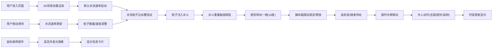

## 1. 产品概述

古代水运仪象台（苏颂水钟）3D交互可视化项目，在虚拟北宋汴京天文院中重现约12米高的五层木构仪象台，通过水流驱动机械结构计时，用户可交互控制水流速率观察整套机械联动系统。

- 主要目的：以数字化方式重现中国古代科技瑰宝，让用户直观理解水运仪象台的机械原理和计时机制
- 目标用户：历史爱好者、科技史研究者、学生及普通大众
- 产品价值：传承中华科技文明，提供沉浸式互动学习体验

## 2. 核心功能

### 2.1 功能模块

1. **3D场景模块**：水运仪象台主体建筑、枢轮、水斗、擒纵器、齿轮传动系统、报时木阁
2. **水流系统模块**：天河水槽、水流粒子系统、水花溅起特效、水流阀门控制
3. **机械联动模块**：枢轮旋转、擒纵器摆动、齿轮组传动、链条传动
4. **报时系统模块**：十二时辰显示、木人击鼓/摇铃/敲钟动作、报时提示文字
5. **交互控制模块**：水流阀门滑块控制、鼠标悬停信息卡片、视角交互

### 2.3 页面详情

| 页面名称 | 模块名称 | 功能描述 |
|-----------|-------------|---------------------|
| 主场景 | 3D仪象台 | 完整展示五层木构仪象台，包含浑仪、浑象、报时木阁、枢轮等核心结构 |
| 主场景 | 水流控制系统 | 右上角滑块控制水流速率(0-100%)，实时影响枢轮转速 |
| 主场景 | 信息显示系统 | 左上角显示当前时辰、枢轮角度，鼠标悬停显示部件信息卡片 |
| 主场景 | 粒子特效系统 | 水流粒子沿水槽流动，落入水斗时溅起水花动画 |
| 主场景 | 机械动画系统 | 枢轮旋转、擒纵器摆动、齿轮传动、报时木人动作 |

## 3. 核心流程

## 4. 用户界面设计

### 4.1 设计风格

- **整体风格**：古风科技，仿古木构建筑美学，融合机械精密感
- **主色调**：深赭色#6b4226、浅木色#d4a76a、青铜色#8b7d3c、琉璃瓦青#2e8b57
- **点缀色**：水蓝色#4fc3f7（水流）、金色#ffd700（高亮）、橘黄#ff8c00（晨昏渐变）
- **背景**：晨昏渐变圆环，底部橘黄#ff8c00过渡到顶部天蓝#87ceeb
- **材质质感**：木材纹理、金属光泽（CSS渐变+阴影模拟）、半透明水流
- **动效风格**：缓动动画(ease-in-out 0.3-0.5s)、平滑过渡、60fps流畅体验

### 4.2 页面设计概述

| 页面名称 | 模块名称 | UI元素 |
|-----------|-------------|-------------|
| 主场景 | 3D场景 | 五层仪象台建筑、枢轮36水斗72拨牙、水槽、齿轮组、链条、报时木人 |
| 主场景 | 背景 | 晨昏渐变圆环(橘黄→天蓝)、古风氛围 |
| 主场景 | 右上角控件 | 水流阀门滑块(0-100%)、数值显示、仿古样式 |
| 主场景 | 左上角信息 | 当前时辰(十二地支)、枢轮角度显示 |
| 主场景 | 信息卡片 | 鼠标跟随、部件名称/功能/当前状态 |
| 主场景 | 粒子系统 | 浅蓝色半透明方块水流(50-80个)、水花消散动画(0.2s) |

### 4.3 响应式

- **设计优先**：桌面端优先，1366x768以上屏幕全屏铺满
- **适配策略**：Canvas自适应窗口尺寸，UI元素使用固定定位+百分比布局
- **性能保障**：requestAnimationFrame驱动，粒子数≤100，避免卡顿

### 4.4 3D场景指导

- **环境与氛围**：北宋汴京天文院虚拟场景，晨昏渐变天空，柔和古风光照
- **光照设置**：主光源模拟日光，环境光提供基础照明，金属部件高光反射
- **相机设置**：初始视角为正面中景，可通过鼠标拖拽旋转、滚轮缩放
- **构图**：仪象台位于画面中心，占据主要视觉空间，背景天空营造纵深感
- **交互**：鼠标悬停部件高亮发光，点击选中显示详情，滑块控制水流
- **后处理**：轻微泛光效果增强金属质感，色彩分级营造古画风
- **性能预算**：总面数控制在合理范围，粒子系统动态管理，帧率稳定60fps
