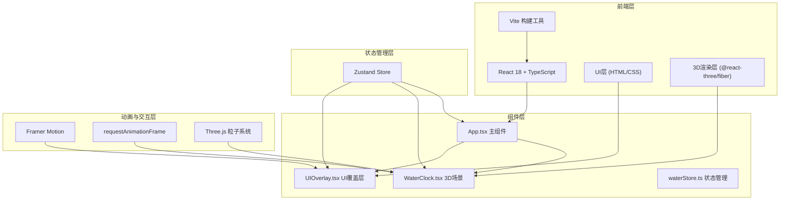

## 1. 架构设计



## 2. 技术描述

- **前端框架**：React 18 + TypeScript
- **构建工具**：Vite 5.x
- **3D引擎**：Three.js + @react-three/fiber + @react-three/drei
- **状态管理**：Zustand
- **动画库**：Framer Motion
- **开发服务器**：Vite devServer (端口3000)

## 3. 核心依赖

| 依赖包 | 版本 | 用途 |
|-------|------|------|
| react | ^18.2.0 | 前端框架 |
| react-dom | ^18.2.0 | React DOM渲染 |
| typescript | ^5.0.0 | 类型安全 |
| vite | ^5.0.0 | 构建工具 |
| @vitejs/plugin-react | ^4.0.0 | Vite React插件 |
| three | ^0.160.0 | 3D渲染引擎 |
| @react-three/fiber | ^8.15.0 | Three.js React渲染器 |
| @react-three/drei | ^9.92.0 | R3F辅助组件库 |
| framer-motion | ^10.16.0 | 动画库 |
| zustand | ^4.4.0 | 状态管理 |
| @types/react | ^18.2.0 | React类型定义 |
| @types/react-dom | ^18.2.0 | React DOM类型定义 |
| @types/three | ^0.160.0 | Three.js类型定义 |

## 4. 目录结构

```
auto116/
├── .trae/documents/
│   ├── PRD.md
│   └── TechnicalArchitecture.md
├── src/
│   ├── components/
│   │   ├── WaterClock.tsx      # 3D场景主组件
│   │   └── UIOverlay.tsx       # UI覆盖层组件
│   ├── store/
│   │   └── waterStore.ts       # Zustand状态管理
│   ├── App.tsx                 # 应用主组件
│   └── main.tsx                # 入口文件
├── index.html                  # HTML入口
├── package.json                # 项目依赖
├── tsconfig.json               # TypeScript配置
└── vite.config.js              # Vite配置
```

## 5. 数据模型

### 5.1 Store 状态定义

```typescript
interface WaterStore {
  flowRate: number;              // 水流速率 0-100
  pivotAngle: number;            // 枢轮角度 (度)
  currentShiChen: string;        // 当前时辰 (子丑寅卯...)
  timeProgress: number;          // 时间进度 0-360度
  isAnimating: boolean;          // 是否正在动画
  hoveredPart: HoveredPart | null; // 当前悬停部件
  mousePosition: { x: number; y: number }; // 鼠标位置
  setFlowRate: (rate: number) => void;
  tickPivotWheel: (deltaTime: number) => void;
  setHoveredPart: (part: HoveredPart | null) => void;
  setMousePosition: (x: number, y: number) => void;
}

interface HoveredPart {
  name: string;
  description: string;
  function: string;
  currentValue: string;
}
```

### 5.2 报时动作类型

```typescript
type BaoShiAction = 'drum' | 'bell' | 'gong'; // 击鼓、摇铃、敲钟

interface TimeAction {
  shiChen: string;
  action: BaoShiAction;
  layer: number; // 木阁层数 1-5
}
```

## 6. 核心算法

### 6.1 枢轮转速计算

```typescript
// 水流速率0-100%对应转速：最慢5秒/格，最快0.5秒/格
// 每格10度，36格一圈
const getRotationSpeed = (flowRate: number): number => {
  const minInterval = 0.5;  // 最快0.5秒/格
  const maxInterval = 5.0;  // 最慢5秒/格
  const interval = maxInterval - (flowRate / 100) * (maxInterval - minInterval);
  const degreesPerSecond = 10 / interval; // 度/秒
  return degreesPerSecond * (Math.PI / 180); // 转换为弧度
};
```

### 6.2 时辰计算

```typescript
const SHI_CHEN = ['子', '丑', '寅', '卯', '辰', '巳', '午', '未', '申', '酉', '戌', '亥'];

const getCurrentShiChen = (angle: number): string => {
  // 枢轮转一圈360度对应12个时辰，每个时辰30度
  const index = Math.floor(angle / 30) % 12;
  return SHI_CHEN[index];
};
```

### 6.3 粒子系统更新

```typescript
// 粒子沿水槽下落，碰到水斗触发水花
const updateParticles = (particles: Particle[], flowRate: number, pivotAngle: number) => {
  particles.forEach((p, i) => {
    if (p.active) {
      p.y -= p.speed * flowRate;
      p.x += Math.sin(p.y * 0.1) * 0.02;
      
      // 检测是否落入当前水斗
      const bucketAngle = getCurrentBucketAngle(pivotAngle);
      if (isInBucket(p, bucketAngle)) {
        p.active = false;
        createSplash(p.x, p.y, p.z); // 创建水花
        triggerBucketFill(); // 触发水斗注水
      }
      
      // 超出边界重置
      if (p.y < -5) resetParticle(p);
    }
  });
};
```

## 7. 性能优化策略

1. **requestAnimationFrame**：所有动画使用RAF驱动，确保60fps
2. **粒子数量控制**：最大100个粒子，动态复用粒子对象池
3. **几何复用**：相同部件使用InstancedMesh减少draw call
4. **状态更新节流**：非关键状态更新节流到16ms
5. **内存管理**：及时 dispose 不需要的几何体和材质
6. **层级优化**：合理设置物体层级，减少矩阵计算
