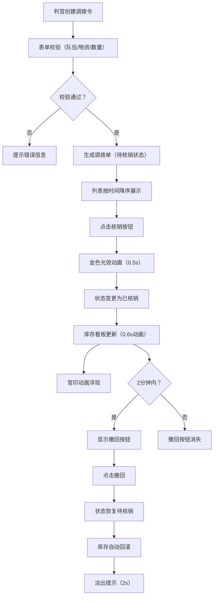

## 1. 产品概述
唐代安西都护府龟兹镇军用物资调拨与核销管理系统，模拟古代军需官工作流程，实现粮草军械的分配、签收、核销全链路追踪。
- 核心用户：安西都护府判官、军需官
- 核心价值：实现物资流转的透明化、规范化管理，确保军令准确执行

## 2. 核心功能

### 2.1 用户角色
| 角色 | 登录方式 | 核心权限 |
|------|----------|----------|
| 判官 | 无需登录（模拟系统） | 创建调拨令、核销物资、撤回操作、查看库存 |

### 2.2 功能模块
1. **调拨令管理**：创建调拨单、列表展示、状态追踪
2. **物资核销**：一键核销、金色光效动画、库存联动
3. **库存看板**：实时物资余量展示、竖向条形图、颜色渐变
4. **撤回机制**：2分钟内可撤回已核销单据、库存自动回滚
5. **筛选统计**：按队伍筛选、统计条展示、列表虚拟化

### 2.3 页面详情
| 页面名称 | 模块名称 | 功能描述 |
|----------|----------|----------|
| 主页面 | 调拨令表单 | 队伍选择（先锋营/左骑营/右骑营/后军辎重营/斥候队）、物资选择（粮草/箭矢/甲胄/马匹/药材）、数量输入（1-1000）、表单校验 |
| 主页面 | 调拨单列表 | 卡片式展示、状态标签（待核销/已核销）、核销按钮、撤回按钮、创建时间排序 |
| 主页面 | 库存看板 | 五种物资余量条形图、深赭色到军绿色渐变、实时更新动画 |
| 主页面 | 统计条 | 总单数、待核销数、已核销数、仿古楷体 |
| 主页面 | 筛选器 | 按队伍名筛选下拉菜单、淡出动画 |

## 3. 核心流程
判官创建调拨令 → 系统校验表单 → 生成调拨单并加入列表 → 军需官领取物资后点击核销 → 金色光效动画 → 状态更新为已核销 → 库存余量同步减少 → 2分钟内可撤回 → 库存回滚状态恢复

## 4. 用户界面设计

### 4.1 设计风格
- **主色调**：土黄#d7ccc8、深褐#3e2723
- **辅助色**：朱红#c04040（待核销）、翠绿#2e7d32（已核销）、金色#ffd700（光效）、米白#fff8e1（卡片背景）
- **字体**：仿古楷体/仿宋衬线字体
- **按钮风格**：圆角矩形、悬停阴影加深、过渡0.2s
- **布局风格**：左右两栏（左65%右35%）、卡片式列表、竖向条形图
- **图标风格**：古代军镇元素、队伍专属图标

### 4.2 页面设计概述
| 页面名称 | 模块名称 | UI元素 |
|----------|----------|--------|
| 主页面 | 调拨令表单 | 下拉选择框、数字输入框、提交按钮、错误提示 |
| 主页面 | 调拨单卡片 | 队伍图标、名称、物资类别、数量、状态标签、操作按钮、悬停阴影 |
| 主页面 | 库存看板 | 深褐背景#4e342e、圆角12px、内边距20px、竖向条形图、渐变色彩 |
| 主页面 | 统计条 | 仿古楷体、主色调#3e2723、辅助色#a1887f |
| 主页面 | 官印动画 | 金色、由小变大0.6s、停留1s、淡出 |

### 4.3 响应式
- 桌面端：左右两栏布局（左65%右35%）
- 移动端（<768px）：上下堆叠布局
- 触控优化：按钮最小44x44px、手势友好

### 4.4 动效设计
- 核销光效：framer-motion opacity 0.3→1循环两次，0.5秒
- 库存更新：高度变化动画0.6秒easeOut
- 卡片筛选：0.3秒错开淡出
- 撤回提示：底部居中淡出，2秒自动消失
- 官印动画：缩放0.6s + 停留1s + 淡出
- 卡片悬停：阴影加深过渡0.2s
