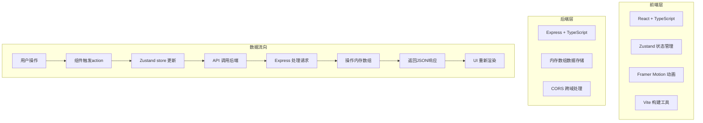
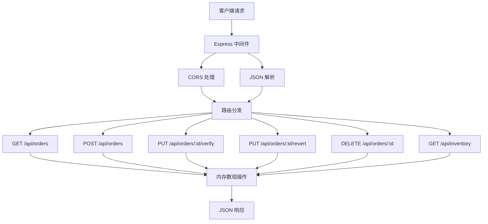
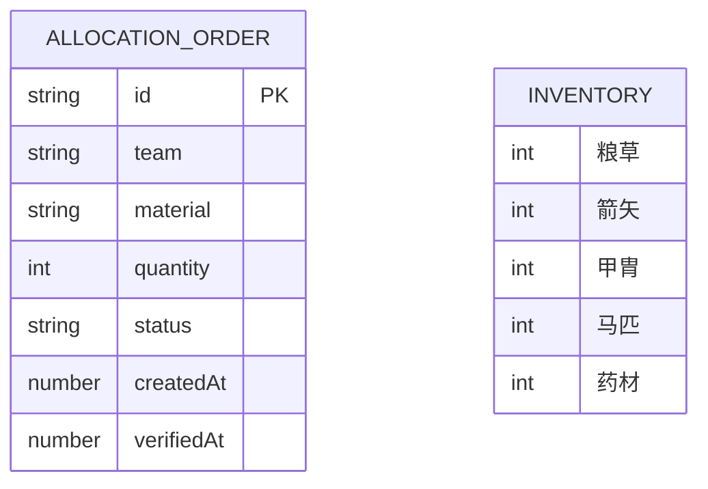

## 1. 架构设计



## 2. 技术描述
- **前端**：React@18 + TypeScript + Vite + Zustand + Framer Motion + uuid
- **后端**：Express@4 + TypeScript + CORS
- **构建工具**：Vite
- **数据存储**：内存数组模拟（无需数据库）
- **开发服务**：Vite开发服务器（端口5173）+ Express后端（端口3001）
- **代理配置**：Vite代理/api请求至后端3001端口

## 3. 路由定义
| 路由 | 用途 |
|------|------|
| / | 主页面，包含所有功能模块 |

## 4. API 定义

### 4.1 类型定义
```typescript
// 队伍类型
type Team = '先锋营' | '左骑营' | '右骑营' | '后军辎重营' | '斥候队';

// 物资类型
type Material = '粮草' | '箭矢' | '甲胄' | '马匹' | '药材';

// 调拨单状态
type OrderStatus = 'pending' | 'verified';

// 调拨单接口
interface AllocationOrder {
  id: string;
  team: Team;
  material: Material;
  quantity: number;
  status: OrderStatus;
  createdAt: number;
  verifiedAt?: number;
}

// 库存接口
interface Inventory {
  粮草: number;
  箭矢: number;
  甲胄: number;
  马匹: number;
  药材: number;
}

// API响应接口
interface ApiResponse<T> {
  success: boolean;
  data?: T;
  error?: string;
  statusCode: number;
}
```

### 4.2 接口列表
| 方法 | 路径 | 描述 | 请求体 | 响应 |
|------|------|------|--------|------|
| GET | /api/orders | 获取所有调拨单 | - | `{ success: true, data: AllocationOrder[] }` |
| POST | /api/orders | 创建调拨单 | `{ team, material, quantity }` | `{ success: true, data: AllocationOrder }` |
| PUT | /api/orders/:id/verify | 核销调拨单 | - | `{ success: true, data: AllocationOrder }` |
| PUT | /api/orders/:id/revert | 撤回核销 | - | `{ success: true, data: AllocationOrder }` |
| DELETE | /api/orders/:id | 删除调拨单 | - | `{ success: true, statusCode: 200 }` |
| GET | /api/inventory | 获取当前库存 | - | `{ success: true, data: Inventory }` |

### 4.3 错误响应
```typescript
{
  success: false,
  error: string,
  statusCode: 400 | 404 | 500
}
```

## 5. 服务器架构图



## 6. 数据模型

### 6.1 数据模型定义


### 6.2 初始数据
```typescript
// 初始库存
const initialInventory: Inventory = {
  粮草: 500,
  箭矢: 500,
  甲胄: 500,
  马匹: 500,
  药材: 500
};

// 初始调拨单（空数组）
const orders: AllocationOrder[] = [];
```

## 7. 性能优化策略
- **列表虚拟化**：卡片数量超过50张时，只渲染可见区域15-20张
- **库存重算**：使用O(1)复杂度计算，确保10ms内完成
- **动画优化**：使用transform和opacity属性触发GPU加速
- **状态管理**：Zustand轻量级状态管理，避免不必要的重渲染
- **TypeScript严格模式**：编译时类型检查，减少运行时错误

## 8. 项目文件结构
```
auto117/
├── package.json
├── vite.config.js
├── tsconfig.json
├── index.html
├── server/
│   └── index.ts          # Express后端
└── src/
    ├── App.tsx           # 主组件
    ├── components.tsx    # 所有子组件
    ├── store.ts          # Zustand状态管理
    └── api.ts            # API请求封装
```
