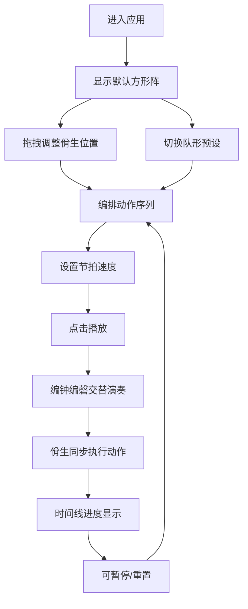

## 1. 产品概述

古代佾舞（八佾舞）表演编排与礼乐节奏同步交互式浏览器工具，让用户在虚拟的明代太庙中扮演太常寺乐舞官，编排佾生队形与动作序列，实现舞蹈动作与编钟、编磬礼乐节奏的严格同步。

- 目标用户：文化爱好者、传统音乐舞蹈研究者、教育工作者
- 产品价值：传承中华礼乐文化，提供沉浸式的古代雅乐编排体验

## 2. 核心功能

### 2.1 用户角色

| 角色 | 注册方式 | 核心权限 |
|------|----------|----------|
| 乐舞官 | 无需注册 | 编排佾生队形、设计动作序列、控制礼乐播放、导出编排方案 |

### 2.2 功能模块

1. **主舞台**：丹陛场景绘制、佾生队列展示、编钟编磬布局、队形交互编排
2. **控制面板**：节奏设置、队形预设、播放控制、节拍器显示
3. **时间线面板**：动作序列编辑、拖拽调整、进度可视化
4. **音频引擎**：编钟编磬音色模拟、节拍触发、礼乐同步

### 2.3 页面详情

| 页面名称 | 模块名称 | 功能描述 |
|----------|----------|----------|
| 主舞台 | 丹陛与佾生队列 | Canvas绘制8x8网格丹陛，支持点击选择佾生，拖拽调整位置（网格吸附），显示64个佾生圆形色块（文舞绿色#2e7d32，武舞红色#c62828） |
| 主舞台 | 编钟编磬布局 | 舞台两侧绘制编钟编磬，播放时高亮当前发声乐器 |
| 控制面板 | 节奏设置 | 滑动条设置节拍速度（24-72 BPM），带刻度标记 |
| 控制面板 | 队形预设 | 四种队形预设（方形阵、雁行阵、圆阵、一字长蛇阵），切换时0.5秒步进移动伴随铜铃音效 |
| 控制面板 | 播放控制 | 播放/暂停/重置按钮，节拍器实时显示当前节拍 |
| 时间线面板 | 动作编排 | 为每个佾生分配6种动作（执羽、秉翟、三献、复位、旋转、行礼），时间线单位为八分之一拍，支持拖拽调整动作起始时间 |
| 可视化反馈 | 播放同步 | 时间线绿色进度条推进，当前拍佾生金色#ffd700边框高亮（0.2秒），动作名称白色半透明文字显示 |

## 3. 核心流程

用户进入应用 → 查看默认8x8方形佾生队列 → 选择佾生并拖拽调整位置（或切换队形预设）→ 为佾生编排动作序列 → 设置礼乐节拍速度 → 点击播放 → 编钟编磬按节拍交替演奏 → 佾生随节拍同步执行动作 → 时间线同步显示进度 → 可暂停/重置/重新编排

## 4. 用户界面设计

### 4.1 设计风格

- **主色调**：深红色#8b0000（大漆地面）、浅灰#d4c9a8到#c4b99a渐变（丹陛石阶）、暗金色#b8963e（飞檐装饰）、棕色#8b4513（交互元素）
- **佾生颜色**：文舞绿色#2e7d32，武舞红色#c62828，高亮金色#ffd700
- **按钮风格**：圆角矩形，棕色系，悬停亮度+20%
- **字体**：标题使用宋体/思源宋体，正文使用系统无衬线字体，营造古雅氛围
- **布局风格**：舞台居中，控制面板底部悬浮，时间线内嵌于控制面板
- **视觉效果**：毛玻璃半透明面板、阴影层级、精细纹理、金色描边装饰

### 4.2 页面设计概述

| 页面名称 | 模块名称 | UI元素 |
|----------|----------|--------|
| 主舞台 | 舞台区域 | 深红色大漆地面、浅灰色丹陛石阶纹理、顶部暗金色飞檐装饰线、两侧编钟编磬阵列、中央8x8网格佾生队列 |
| 主舞台 | 佾生元素 | 直径30px圆形、1px黑色描边、选中时8px同色阴影（透明度0.3）、播放时金色边框高亮0.2秒、上方14px白色半透明动作文字 |
| 控制面板 | 面板容器 | 背景rgba(255,255,255,0.15)、backdrop-filter: blur(10px)、底部自适应宽度 |
| 控制面板 | 控制组件 | 棕色系按钮和滑动条、刻度标记、节拍器脉冲动画 |
| 时间线面板 | 时间线 | 网格背景、动作色块、绿色进度条、拖拽手柄 |

### 4.3 响应式设计

- **桌面优先**：舞台区域占视口高度65%以上，控制面板高度不低于120px
- **移动适配**：宽度小于768px时，控制面板改为横向滚动排列，佾生尺寸自适应缩小
- **触摸优化**：增大触摸热区，支持移动端拖拽操作

## 5. 性能要求

- 舞台刷新率保持50FPS以上
- 64个佾生同时移动时动画不卡顿
- 声音播放延迟不超过50ms
- Canvas绘制优化，使用requestAnimationFrame
