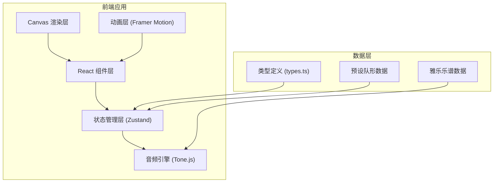

## 1. 架构设计



## 2. 技术栈描述

- **前端框架**：React@18 + TypeScript@5
- **构建工具**：Vite@5 + @vitejs/plugin-react@4
- **状态管理**：Zustand@4
- **动画库**：Framer Motion@11
- **音频引擎**：Tone.js@14
- **样式方案**：CSS Modules + CSS Variables

## 3. 项目结构

```
├── package.json
├── vite.config.js
├── tsconfig.json
├── index.html
└── src/
    ├── types.ts          # 类型定义
    ├── store.ts          # Zustand 状态管理
    ├── components/
    │   ├── DanceStage.tsx      # Canvas 舞台组件
    │   ├── ControlPanel.tsx    # 控制面板组件
    │   ├── Timeline.tsx        # 时间线组件
    │   └── AudioEngine.ts      # 音频引擎
    ├── data/
    │   ├── formations.ts       # 队形预设数据
    │   └── score.ts            # 雅乐乐谱数据
    └── App.tsx           # 主应用组件
```

## 4. 路由定义

| 路由 | 用途 |
|------|------|
| / | 主应用页面（单页应用，无多路由） |

## 5. 类型定义

### 5.1 核心类型

```typescript
// 佾生类型
type DancerType = 'civil' | 'military';

// 动作类型
type ActionType = 'holdFeather' | 'holdDi' | 'threeOfferings' | 'reset' | 'rotate' | 'bow';

// 动作指令
interface DanceAction {
  id: string;
  type: ActionType;
  startBeat: number;      // 起始拍（八分之一拍为单位）
  duration: number;       // 持续拍数
}

// 佾生状态
interface Dancer {
  id: string;
  type: DancerType;
  gridX: number;          // 网格位置 X (0-7)
  gridY: number;          // 网格位置 Y (0-7)
  targetGridX?: number;   // 动画目标位置
  targetGridY?: number;
  actions: DanceAction[]; // 动作序列
  isHighlighted: boolean; // 是否高亮
}

// 队形预设
interface Formation {
  name: string;
  positions: { dancerId: string; gridX: number; gridY: number }[];
}

// 乐谱节拍
interface ScoreBeat {
  beat: number;
  instrument: 'bell' | 'chime';
  note: string;
}

// 播放状态
interface PlaybackState {
  isPlaying: boolean;
  currentBeat: number;    // 当前拍（八分之一拍为单位）
  bpm: number;            // 节拍速度 24-72
  totalBeats: number;     // 总拍数
}

// 应用状态
interface AppState {
  dancers: Dancer[];
  selectedDancerId: string | null;
  playback: PlaybackState;
  formations: Formation[];
  currentFormationIndex: number;
}
```

## 6. 状态管理设计

### 6.1 Zustand Store Actions

```typescript
interface AppStore extends AppState {
  // 佾生操作
  selectDancer: (id: string | null) => void;
  moveDancer: (id: string, gridX: number, gridY: number) => void;
  addAction: (dancerId: string, action: Omit<DanceAction, 'id'>) => void;
  removeAction: (dancerId: string, actionId: string) => void;
  updateActionTime: (dancerId: string, actionId: string, startBeat: number) => void;
  
  // 队形操作
  applyFormation: (index: number) => void;
  transitionToFormation: (index: number) => void;
  
  // 播放控制
  setBpm: (bpm: number) => void;
  play: () => void;
  pause: () => void;
  reset: () => void;
  setCurrentBeat: (beat: number) => void;
  
  // 高亮控制
  highlightDancer: (id: string) => void;
  clearHighlights: () => void;
}
```

## 7. 核心实现要点

### 7.1 Canvas 舞台渲染
- 使用 `requestAnimationFrame` 确保50FPS以上刷新率
- 网格吸附算法：`Math.round(canvasX / cellSize)` 转换为网格坐标
- 佾生移动动画：每0.5秒步进一格，使用插值计算中间位置
- 批量绘制优化：先绘制背景和网格，再统一绘制佾生

### 7.2 音频引擎 (Tone.js)
- 编钟音色：使用 `Oscillator` + `LowpassFilter` + `Reverb` 模拟低频浑厚音色
- 编磬音色：使用 `Oscillator` + `HighpassFilter` + `Delay` 模拟高频清脆音色
- 铜铃音效：短脉冲 `SineOscillator` 快速衰减
- 节拍调度：使用 `Tone.Transport.scheduleRepeat` 保证同步精度

### 7.3 时间同步机制
- 时间线单位：1拍 = 8个单位（八分之一拍精度）
- 每拍触发：编钟/编磬交替发声，同时更新当前拍佾生动作
- 高亮同步：动作触发时设置 `isHighlighted = true`，0.2秒后自动重置

### 7.4 队形过渡动画
- 步进间隔：0.5秒/格
- 音效同步：每步移动触发铜铃音效
- 动画队列：使用 `setTimeout` 链式调用实现逐格移动

### 7.5 响应式布局
- Canvas 尺寸随容器自适应
- 网格单元大小动态计算：`Math.min(containerWidth, containerHeight) / 8`
- 移动端：横向滚动控制面板，佾生最小尺寸20px
