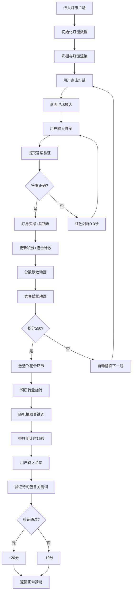

## 1. 产品概述

宋代灯市灯谜互动平台，模拟古代灯市上灯谜悬挂、猜谜互动与行酒令积分结算的全栈Web应用。解决传统灯谜活动中谜面与谜底管理混乱、猜谜过程缺乏实时反馈、以及聚会中行酒令规则难以自动执行和计分的问题。

- 目标用户：传统文化爱好者、聚会组织者、家庭娱乐用户
- 市场价值：传承中华传统文化，提供沉浸式的线上灯谜互动体验，结合行酒令玩法增强社交娱乐性

## 2. 核心功能

### 2.1 用户角色

| 角色 | 注册方式 | 核心权限 |
|------|----------|----------|
| 普通玩家 | 自动分配临时ID | 猜灯谜、参与飞花令、查看积分榜 |
| 管理员 | 后台登录 | 管理灯谜库、诗词库、查看历史记录 |

### 2.2 功能模块

1. **灯市主场**：宋代彩棚3D视觉、走马灯动画、三层灯谜悬挂、猜谜对话框、宾客角色动画
2. **猜谜系统**：灯谜点击交互、答案验证、实时反馈（正确/错误动画）、自动替换下一题
3. **积分与连击系统**：基础得分、连击奖励、分数飘散动画、积分榜展示
4. **飞花令系统**：铜质转盘、关键词随机抽取、诗句验证、倒计时香柱
5. **后台管理**：灯谜CRUD、诗词库管理、历史记录查询、数据统计

### 2.3 页面详情

| 页面名称 | 模块名称 | 功能描述 |
|----------|----------|----------|
| 灯市主场 | 彩棚展示区 | CSS绘制宋代彩棚，青砖地面、朱红木柱、八角攒尖顶、走马灯旋转动画 |
| 灯市主场 | 灯谜悬挂区 | 上中下三层灯架，分别悬挂诗谜（竹简）、物谜（葫芦）、字谜（方块） |
| 灯市主场 | 猜谜对话框 | 莫高窟莲花卷草纹镶边对话框，输入答案、验证反馈 |
| 灯市主场 | 宾客角色区 | 6个CSS绘制小人围绕彩棚，猜中时鼓掌动画 |
| 灯市主场 | 积分榜 | 竹简造型积分榜，展示前三名玩家分数，隶书字体 |
| 灯市主场 | 飞花令模块 | 铜质转盘、香柱倒计时、诗句对答界面 |
| 后台管理 | 灯谜管理 | 分级/难度/状态筛选，CRUD操作 |
| 后台管理 | 诗词管理 | 诗句库维护，关键词分类 |
| 后台管理 | 数据统计 | 历史积分排行、游戏记录查询 |

## 3. 核心流程

## 4. 用户界面设计

### 4.1 设计风格

**宋式古雅风格**
- 主色调：#6b7b6b（青砖）、#8b2500（朱红）、#f5deb3（古纸）
- 点缀色：#b22222（印章红）、#d4a76a（木黄）、#32cd32（正确绿）
- 按钮风格：圆角矩形，淡褐阴影，悬停微微上浮
- 字体：标题用书法风格字体，正文用宋体/楷体，积分榜用隶书
- 布局：桌面端三列灯架布局，手机端单列布局
- 图标：使用中式传统纹样（云纹、莲花卷草纹）

### 4.2 页面设计概述

| 页面名称 | 模块名称 | UI元素 |
|----------|----------|--------|
| 灯市主场 | 彩棚展示 | 八角攒尖顶、八根朱红木柱、青砖地面、走马灯旋转动画 |
| 灯市主场 | 灯谜卡片 | 竹简（40x15px棕色）、葫芦形（20x30px土黄）、正方形（30x30px米色），红绳系挂 |
| 灯市主场 | 走马灯 | 六角形（60x40px），古纸色灯身，梅兰竹菊四面图案，烛火径向渐变#ffa500至#ff4500 |
| 灯市主场 | 猜谜对话框 | 120x80px，莫高窟莲花卷草纹镶边，居中悬浮/手机端全屏 |
| 灯市主场 | 宾客角色 | 25px身高小人，6个围绕站立，衣着色#e6a8a8至#a8d4e6随机 |
| 灯市主场 | 积分榜 | 300x200px展开竹简，纵向滚动，朱砂红标题"灯市纪勋榜" |
| 灯市主场 | 飞花令转盘 | 直径60px铜质，分"花""月""风""雪"四区，旋转动画 |
| 灯市主场 | 倒计时香柱 | 高80px，顶部灰到底部白渐变，每0.5秒缩短1px |

### 4.3 响应式设计

**桌面优先，移动适配**
- 桌面端（≥768px）：三列灯架布局，猜谜对话框居中悬浮
- 手机端（<768px）：单列灯架布局，灯谜卡片缩小30%，猜谜对话框全屏
- 触摸优化：点击区域≥44x44px，手势滑动切换灯谜

### 4.4 动画与性能

**动画效果**
- 走马灯：缓慢旋转动画（20秒/圈）
- 灯谜点击：弹跳动画（framer-motion）
- 猜中反馈：灯身变绿+铃铛声，分数#c47e3a色向上飘散
- 错误反馈：红色闪烁0.3秒
- 宾客鼓掌：transform: translateY(5px)循环2次，0.2秒
- 转盘旋转：3-5秒缓动旋转

**性能要求**
- 灯盏悬挑动画帧率≥55fps
- 猜谜状态刷新延迟≤30ms
- 飞花令倒计时更新周期精确到100ms
