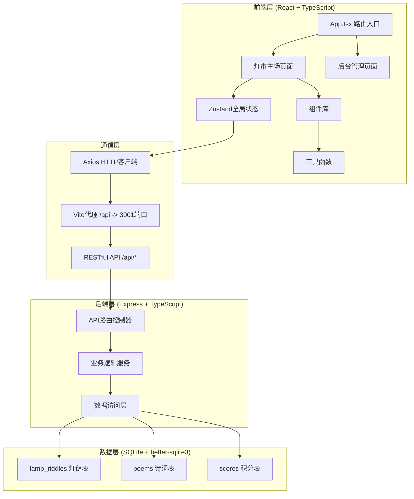
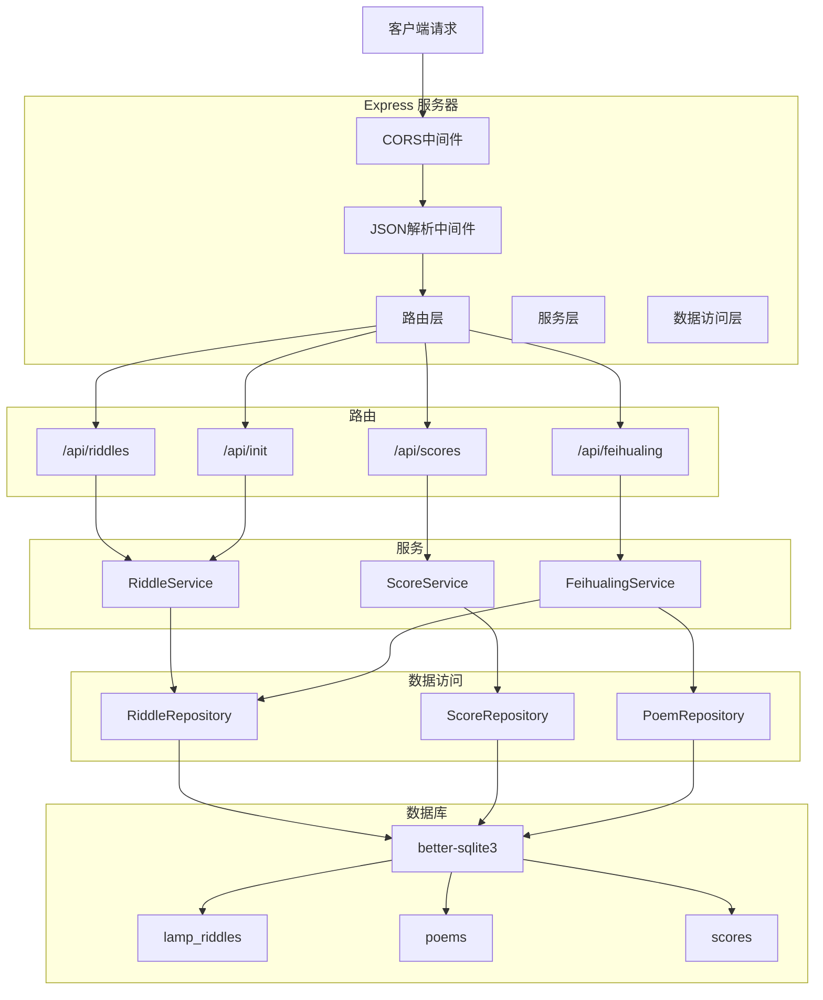
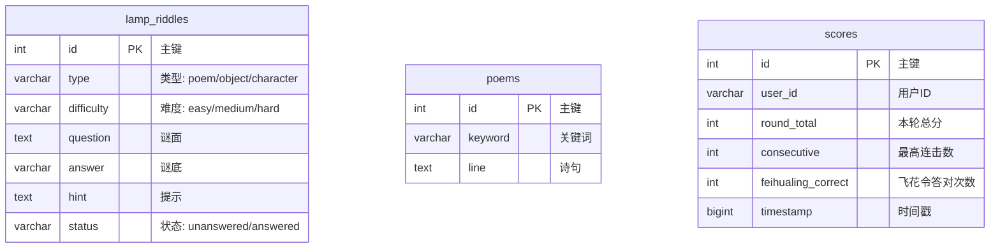

## 1. 架构设计



## 2. 技术描述

- **前端框架**：React 18 + TypeScript 5
- **构建工具**：Vite 5 + @vitejs/plugin-react
- **状态管理**：Zustand 4
- **动画库**：Framer Motion 11
- **HTTP客户端**：Axios 1.6
- **路由**：React Router DOM 6
- **后端框架**：Express 4
- **数据库**：SQLite + better-sqlite3
- **并发启动**：concurrently
- **端口配置**：前端5173，后端3001

## 3. 路由定义

| 路由 | 页面 | 功能 |
|------|------|------|
| / | 灯市主场 | 彩棚展示、灯谜互动、飞花令、积分榜 |
| /admin | 后台管理 | 灯谜管理、诗词管理、数据统计 |

## 4. API 定义

### 4.1 类型定义

```typescript
// 灯谜类型
type RiddleType = 'poem' | 'object' | 'character';
type Difficulty = 'easy' | 'medium' | 'hard';
type RiddleStatus = 'unanswered' | 'answered';

interface Riddle {
  id: number;
  type: RiddleType;
  difficulty: Difficulty;
  question: string;
  answer: string;
  hint: string;
  status: RiddleStatus;
}

// 诗词类型
interface Poem {
  id: number;
  keyword: string;
  line: string;
}

// 积分记录类型
interface ScoreRecord {
  id: number;
  user_id: string;
  round_total: number;
  consecutive: number;
  feihualing_correct: number;
  timestamp: number;
}

// 飞花令数据
interface FeihualingData {
  keyword: string;
  timeLeft: number;
  isActive: boolean;
}
```

### 4.2 接口定义

| 方法 | 路径 | 描述 | 请求体 | 响应 |
|------|------|------|--------|------|
| POST | /api/init | 初始化种子数据 | - | `{ success: boolean, message: string }` |
| GET | /api/riddles | 获取灯谜列表（支持筛选） | query: type, difficulty, status | `Riddle[]` |
| POST | /api/riddles/guess | 提交猜谜答案 | `{ riddleId: number, userId: string, answer: string }` | `{ correct: boolean, score: number, consecutive: number, bonus: number }` |
| GET | /api/scores | 获取积分排行榜 | query: limit | `ScoreRecord[]` |
| POST | /api/scores | 保存积分记录 | `ScoreRecord` | `{ id: number }` |
| POST | /api/feihualing/start | 开始飞花令 | - | `{ keyword: string, poemLine: string }` |
| POST | /api/feihualing/submit | 提交飞花令诗句 | `{ keyword: string, userLine: string, userId: string }` | `{ correct: boolean, score: number }` |

## 5. 服务器架构图



## 6. 数据模型

### 6.1 ER图



### 6.2 DDL 语句

```sql
-- 灯谜表
CREATE TABLE IF NOT EXISTS lamp_riddles (
  id INTEGER PRIMARY KEY AUTOINCREMENT,
  type TEXT NOT NULL CHECK(type IN ('poem', 'object', 'character')),
  difficulty TEXT NOT NULL CHECK(difficulty IN ('easy', 'medium', 'hard')),
  question TEXT NOT NULL,
  answer TEXT NOT NULL,
  hint TEXT,
  status TEXT NOT NULL DEFAULT 'unanswered' CHECK(status IN ('unanswered', 'answered'))
);

-- 诗词表
CREATE TABLE IF NOT EXISTS poems (
  id INTEGER PRIMARY KEY AUTOINCREMENT,
  keyword TEXT NOT NULL,
  line TEXT NOT NULL
);

-- 积分表
CREATE TABLE IF NOT EXISTS scores (
  id INTEGER PRIMARY KEY AUTOINCREMENT,
  user_id TEXT NOT NULL,
  round_total INTEGER NOT NULL DEFAULT 0,
  consecutive INTEGER NOT NULL DEFAULT 0,
  feihualing_correct INTEGER NOT NULL DEFAULT 0,
  timestamp INTEGER NOT NULL
);

-- 创建索引
CREATE INDEX IF NOT EXISTS idx_riddles_type ON lamp_riddles(type);
CREATE INDEX IF NOT EXISTS idx_riddles_difficulty ON lamp_riddles(difficulty);
CREATE INDEX IF NOT EXISTS idx_riddles_status ON lamp_riddles(status);
CREATE INDEX IF NOT EXISTS idx_poems_keyword ON poems(keyword);
CREATE INDEX IF NOT EXISTS idx_scores_user_id ON scores(user_id);
CREATE INDEX IF NOT EXISTS idx_scores_total ON scores(round_total DESC);
```

### 6.3 种子数据

```typescript
// 灯谜种子数据
const seedRiddles = [
  // 诗谜 - 竹简造型
  { type: 'poem', difficulty: 'easy', question: '床前明月光，疑是地上霜。举头望明月，低头思故乡。（打一节日）', answer: '中秋', hint: '月圆人团圆' },
  { type: 'poem', difficulty: 'medium', question: '爆竹声中一岁除，春风送暖入屠苏。（打一节日）', answer: '春节', hint: '新年伊始' },
  { type: 'poem', difficulty: 'hard', question: '但愿人长久，千里共婵娟。（打一花卉）', answer: '月季', hint: '月月盛开' },
  
  // 物谜 - 葫芦形
  { type: 'object', difficulty: 'easy', question: '有面没有口，有脚没有手，虽有四只脚，自己不会走。（打一家具）', answer: '桌子', hint: '吃饭写字都用它' },
  { type: 'object', difficulty: 'medium', question: '身穿绿衣裳，肚里水汪汪，生的子儿多，个个黑脸膛。（打一水果）', answer: '西瓜', hint: '夏天必备' },
  { type: 'object', difficulty: 'hard', question: '小小诸葛亮，独坐中军帐，摆下八卦阵，专捉飞来将。（打一动物）', answer: '蜘蛛', hint: '织网高手' },
  
  // 字谜 - 正方形
  { type: 'character', difficulty: 'easy', question: '一月七日。（打一字）', answer: '脂', hint: '月+七+日' },
  { type: 'character', difficulty: 'medium', question: '一加一，不等于二。（打一字）', answer: '王', hint: '横着看' },
  { type: 'character', difficulty: 'hard', question: '四面都是山，山山都相连。（打一字）', answer: '田', hint: '四个山字叠' },
];

// 诗词种子数据
const seedPoems = [
  { keyword: '花', line: '人面不知何处去，桃花依旧笑春风。' },
  { keyword: '花', line: '竹外桃花三两枝，春江水暖鸭先知。' },
  { keyword: '花', line: '接天莲叶无穷碧，映日荷花别样红。' },
  { keyword: '花', line: '落红不是无情物，化作春泥更护花。' },
  { keyword: '月', line: '明月几时有，把酒问青天。' },
  { keyword: '月', line: '床前明月光，疑是地上霜。' },
  { keyword: '月', line: '海上生明月，天涯共此时。' },
  { keyword: '月', line: '春花秋月何时了，往事知多少。' },
  { keyword: '风', line: '春风又绿江南岸，明月何时照我还。' },
  { keyword: '风', line: '夜来风雨声，花落知多少。' },
  { keyword: '风', line: '随风潜入夜，润物细无声。' },
  { keyword: '风', line: '羌笛何须怨杨柳，春风不度玉门关。' },
  { keyword: '雪', line: '窗含西岭千秋雪，门泊东吴万里船。' },
  { keyword: '雪', line: '忽如一夜春风来，千树万树梨花开。' },
  { keyword: '雪', line: '孤舟蓑笠翁，独钓寒江雪。' },
  { keyword: '雪', line: '梅须逊雪三分白，雪却输梅一段香。' },
];
```

## 7. 项目文件结构

```
auto12/
├── .trae/documents/
│   ├── PRD-宋代灯市灯谜应用.md
│   └── 技术架构-宋代灯市灯谜应用.md
├── server/
│   ├── db.ts          # 数据库初始化与Schema
│   └── index.ts       # Express后端API
├── src/
│   ├── components/
│   │   ├── LanternGrid.tsx    # 彩棚灯架布局
│   │   ├── LanternCard.tsx    # 灯谜卡片组件
│   │   ├── ColorfulShed.tsx   # 彩棚组件
│   │   ├── RevolvingLantern.tsx # 走马灯组件
│   │   ├── GuestCharacter.tsx # 宾客角色组件
│   │   ├── RiddleDialog.tsx   # 猜谜对话框
│   │   ├── ScoreBoard.tsx     # 积分榜
│   │   ├── FeihualingWheel.tsx # 飞花令转盘
│   │   └── IncenseTimer.tsx   # 香柱倒计时
│   ├── store/
│   │   └── riddleStore.ts     # Zustand全局状态
│   ├── utils/
│   │   └── audio.ts           # 音频模块
│   ├── pages/
│   │   ├── LanternMarket.tsx  # 灯市主场
│   │   └── AdminPanel.tsx     # 后台管理
│   ├── App.tsx                # 根组件
│   └── main.tsx               # 入口
├── index.html
├── vite.config.js
├── tsconfig.json
├── package.json
└── README.md
```
