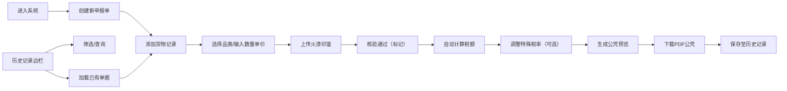

## 1. 产品概述

临安市舶司公凭签发系统是一款模拟南宋海外贸易管理的全栈Web应用，让用户以临安府舶商的身份体验货物申报、税额计算与公凭核发的完整流程。

- 面向对宋代历史、海外贸易文化感兴趣的用户，以及教育场景的历史教学演示
- 以游戏化方式重现南宋市舶司的管理制度，展现古代海关的运作模式

## 2. 核心功能

### 2.1 用户角色

| 角色 | 注册方式 | 核心权限 |
|------|----------|----------|
| 舶商（用户） | 无需注册，直接使用 | 创建申报单、登记货物、上传印鉴、计算税额、下载公凭、管理历史单据 |

### 2.2 功能模块

1. **申报单创建页面**：货物登记表单、火漆印鉴上传、税额实时计算
2. **公凭预览页面**：Canvas绘制公凭预览、朱红印章叠加效果
3. **历史记录管理**：左侧边栏历史申报单列表、筛选查询、单据加载编辑

### 2.3 页面详情

| 页面名称 | 模块名称 | 功能描述 |
|----------|----------|----------|
| 主申报页面 | 仿古横批头部 | 显示"临安市舶司"字样和当前日期 |
| 主申报页面 | 货物登记表单 | 添加/删除货物记录、选择货物品类、输入数量单价、上传火漆印鉴 |
| 主申报页面 | 货物核验标记 | 点击核验通过按钮显示绿色对勾标记和底色变化动画 |
| 主申报页面 | 税额汇总面板 | 固定右下角，按品类显示抽解比例和分项税额、总税额 |
| 主申报页面 | 公凭预览区域 | Canvas绘制公凭样式，叠加朱红市舶司印章 |
| 主申报页面 | 历史记录边栏 | 表格展示历史申报单、支持筛选、点击加载编辑 |

## 3. 核心流程

用户进入系统后，首先看到仿古风格的申报界面。用户添加多条货物记录（选择品名、输入数量和单价、上传火漆印鉴图片），每项货物核验通过后显示绿色标记。系统根据品类自动计算抽解税额，用户可手动调整特殊贡品税率。确认无误后生成公凭预览，点击下载按钮由服务器生成PDF并返回下载链接。所有申报单保存在本地，左侧边栏可查看和管理历史记录。

## 4. 用户界面设计

### 4.1 设计风格

- **主色调**：宣纸白(#faf3e0)背景，仿古墨色(#2c2c2c)文字，朱砂红(#c0392b)强调色，靛蓝(#2980b9)交互色
- **按钮样式**：朱砂红背景、白色文字、圆角8px、hover缩放1.05过渡0.2s
- **字体**：标题使用仿宋体，正文使用清晰易读的宋体/衬线字体
- **布局风格**：宋代书画卷轴风格，左侧边栏历史记录，中间主申报区，右下角税额汇总
- **视觉元素**：木纹边框、卷轴装饰、宣纸纹理背景、朱红印章效果

### 4.2 页面设计概述

| 页面名称 | 模块名称 | UI元素 |
|----------|----------|--------|
| 主申报页面 | 仿古横批头部 | 卷轴样式背景、"临安市舶司"仿宋大字、右侧日期显示 |
| 主申报页面 | 货物登记表单 | 浅木纹色边框包裹、独立卡片式货物记录、阴影3px、圆角8px |
| 主申报页面 | 印鉴上传区 | 虚线边框、拖拽时变为靛蓝色实线、提示文字居中 |
| 主申报页面 | 税额汇总面板 | 半透明白色背景、朱砂红金额数字、固定右下角 |
| 主申报页面 | 公凭预览区 | Canvas绘制、宣纸纹理、底部朱红圆形印章 |
| 主申报页面 | 历史记录边栏 | 表格布局、悬停淡赭色、选中深赭色高亮 |

### 4.3 响应性

- 桌面端优先设计，适配1280px及以上屏幕
- 主内容区采用自适应布局，历史边栏固定宽度280px
- 触控操作优化，按钮最小尺寸44px
- 关键动画降级方案，确保低性能设备流畅运行

## 5. 性能要求

- 界面交互延迟低于200ms
- 服务器端PDF生成在5秒内完成
- 图片上传即时预览，Base64存储优化
- 状态管理使用zustand确保响应式更新
