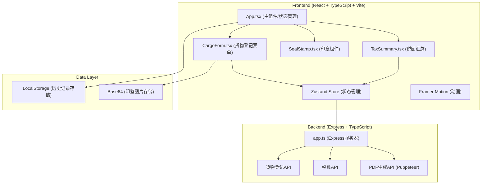
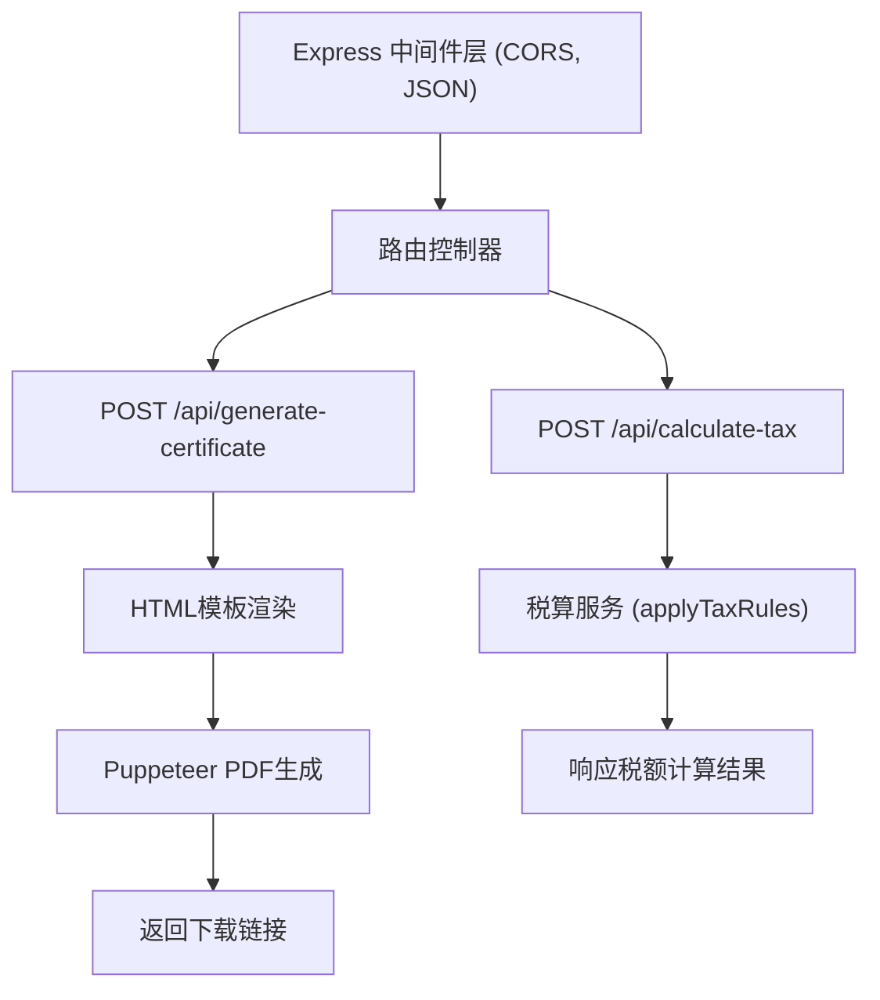

## 1. 架构设计



## 2. 技术描述

- **前端**：React 18 + TypeScript + Vite 5
- **状态管理**：Zustand 4
- **动画库**：Framer Motion 11
- **后端**：Express 4 + TypeScript
- **PDF生成**：Puppeteer 22
- **构建工具**：Vite 5 + @vitejs/plugin-react 4
- **开发服务器端口**：3000
- **数据存储**：LocalStorage（历史记录）、Base64（图片）

## 3. 目录结构

```
auto120/
├── .trae/documents/
│   ├── PRD.md
│   └── tech_architecture.md
├── server/
│   └── app.ts
├── src/
│   ├── components/
│   │   ├── CargoForm.tsx
│   │   ├── TaxSummary.tsx
│   │   └── SealStamp.tsx
│   ├── store/
│   │   └── useStore.ts
│   ├── types/
│   │   └── index.ts
│   ├── utils/
│   │   └── taxCalculator.ts
│   ├── App.tsx
│   └── main.tsx
├── package.json
├── vite.config.js
├── tsconfig.json
└── index.html
```

## 4. 数据类型定义

```typescript
interface CargoItem {
  id: string;
  name: string;
  category: 'spice' | 'precious_spice' | 'herb' | 'silk';
  quantity: number;
  unit: '斤' | '匹';
  unitPrice: number;
  sealImage: string | null;
  isVerified: boolean;
  taxRate: number;
  overrideTaxRate?: number;
}

interface Declaration {
  id: string;
  declarationNo: string;
  merchantName: string;
  shipNo: string;
  date: string;
  cargoList: CargoItem[];
  totalTax: number;
  status: 'pending' | 'signed' | 'issued';
}

interface TaxBreakdown {
  category: string;
  rate: number;
  subtotal: number;
  items: CargoItem[];
}
```

## 5. 抽解税则配置

```typescript
const TAX_RULES = {
  spice: { rate: 0.15, name: '香药' },        // 乳香、没药、苏合香
  precious_spice: { rate: 0.20, name: '贵重香药' }, // 丁香、龙脑
  herb: { rate: 0.05, name: '药材' },          // 黄连、川芎、当归
  silk: { rate: 0.10, name: '丝织品' },        // 白叠布、綺罗、纱
};
```

## 6. API 定义

### 6.1 货物登记与税额计算

**POST** `/api/calculate-tax`

请求体：
```typescript
{
  cargoList: CargoItem[];
}
```

响应：
```typescript
{
  taxBreakdown: TaxBreakdown[];
  totalTax: number;
}
```

### 6.2 PDF公凭生成

**POST** `/api/generate-certificate`

请求体：
```typescript
{
  declaration: Declaration;
  taxBreakdown: TaxBreakdown[];
  sealImage: string;
}
```

响应：
```typescript
{
  downloadUrl: string;
  filename: string;
}
```

## 7. 服务器架构



## 8. 前端状态管理 (Zustand)

```typescript
interface StoreState {
  currentDeclaration: Declaration | null;
  historyDeclarations: Declaration[];
  filters: {
    dateRange: [string, string];
    status: string;
    shipNo: string;
  };
  setCurrentDeclaration: (d: Declaration) => void;
  addCargoItem: (item: CargoItem) => void;
  removeCargoItem: (id: string) => void;
  updateCargoItem: (id: string, updates: Partial<CargoItem>) => void;
  verifyCargoItem: (id: string) => void;
  saveDeclaration: () => void;
  loadDeclaration: (id: string) => void;
  setFilters: (filters: Partial<StoreState['filters']>) => void;
  calculateTax: () => Promise<{ taxBreakdown: TaxBreakdown[]; totalTax: number }>;
  generateCertificate: () => Promise<string>;
}
```

## 9. 性能优化策略

1. **前端状态优化**：Zustand按需订阅，避免不必要重渲染
2. **图片处理**：Canvas压缩后转Base64，控制图片大小
3. **防抖处理**：税额计算使用防抖，避免频繁API调用
4. **虚拟滚动**：历史记录多时使用虚拟滚动
5. **PDF生成**：Puppeteer复用浏览器实例，设置超时限制
6. **动画优化**：使用transform属性动画，避免重排重绘
7. **懒加载**：历史记录边栏按需展开
