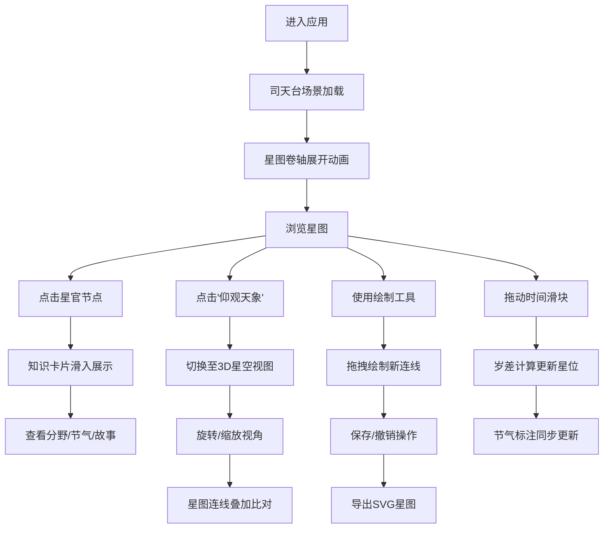

## 1. 产品概述

天垣星谱是一款基于唐代天文文化的交互式古代星图复原与天文知识探索应用，让用户在虚拟的唐代长安司天台中，以司天监星官的身份探索中国古代星空文化。

- 核心价值：将敦煌星图、《步天歌》等珍贵古代天文遗产进行数字化复原，结合现代3D可视化技术，打造沉浸式的天文知识学习体验
- 目标用户：天文爱好者、历史文化爱好者、教育工作者、学生群体

## 2. 核心功能

### 2.1 用户角色
| 角色 | 注册方式 | 核心权限 |
|------|----------|----------|
| 访客用户 | 无需注册 | 浏览星图、查看星官知识、体验3D星空、使用时间模拟 |

### 2.2 功能模块
1. **主界面**：司天台穹顶场景、星图卷轴展示区、知识卡片区
2. **2D星图浏览**：绢本卷轴展开/折叠、星官显示、触摸交互
3. **3D星空体验**：Three.js球面星空、视角旋转缩放、星图叠加比对
4. **星官知识库**：分野信息、节气标记、古文故事展示
5. **星图绘制工具**：手动绘制连线、历史记录、撤销功能、SVG导出
6. **时间模拟系统**：岁差计算、节气更新、时间滑块

### 2.3 页面详情
| 页面名称 | 模块名称 | 功能描述 |
|---------|----------|----------|
| 主界面 | 司天台穹顶背景 | 深蓝色渐变背景，营造古代天文台氛围 |
| 主界面 | 星图卷轴区 | 绢本卷轴动画展开，展示1365颗恒星及星官连线 |
| 主界面 | 知识卡片区 | 右侧滑入式卡片，展示星官分野、节气、故事 |
| 主界面 | 功能按钮区 | 仰观天象、导出SVG、重置连线等操作按钮 |
| 主界面 | 时间滑块 | 底部时间轴，支持公元前1000年至公元1000年的岁差模拟 |
| 3D星空视图 | 全景星空 | Three.js球面星空，支持旋转缩放 |
| 3D星空视图 | 星图叠加 | 半透明星官连线与3D星空叠加比对 |

## 3. 核心流程

## 4. 界面设计

### 4.1 设计风格
- **主色调**：深蓝色#0a0a23渐变至墨蓝色#1a1a2e，模拟夜空
- **辅助色**：米黄色#f5e6c8（绢本）、金色#ffd700（重要星官高亮）、浅蓝灰色#c9d1d9（正文）
- **按钮样式**：圆角6px，半透明背景rgba(255,255,255,0.08)，hover时变为rgba(255,215,0,0.2)，过渡0.2s
- **字体**：标题使用具有古典气质的衬线字体，正文使用清晰易读的无衬线字体
- **布局风格**：桌面端左右分栏（星图60% + 卡片40%），移动端上下堆叠或抽屉式

### 4.2 页面设计概述
| 页面名称 | 模块名称 | UI元素 |
|---------|----------|--------|
| 主界面 | 星图卷轴 | 绢本纹理、磨损效果、棕绳绑带、弹性展开动画（0.8s） |
| 主界面 | 星官节点 | 按星等大小（10/8/6px），紫垣黄、太垣白、天市青，0.3px灰色连线 |
| 主界面 | 知识卡片 | #1a1a2e底色，毛玻璃效果，宽280px，滑入+淡入动画（0.4s） |
| 主界面 | 时间滑块 | 惯性滚动效果（缓动0.4s），显示年份和二十四节气 |
| 3D星空 | 球面星空 | 半透明光点，半径50单位，阻尼旋转（0.3s），缩放20-80单位 |
| 3D星空 | 连线叠加 | 半透明星官连线，颜色与2D星图一致 |

### 4.3 响应式设计
- **桌面宽屏（>1024px）**：星图占左侧60%，右侧40%为天空背景与知识卡片
- **平板（768-1023px）**：星图与卡片改为上下堆叠布局
- **手机（<768px）**：仅显示星图，知识卡片改为底部抽屉式弹出

### 4.4 3D场景设计
- **环境**：深邃宇宙背景，无光源污染，营造纯净星空
- **光照**：星体自发光，无需额外光源
- **相机**：透视相机，初始视角对准天赤道区域
- **运动**：OrbitControls阻尼旋转，缩放限制在20-80单位
- **交互**：鼠标/触摸拖动旋转，滚轮缩放，双击重置视角
- **后处理**：轻微Bloom效果增强星点发光感
- **性能**：使用BufferGeometry+Points一次性提交，帧率≥30fps
