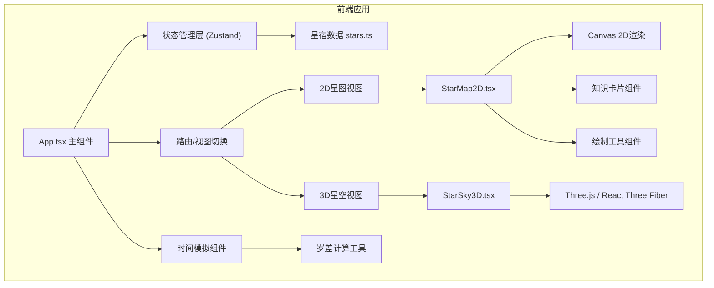

## 1. 架构设计



## 2. 技术描述

- **前端框架**: React 18 + TypeScript 5
- **构建工具**: Vite 5
- **状态管理**: Zustand
- **动画库**: Framer Motion
- **3D引擎**: Three.js + @react-three/fiber + @react-three/drei
- **样式方案**: CSS Modules + CSS Variables
- **图标库**: Lucide React

## 3. 目录结构

```
src/
├── App.tsx              # 主组件，路由和全局状态管理
├── main.tsx             # 应用入口
├── index.css            # 全局样式
├── stars.ts             # 星宿数据定义
├── components/
│   ├── StarMap2D.tsx    # 2D星图组件
│   ├── StarSky3D.tsx    # 3D星空组件
│   ├── KnowledgeCard.tsx # 知识卡片组件
│   ├── DrawingTools.tsx  # 绘制工具组件
│   ├── TimeSlider.tsx    # 时间滑块组件
│   ├── ScrollCanvas.tsx  # 卷轴画布组件
│   └── StarNode.tsx      # 星官节点组件
├── hooks/
│   ├── usePrecession.ts  # 岁差计算Hook
│   ├── useStarData.ts    # 星宿数据Hook
│   └── useDrawing.ts     # 绘制工具Hook
├── store/
│   └── useAppStore.ts    # 全局状态管理
├── utils/
│   ├── astronomy.ts      # 天文计算工具
│   └── svgExport.ts      # SVG导出工具
└── types/
    └── index.ts          # TypeScript类型定义
```

## 4. 核心数据模型

```typescript
// 星宿数据模型
interface Star {
  id: string;
  name: string;          // 星官名
  x: number;             // 2D坐标X
  y: number;             // 2D坐标Y
  ra: number;            // 赤经 (度)
  dec: number;           // 赤纬 (度)
  magnitude: number;     // 星等 (1, 2, 3)
  palace: 'ziwei' | 'taiwei' | 'tianshi'; // 三垣
  constellation: string; // 所属28宿
  color: string;         // 颜色
}

// 星官连线模型
interface ConstellationLine {
  id: string;
  from: string; // Star id
  to: string;   // Star id
  color: string;
  isCustom?: boolean;
}

// 星官知识模型
interface StarKnowledge {
  starId: string;
  fanye: string;      // 分野
  jieqi: string;      // 节气标记
  story: string;      // 古文故事
  source: string;     // 出处
}

// 绘制历史记录
interface DrawingHistory {
  id: string;
  action: 'add' | 'delete';
  line: ConstellationLine;
  timestamp: number;
}

// 应用状态
interface AppState {
  viewMode: '2d' | '3d';
  selectedStar: Star | null;
  currentYear: number;
  showOverlay: boolean;
  customLines: ConstellationLine[];
  drawingHistory: DrawingHistory[];
  isDrawing: boolean;
  drawingStart: Star | null;
}
```

## 5. 状态管理设计

```typescript
// src/store/useAppStore.ts
import { create } from 'zustand';

const useAppStore = create<AppState & Actions>((set, get) => ({
  // 初始状态
  viewMode: '2d',
  selectedStar: null,
  currentYear: 618, // 唐朝建立年份
  showOverlay: false,
  customLines: [],
  drawingHistory: [],
  isDrawing: false,
  drawingStart: null,

  // Actions
  setViewMode: (mode) => set({ viewMode: mode }),
  selectStar: (star) => set({ selectedStar: star }),
  setCurrentYear: (year) => set({ currentYear: year }),
  toggleOverlay: () => set((s) => ({ showOverlay: !s.showOverlay })),
  startDrawing: (star) => set({ isDrawing: true, drawingStart: star }),
  cancelDrawing: () => set({ isDrawing: false, drawingStart: null }),
  addCustomLine: (line) => {
    const state = get();
    const historyItem: DrawingHistory = {
      id: Date.now().toString(),
      action: 'add',
      line,
      timestamp: Date.now(),
    };
    set({
      customLines: [...state.customLines, line],
      drawingHistory: [...state.drawingHistory, historyItem].slice(-5),
      isDrawing: false,
      drawingStart: null,
    });
  },
  undoLastDrawing: () => {
    const state = get();
    if (state.drawingHistory.length === 0) return;
    const lastHistory = state.drawingHistory[state.drawingHistory.length - 1];
    if (lastHistory.action === 'add') {
      set({
        customLines: state.customLines.filter((l) => l.id !== lastHistory.line.id),
        drawingHistory: state.drawingHistory.slice(0, -1),
      });
    }
  },
  resetCustomLines: () => set({ customLines: [], drawingHistory: [] }),
}));
```

## 6. 性能优化策略

### 6.1 2D星图渲染优化
- 使用单Canvas绘制，单次帧绘制调用<10次
- 星点使用离屏Canvas预渲染
- 连线使用Path2D批量绘制
- 实施脏矩形优化，仅重绘变化区域

### 6.2 3D星空性能优化
- 使用BufferGeometry + Points一次性提交所有星点到GPU
- 星点材质使用AdditiveBlending增强发光效果
- 相机控制使用OrbitControls的enableDamping实现平滑阻尼
- 帧率监控，动态调整渲染质量

### 6.3 动画性能优化
- 使用CSS transform和opacity属性实现硬件加速动画
- 使用will-change属性提前告知浏览器优化
- 知识卡片动画使用transform: translateX()避免重排
- 时间滑块使用requestAnimationFrame实现惯性缓动

## 7. 关键算法

### 7.1 岁差计算
```typescript
// 每71.6年偏移1度
const PRECESSION_RATE = 1 / 71.6; // 度/年
const BASE_YEAR = 2000; // J2000历元

function calculatePrecession(year: number): number {
  const deltaYears = year - BASE_YEAR;
  return deltaYears * PRECESSION_RATE;
}

function applyPrecession(star: Star, year: number): { ra: number; dec: number } {
  const precession = calculatePrecession(year);
  // 简化的岁差计算（实际需考虑黄道倾角变化）
  const raRad = (star.ra * Math.PI) / 180;
  const decRad = (star.dec * Math.PI) / 180;
  const precRad = (precession * Math.PI) / 180;
  
  // 应用岁差旋转
  const newRa = raRad + precRad * Math.cos(decRad);
  return {
    ra: (newRa * 180) / Math.PI % 360,
    dec: star.dec,
  };
}
```

### 7.2 球面坐标转换
```typescript
function sphericalToCartesian(ra: number, dec: number, radius: number): THREE.Vector3 {
  const phi = (90 - dec) * (Math.PI / 180);
  const theta = ra * (Math.PI / 180);
  return new THREE.Vector3(
    radius * Math.sin(phi) * Math.cos(theta),
    radius * Math.cos(phi),
    radius * Math.sin(phi) * Math.sin(theta)
  );
}
```
