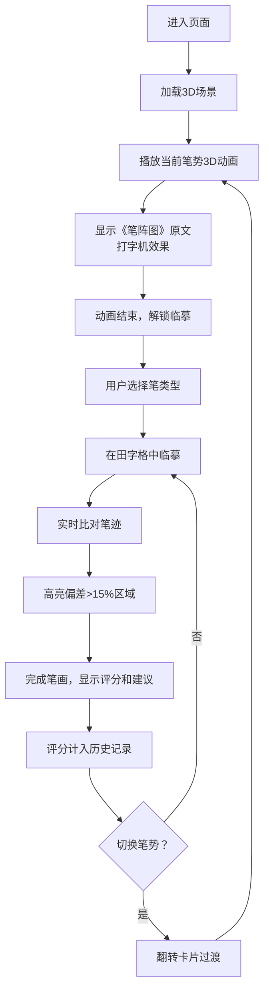

## 1. 产品概述

墨池笔阵·兰亭临摹是一款基于3D可视化的书法临摹练习工具，以王羲之《笔阵图》七种笔势为核心，在虚拟东晋兰亭场景中，让用户沉浸式学习中国传统书法。通过3D动画诠释笔势意境，实时笔迹比对提供精准反馈，帮助书法爱好者理解并掌握经典笔法。

- **目标用户**：书法爱好者、初学者、中国文化爱好者
- **核心价值**：将抽象的书法理论转化为可视化的3D动画，通过实时反馈降低书法学习门槛
- **市场定位**：文化与科技结合的创新书法教育工具

## 2. 核心功能

### 2.1 用户角色
| 角色 | 注册方式 | 核心权限 |
|------|----------|----------|
| 普通用户 | 无需注册，直接使用 | 浏览3D场景、临摹练习、查看评分、切换笔势 |

### 2.2 功能模块
1. **3D场景模块**：墨池、柳树粒子系统、石案、毛笔手柄、范字动画
2. **临摹交互模块**：笔迹采样、实时渲染、鼠标/触控笔支持
3. **评分反馈模块**：笔迹比对、偏差高亮、评分计算、建议生成
4. **UI控制面板**：笔类型选择、评分历史、笔势切换、原文展示
5. **笔势切换模块**：翻转卡片过渡动画、3D动画预览

### 2.3 页面详情
| 页面名称 | 模块名称 | 功能描述 |
|-----------|-------------|---------------------|
| 主页面 | 3D场景 | Three.js渲染兰亭墨池场景，包含墨池水面、柳树粒子、石案宣纸、田字格、范字动画 |
| 主页面 | 临摹区域 | 用户通过鼠标/触控笔在田字格中临摹，实时渲染笔迹 |
| 主页面 | 右侧控制面板 | 笔类型选择（兼毫/狼毫/羊毫）、评分历史记录列表 |
| 主页面 | 翻转卡片 | 正面显示范字和3D动画预览，反面显示评分和统计，支持左右切换笔势 |
| 主页面 | 原文展示 | 播放3D动画时，屏幕边缘显示《笔阵图》原文，打字机效果逐字显现 |

## 3. 核心流程

### 主流程描述
用户进入页面 → 加载3D场景 → 自动播放当前笔势的3D动画 → 显示《笔阵图》原文（打字机效果）→ 动画结束后解锁临摹 → 用户选择笔类型 → 在田字格中临摹笔画 → 系统实时比对笔迹与范字 → 高亮偏差超过15%的区域 → 完成笔画后显示评分（0-100分）和建议 → 评分计入历史记录 → 用户可切换到下一势/上一势 → 重复流程

## 4. 用户界面设计

### 4.1 设计风格
- **主色调**：浅米色 `#f5e6d3`（背景）、水墨黑 `#1a1a1a`（文字/笔迹）、朱砂红 `#cc3333`（偏差高亮）、青灰色 `#8baaa4`（墨池水面）
- **辅助色**：浅灰色 `#d4c9b8`（田字格）、淡墨 `#b0a090`、浓墨 `#4a3b32`、柳绿 `#5a8c5a`、古铜金 `#a0845c`（原文）
- **字体**：标题使用 "Ma Shan Zheng"（Google Fonts），正文使用 serif 行楷
- **整体风格**：仿古水墨风格，半透明蚕丝纸质感UI，东方美学意境
- **过渡动画**：所有过渡时间 0.2-0.5s，cubic-bezier 缓动
- **卡片样式**：圆角 12px，半透明 `rgba(255,255,255,0.85)`，内阴影 0.2s 缓动
- **按钮样式**：箭头按钮悬停缩放 1.1 倍，0.2s 过渡

### 4.2 页面设计概述
| 页面名称 | 模块名称 | UI Elements |
|-----------|-------------|-------------|
| 主页面 | 3D场景 | 墨池水面（半透明平面 #8baaa4 alpha 0.6）、柳树（粒子系统 150根/株 #5a8c5a）、石案、宣纸、田字格（80px/格，线粗1.5px #d4c9b8）、毛笔手柄（CylinderGeometry） |
| 主页面 | 临摹区域 | 范字（半透明黑 #1a1a1a alpha 0.7）、用户笔迹（根据笔类型变化）、偏差高亮（朱砂红 #cc3333） |
| 主页面 | 右侧控制面板 | 蚕丝纸质感，浮动右侧，笔类型选择按钮，评分历史列表 |
| 主页面 | 翻转卡片 | 正面范字+3D预览，反面评分+统计，0.5s flip 过渡，左右箭头按钮 |
| 主页面 | 原文展示 | 屏幕边缘，行楷字体，#a0845c，打字机效果 0.15s/字 |
| 主页面 | 笔势动画 | 横-千里阵云（云团左→右，淡墨→浓墨）、撇-陆断犀象（犀牛木雕左上→右下甩出）、点-高峰坠石（青石自由落体）等7种 |

### 4.3 响应式设计
- **桌面端**（>768px）：操作面板浮动在右侧，田字格 80px/格
- **移动端**（<768px）：操作面板收窄为底部抽屉（高度40%），田字格自动调整为 60px/格
- **触摸优化**：支持触控笔输入，增加触摸热区
- **缩放控制**：鼠标滚轮缩放 0.8-1.5 倍，最大响应时间 0.3s

### 4.4 3D场景设计
- **环境**：东晋会稽山阴兰亭旁，青石铺就的墨池边，自然日光，柔和阴影
- **光照**：HemisphereLight + DirectionalLight，模拟室外自然光，色温偏暖
- **相机**：固定俯角约60度，距离石案约3-5米，可滚轮缩放（0.8-1.5倍），OrbitControls 禁用旋转
- **构图**：石案位于画面中下三分之一处，墨池占据下半部分，柳树点缀两侧，宣纸为视觉焦点
- **核心元素**：
  - 墨池：半透明平面，水色 `#8baaa4`，alpha 0.6，轻微波纹动画
  - 柳树：3-4株，粒子系统模拟枝条（每株约150根绿色 `#5a8c5a` 粒子），随风摇摆
  - 石案：青石材质，表面有纹理
  - 宣纸：米白色，微透光，边缘有古旧质感
  - 毛笔手柄：CylinderGeometry 模拟，跟随鼠标/触控笔移动
  - 田字格：浅灰色 `#d4c9b8`，每格80px（移动端60px），线粗1.5px
  - 范字：半透明黑色 `#1a1a1a`，alpha 0.7，浮现在格子中
- **后处理**：轻微Bloom效果，模拟水墨晕染感，色彩分级偏暖调
- **性能**：稳定30fps以上，粒子总数控制在600-800之间，单个笔画比对计算 <50ms

## 5. 性能要求
- **帧率**：稳定30fps以上
- **响应时间**：所有交互反馈 <0.3s
- **计算耗时**：单个笔画比对 <50ms
- **3D动画**：流畅无卡顿
- **粒子系统**：600-800个粒子，运行流畅
