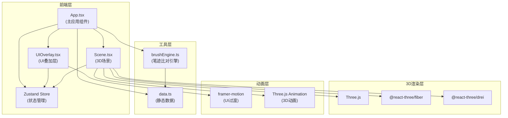

## 1. 架构设计



## 2. 技术描述

### 核心技术栈
- **前端框架**：React 18 + TypeScript
- **构建工具**：Vite 5
- **3D渲染**：Three.js + @react-three/fiber + @react-three/drei
- **状态管理**：Zustand
- **UI动画**：framer-motion
- **字体**：Google Fonts - Ma Shan Zheng

### 依赖说明
| 依赖包 | 版本 | 用途 |
|--------|------|------|
| react | ^18.2.0 | 前端框架 |
| react-dom | ^18.2.0 | DOM渲染 |
| three | ^0.160.0 | 3D渲染引擎 |
| @react-three/fiber | ^8.15.0 | Three.js React渲染器 |
| @react-three/drei | ^9.92.0 | Three.js 辅助组件 |
| zustand | ^4.4.0 | 状态管理 |
| framer-motion | ^10.16.0 | UI动画 |
| typescript | ^5.3.0 | 类型系统 |
| vite | ^5.0.0 | 构建工具 |
| @vitejs/plugin-react | ^4.2.0 | Vite React插件 |
| @types/react | ^18.2.0 | React类型定义 |
| @types/react-dom | ^18.2.0 | ReactDOM类型定义 |
| @types/three | ^0.160.0 | Three.js类型定义 |

## 3. 目录结构

```
auto124/
├── index.html                 # 入口HTML
├── package.json               # 项目配置
├── vite.config.js             # Vite配置
├── tsconfig.json              # TypeScript配置
├── .trae/
│   └── documents/
│       ├── PRD.md            # 产品需求文档
│       └── Technical-Architecture.md  # 技术架构文档
└── src/
    ├── App.tsx                # 主应用组件
    ├── main.tsx               # 入口文件
    ├── index.css              # 全局样式
    ├── components/
    │   ├── Scene.tsx          # 3D场景组件
    │   └── UIOverlay.tsx      # UI叠加层组件
    ├── store/
    │   └── useStore.ts        # Zustand状态管理
    └── utils/
        ├── brushEngine.ts     # 笔迹比对引擎
        └── data.ts            # 静态数据
```

## 4. 状态管理设计 (Zustand Store)

### Store 状态定义
```typescript
interface BrushState {
  // 当前笔势索引 (0-6)
  currentStrokeIndex: number;
  // 笔类型: 'jianhao' | 'langhao' | 'yanghao'
  brushType: BrushType;
  // 是否正在播放动画
  isAnimating: boolean;
  // 是否允许临摹
  canWrite: boolean;
  // 用户笔迹点数组
  userStrokePoints: Point[];
  // 评分历史记录
  scoreHistory: ScoreRecord[];
  // 当前评分
  currentScore: number | null;
  // 当前建议
  currentSuggestion: string | null;
  // 偏差区域
  deviationAreas: DeviationArea[];
  // 当前是否正在书写
  isWriting: boolean;
  // 田字格大小 (响应式)
  gridSize: number;
  // 相机缩放
  cameraZoom: number;
  // 翻转卡片是否显示背面
  showCardBack: boolean;
}

interface BrushActions {
  setCurrentStrokeIndex: (index: number) => void;
  setBrushType: (type: BrushType) => void;
  setIsAnimating: (value: boolean) => void;
  setCanWrite: (value: boolean) => void;
  addStrokePoint: (point: Point) => void;
  clearStrokePoints: () => void;
  addScoreRecord: (record: ScoreRecord) => void;
  setCurrentScore: (score: number | null) => void;
  setCurrentSuggestion: (suggestion: string | null) => void;
  setDeviationAreas: (areas: DeviationArea[]) => void;
  setIsWriting: (value: boolean) => void;
  setGridSize: (size: number) => void;
  setCameraZoom: (zoom: number) => void;
  setShowCardBack: (value: boolean) => void;
  nextStroke: () => void;
  prevStroke: () => void;
  resetForNewStroke: () => void;
}
```

### 核心数据类型
```typescript
type BrushType = 'jianhao' | 'langhao' | 'yanghao';

interface Point {
  x: number;
  y: number;
  pressure?: number;
  timestamp: number;
}

interface ScoreRecord {
  strokeIndex: number;
  strokeName: string;
  score: number;
  suggestion: string;
  timestamp: number;
}

interface DeviationArea {
  x: number;
  y: number;
  radius: number;
  deviationPercent: number;
}

interface StrokeData {
  name: string;
  character: string;
  description: string;
  originalText: string;
  path: Point[];
  animationConfig: AnimationConfig;
  suggestions: SuggestionConfig[];
}

interface AnimationConfig {
  type: 'cloud' | 'rhinoceros' | 'stone' | 'wave' | 'arrow' | 'axe' | 'needle';
  duration: number;
  startPosition: { x: number; y: number; z: number };
  endPosition: { x: number; y: number; z: number };
  colorStart: string;
  colorEnd: string;
}
```

## 5. 核心模块说明

### 5.1 brushEngine.ts - 笔迹比对引擎
**纯函数模块，无副作用**

| 函数 | 输入 | 输出 | 说明 |
|------|------|------|------|
| `simplifyPath` | points: Point[], tolerance: number | Point[] | Ramer-Douglas-Peucker轨迹简化算法 |
| `calculateFrechetDistance` | path1: Point[], path2: Point[] | number | 计算两条路径的弗雷歇距离 |
| `calculateDeviation` | userPath: Point[], referencePath: Point[] | { areas: DeviationArea[], avgDeviation: number } | 计算用户笔迹与范字的偏差区域 |
| `calculateScore` | avgDeviation: number, pathLength: number, timeTaken: number | number | 计算综合评分 (0-100) |
| `generateSuggestion` | strokeIndex: number, deviationAreas: DeviationArea[], score: number | string | 根据偏差生成个性化建议 |

**性能要求**：
- 单个笔画比对计算耗时 < 50ms
- 时间复杂度 O(n*m)，其中 n 和 m 分别为两条路径的点数
- 路径简化后点数控制在 20-50 之间

### 5.2 Scene.tsx - 3D场景组件
**使用 @react-three/fiber 和 drei 实现**

| 组件 | 功能 |
|------|------|
| `InkPool` | 墨池水面，半透明平面，带轻微波纹动画 |
| `WillowTree` | 柳树，粒子系统模拟枝条，每株150个粒子，随风摇摆 |
| `StoneTable` | 石案，青石材质 |
| `RicePaper` | 宣纸，带田字格渲染 |
| `BrushHandle` | 毛笔手柄，CylinderGeometry，跟随鼠标移动 |
| `ModelCharacter` | 范字渲染，半透明浮现在格子中 |
| `StrokeAnimation` | 七种笔势的3D动画 |
| `UserStrokeMesh` | 用户笔迹Mesh实时渲染 |
| `DeviationHighlight` | 偏差区域高亮（朱砂红） |

### 5.3 UIOverlay.tsx - UI叠加层组件
**使用 framer-motion 实现动画**

| 组件 | 功能 |
|------|------|
| `ControlPanel` | 右侧控制面板，蚕丝纸质感，笔类型选择 |
| `ScoreHistory` | 评分历史记录列表 |
| `FlipCard` | 翻转卡片，正面范字预览，反面评分统计 |
| `OriginalTextDisplay` | 《笔阵图》原文展示，打字机效果 |
| `NavigationArrows` | 上一势/下一势箭头按钮 |
| `ScoreDisplay` | 当前评分和建议展示 |

### 5.4 data.ts - 静态数据
包含七种笔势的完整数据：
1. 横（千里阵云）- 云团动画
2. 点（高峰坠石）- 落石动画
3. 撇（陆断犀象）- 犀牛甩出动
4. 捺（崩浪雷奔）- 浪涛动画
5. 竖（万岁枯藤）- 藤蔓生长动画
6. 折（劲弩筋节）- 弩箭发射动画
7. 钩（利剑斩犀）- 利剑斩击动画

## 6. 性能优化策略

### 6.1 3D渲染优化
- 粒子系统使用 BufferGeometry 而非单个 Mesh
- 用户笔迹使用 Line2 或 TubeGeometry 进行批量渲染
- 材质共享，减少材质切换开销
- 阴影贴图分辨率适中（1024x1024）
- 禁用不必要的后处理效果
- 使用 InstancedMesh 渲染重复元素（如柳叶粒子）

### 6.2 计算优化
- 笔迹路径实时简化（Ramer-Douglas-Peucker）
- 弗雷歇距离计算使用动态规划优化
- 偏差计算在 requestIdleCallback 中进行
- 评分计算使用 Web Worker（如需要）

### 6.3 响应式优化
- 使用 CSS Container Queries 或 ResizeObserver 监听尺寸变化
- 田字格大小根据屏幕宽度动态调整
- 移动端降低粒子数量（每株柳树100个粒子）
- 移动端降低阴影质量

## 7. 启动脚本

```json
{
  "scripts": {
    "dev": "vite",
    "build": "tsc && vite build",
    "preview": "vite preview"
  }
}
```

## 8. 配置文件说明

### vite.config.js
- 配置 React 插件
- 配置路径别名 @
- 配置服务器端口（默认5173）

### tsconfig.json
- target: ES2020
- module: ESNext
- 严格模式: strict: true
- JSX: react-jsx
- 路径别名配置

### index.html
- 标题: 墨池笔阵 · 兰亭临摹
- 引入 Google Fonts: Ma Shan Zheng
- 根元素: <div id="root"></div>
- 背景色: #f5e6d3
