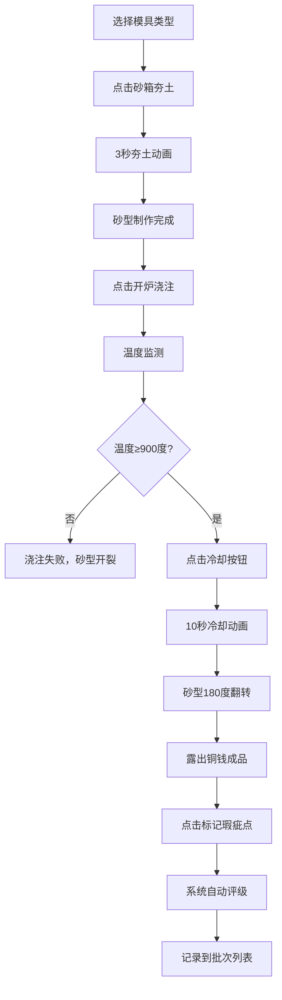

## 1. 产品概述

宝源局铸币坊是一款古代铜钱翻砂铸造工艺的交互模拟与铸币质量检验的浏览器工具应用，用户可在虚拟的明代宝源局铸币坊中扮演铸币匠人，完成从制作砂型、浇铸铜液到检验成品的完整工序。

- 核心价值：通过沉浸式交互体验，让用户了解中国古代翻砂铸造工艺的完整流程
- 目标用户：历史爱好者、教育工作者、学生群体
- 市场定位：兼具教育性与趣味性的文化科普Web应用

## 2. 核心特性

### 2.1 用户角色

| 角色 | 注册方式 | 核心权限 |
|------|----------|----------|
| 铸币匠人 | 无需注册，直接使用 | 完整的铸造工序操作、质量检验、批次记录管理 |

### 2.2 功能模块

1. **主界面**：三视图布局（左侧工序面板、中央铸造区、右侧质量检验面板）
2. **砂型制作模块**：模具选择、砂箱夯土动画、钱腔成型
3. **铜液浇注模块**：化铜炉开炉、铜液浇注动画、温度监测与失败判定
4. **开箱质检模块**：冷却动画、砂型翻转、瑕疵标记
5. **质量评级模块**：自动评级、重量直径显示、瑕疵统计
6. **批次记录模块**：历史记录列表、虚拟滚动、CSV导出、记录删除

### 2.3 页面详情

| 页面名称 | 模块名称 | 功能描述 |
|-----------|-------------|---------------------|
| 主界面 | 工序面板 | 显示当前工序进度，提供模具选择、开炉、冷却等操作按钮 |
| 主界面 | 铸造区 | 渲染砂型、化铜炉、浇注动画、翻转动画、铜钱成品 |
| 主界面 | 质量面板 | 显示瑕疵列表、称重数值、评级结果、批次历史记录 |

## 3. 核心流程

用户进入应用后，依次完成以下工序：

1. 选择模具类型（母钱模/雕母模/样钱模）
2. 点击砂箱进行夯土，等待3秒完成砂型制作
3. 点击化铜炉"开炉"按钮，铜液注入型腔
4. 监测温度，若低于900度则浇注失败
5. 点击"冷却"按钮，等待10秒冷却
6. 砂型自动翻转，露出铜钱成品
7. 点击瑕疵点进行标记
8. 系统自动评级并记录到批次列表

## 4. 用户界面设计

### 4.1 设计风格

- **主色调**：素白宣纸色 #f5f0e8（背景）、赭红木纹色 #8b4513（标题栏）、深红木色 #5c3a1e（砂箱）
- **辅助色**：青铜色 #8b5e3c（化铜炉）、朱红色 #cc3333（印章按钮边框）、浅朱红 #fce4e4（悬停状态）
- **评级色**：绿色 #2e7d32（良币）、黄色 #f9a825（次品）、红色 #d32f2f（废品）
- **按钮样式**：仿古印章样式，白底朱文，边框2px实线 #cc3333，圆角4px，悬停背景浅朱红
- **字体**：采用具有古风的宋体/楷体类字体，标题加粗
- **布局风格**：三栏式布局，1px深灰边框分隔，仿古作坊质感
- **纹理效果**：砂面噪点纹理、木纹边框、宣纸背景质感

### 4.2 页面设计概述

| 页面名称 | 模块名称 | UI元素 |
|-----------|-------------|-------------|
| 主界面 | 标题栏 | 高度50px，赭红木纹色，居中显示"宝源局铸币坊" |
| 主界面 | 工序面板 | 宽度280px，左侧纵向排列，包含模具选择卡片、操作按钮区、工序进度指示 |
| 主界面 | 铸造区 | 占据剩余宽度65%，中央区域，包含化铜炉、砂箱、浇注动画、铜钱展示 |
| 主界面 | 质量面板 | 宽度280px，右侧纵向排列，包含瑕疵列表、评级卡片、批次记录列表 |

### 4.3 响应式设计

- **桌面端（≥900px）**：三栏式布局，左280px + 中间65% + 右280px
- **平板端（600px-900px）**：左面板保留，右面板折叠至底部作为横向滑动面板（高60px）
- **移动端（<600px）**：左面板折叠为顶部下拉菜单，右面板折叠至底部横向滑动面板

### 4.4 动画设计

- **夯土动画**：3秒，砂面从散粒变为紧实平面，颗粒感消失，0.3秒缓出
- **铜液渐变**：0.5秒一次颜色渐变（暗红→亮橙），径向渐变模拟熔融光泽
- **温度指示**：0.5秒线性过渡数值插值
- **冷却动画**：10秒，砂型从红热变回常温，蒸汽粒子升起
- **翻转动画**：CSS 3D变换，rotateX 180度，0.8秒ease-in-out
- **瑕疵标记**：点击后变红，弹出标注框，响应时间<50ms
