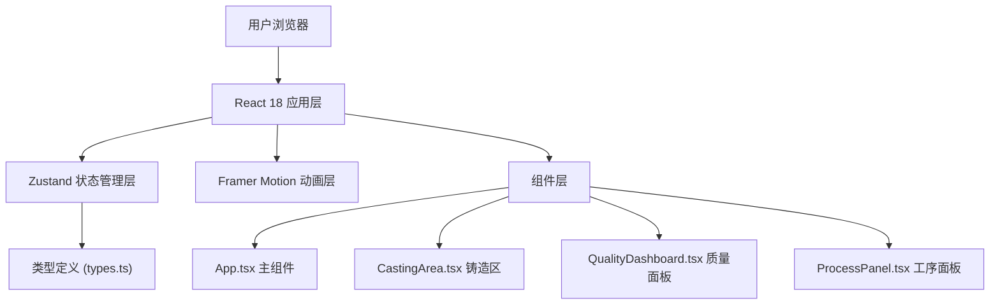

## 1. 架构设计

本项目为纯前端浏览器应用，采用React + TypeScript + Vite技术栈，无需后端服务。



## 2. 技术描述

- **前端框架**：React@18 + TypeScript@5
- **构建工具**：Vite@5
- **状态管理**：Zustand@4
- **动画库**：Framer Motion@11
- **样式方案**：原生CSS + CSS变量（无需Tailwind，保持仿古风格）
- **图标方案**：Lucide React（如需要）
- **无后端、无数据库**，数据存储于浏览器内存，CSV导出为客户端生成

## 3. 核心文件结构

| 文件路径 | 职责说明 |
|---------|----------|
| `package.json` | 项目依赖与脚本配置 |
| `vite.config.js` | Vite构建配置，启用React插件 |
| `tsconfig.json` | TypeScript配置，严格模式 |
| `index.html` | 入口页面，标题"宝源局铸币坊" |
| `src/types.ts` | 核心类型定义（铸件状态、模具类型、铜液温度、瑕疵类型等） |
| `src/store.ts` | Zustand状态管理（工序、铜液、模具、成品记录） |
| `src/App.tsx` | 主组件，三视图布局容器 |
| `src/components/CastingArea.tsx` | 铸造区组件（砂型、浇注、翻转动画） |
| `src/components/QualityDashboard.tsx` | 质量面板组件（瑕疵列表、评级、批次记录） |
| `src/components/ProcessPanel.tsx` | 工序面板组件（模具选择、操作按钮） |
| `src/hooks/useAnimation.ts` | 动画相关自定义Hook |
| `src/utils/csv.ts` | CSV导出工具函数 |

## 4. 核心类型定义

```typescript
// src/types.ts
export type ProcessStage = 'mold-selection' | 'sand-compacting' | 'sand-ready' | 'pouring' | 'cooling' | 'flipping' | 'inspection' | 'failed';

export type MoldType = 'mother' | 'carved' | 'sample';

export type FlawType = 'air-pocket' | 'sand-hole' | 'cold-shut';

export interface Flaw {
  id: string;
  type: FlawType;
  x: number;
  y: number;
  marked: boolean;
}

export interface CoinQuality {
  id: string;
  grade: 'excellent' | 'defective' | 'rejected';
  weight: number;
  diameter: number;
  flaws: Flaw[];
  timestamp: number;
}

export interface Mold {
  type: MoldType;
  name: string;
  color: string;
}

export interface CopperState {
  temperature: number;
  isMelting: boolean;
  colorIndex: number;
}

export interface SandMoldState {
  isCompacted: boolean;
  compactProgress: number;
  hasCavity: boolean;
  isCracked: boolean;
  temperature: number;
  isFlipped: boolean;
  flipProgress: number;
}
```

## 5. 状态管理设计

```typescript
// src/store.ts
interface CastingStore {
  // 工序状态
  currentStage: ProcessStage;
  setStage: (stage: ProcessStage) => void;
  
  // 模具状态
  selectedMold: MoldType | null;
  molds: Mold[];
  selectMold: (type: MoldType) => void;
  
  // 铜液状态
  copper: CopperState;
  startPouring: () => void;
  stopPouring: () => void;
  updateTemperature: (temp: number) => void;
  
  // 砂型状态
  sandMold: SandMoldState;
  startCompacting: () => void;
  setCracked: () => void;
  startCooling: () => void;
  startFlipping: () => void;
  
  // 当前铜钱
  currentCoin: {
    flaws: Flaw[];
    weight: number;
    diameter: number;
  } | null;
  generateCoin: () => void;
  markFlaw: (flawId: string) => void;
  
  // 批次记录
  coinRecords: CoinQuality[];
  addRecord: (record: CoinQuality) => void;
  removeRecord: (id: string) => void;
  exportRecords: () => string;
  
  // 重置
  resetProcess: () => void;
}
```

## 6. 性能优化策略

| 优化点 | 实现方案 |
|-------|----------|
| 动画帧率 | 使用requestAnimationFrame驱动，目标45fps+ |
| 瑕疵点响应 | 使用CSS :active + onClick，避免重渲染，目标<50ms |
| 批次列表虚拟滚动 | 超过50条时启用，最多渲染15条可见项，使用useRef管理滚动位置 |
| 粒子效果 | Canvas或CSS变量实现，限制粒子数量<50 |
| 温度插值 | 使用useMemo缓存计算结果，0.5秒线性过渡 |

## 7. 动画实现方案

| 动画类型 | 技术方案 |
|---------|----------|
| 夯土动画 | Framer Motion + CSS transition，3秒完成，颗粒opacity渐变 |
| 铜液渐变 | setInterval每0.5秒切换colorIndex，CSS linear-gradient |
| 温度指示条 | Framer Motion useSpring，0.5秒线性插值 |
| 冷却动画 | 10秒CSS keyframes，颜色从红热过渡到常温，粒子上升 |
| 砂型翻转 | CSS 3D transform: rotateX(180deg)，0.8s ease-in-out |
| 瑕疵标记 | CSS transform: scale(1.2) + color transition |

## 8. 响应式断点

| 断点 | 布局变化 |
|------|----------|
| ≥900px | 标准三栏布局：左280px + 中间65% + 右280px |
| 600px-900px | 左面板保留，右面板折叠为底部横向滑动面板（高60px） |
| <600px | 左面板折叠为顶部下拉菜单，右面板折叠为底部横向滑动面板 |
