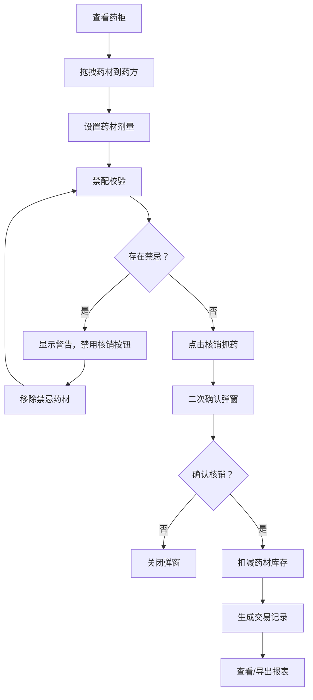

## 1. 产品概述

仁济堂药铺系统是一款模拟北宋汴京药铺问诊抓药与库存核销的全栈Web应用，让用户以掌柜身份管理药材库存、创建药方、核销药材并查看每日经营报表。

- 核心目标：还原古代药铺经营场景，实现药材管理、药方开具、库存核销、账目统计的完整业务流程
- 目标用户：对中医药文化感兴趣的用户、历史场景模拟爱好者

## 2. 核心功能

### 2.1 用户角色

| 角色 | 注册方式 | 核心权限 |
|------|---------|----------|
| 掌柜 | 无需注册，直接使用 | 药材库存管理、药方创建、药材核销、经营报表查看与导出 |

### 2.2 功能模块

1. **药材药柜展示区**：九宫格展示药材，药性颜色标识，库存告急提示，详情弹窗
2. **药方编辑区**：拖拽添加药材，剂量设置，金额计算，禁配校验，核销抓药
3. **交易报表面板**：交易流水列表，日期筛选，详情展开，JSON导出

### 2.3 页面详情

| 页面名称 | 模块名称 | 功能描述 |
|---------|---------|----------|
| 主页面 | 药材药柜 | 九宫格展示药材，药性颜色标签，库存告急角标，点击查看详情 |
| 主页面 | 药方编辑 | 拖拽药材添加，剂量调整，金额汇总，禁忌校验，二次确认核销 |
| 主页面 | 交易报表 | 按日流水展示，详情展开，日期筛选，导出JSON |

## 3. 核心流程

用户打开应用后，查看药柜中的药材库存，通过拖拽将需要的药材添加到药方编辑区，设置每味药材的剂量，系统自动校验禁忌配伍，确认无误后点击核销抓药，二次确认后扣减库存并生成交易记录，最后可在右侧面板查看和导出每日经营报表。

## 4. 用户界面设计

### 4.1 设计风格

- **主色调**：宣纸白 #fdf5e6（背景）、木纹棕 #8d6e63（边框）、墨蓝 #2c3e50（标题栏）
- **辅助色**：辛温红 #e57373、甘寒蓝 #64b5f6、苦寒绿 #81c784、朱红 #c62828（确认按钮）
- **按钮风格**：圆角矩形，木纹边框，悬停放大效果
- **字体**：使用具有古典韵味的字体组合，标题使用书法风格字体，正文使用清晰易读的宋体类字体
- **布局风格**：三栏式布局（1200px+），移动端单栏堆叠
- **图标风格**：使用中药材相关的emoji和简约线条图标

### 4.2 页面设计概述

| 页面名称 | 模块名称 | UI元素 |
|---------|---------|--------|
| 主页面 | 药材药柜 | 九宫格布局，木纹边框卡片，药性颜色标签，库存角标，悬停放大动画，点击弹出详情面板 |
| 主页面 | 药方编辑区 | 半透明水蓝色背景，拖拽弹性动画（spring stiffness 300, damping 20），剂量输入框，金额统计，红色警告条，二次确认半透明遮罩 |
| 主页面 | 交易报表 | 斑马线表格，日期筛选器，展开/折叠详情，导出按钮，可滚动区域 |

### 4.3 响应式

- **桌面端**（1200px+）：三栏布局，药柜左、药方中、报表右
- **平板端**（768px-1200px）：两栏布局，药柜与药方合并，报表单独一栏
- **移动端**（<768px）：单栏堆叠，药柜在上、药方在中、报表在下，优化触摸交互

### 4.4 动画效果

- 药柜格子悬停：放大1.05倍，增加box-shadow
- 拖拽药材：spring弹性动画（stiffness 300, damping 20）
- 警示信息：红色渐变背景 + 轻微抖动动画
- 页面加载： staggered 渐入动画
- 库存更新：数字变化过渡动画
