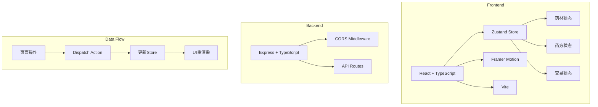
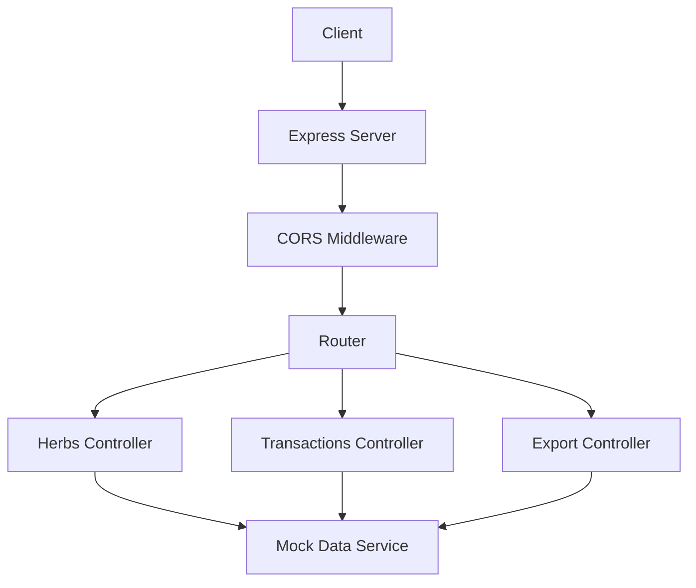
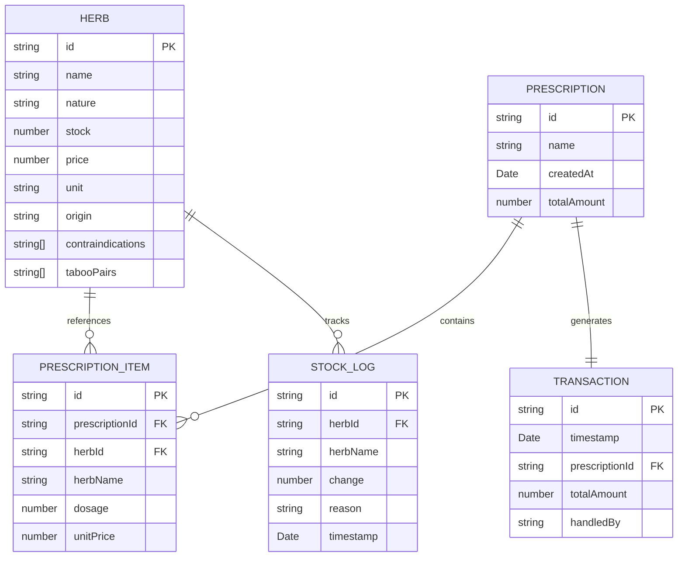

## 1. 架构设计



## 2. 技术描述

- **前端**：React@18 + TypeScript + Vite + Zustand + Framer Motion
- **构建工具**：Vite@5
- **后端**：Express@4 + TypeScript + CORS
- **状态管理**：Zustand（轻量、高性能）
- **动画库**：Framer Motion（拖拽、弹性动画）
- **数据存储**：前端内存状态（Zustand），后端Mock数据

## 3. 路由定义

| 路由 | 用途 |
|-----|------|
| / | 主应用页面（药柜、药方、报表三合一） |
| /api/herbs | 获取药材列表 |
| /api/transactions | 获取交易记录 |
| /api/export | 导出账目数据 |

## 4. API 定义

### 4.1 类型定义

```typescript
// 药材属性
interface Herb {
  id: string;
  name: string;
  nature: '辛温' | '甘寒' | '苦寒' | '其他';
  stock: number;
  price: number;
  unit: string;
  origin: string;
  contraindications: string[];
  tabooPairs: string[];
}

// 药方中的药材
interface PrescriptionItem {
  herbId: string;
  herbName: string;
  dosage: number;
  unitPrice: number;
}

// 药方
interface Prescription {
  id: string;
  name: string;
  createdAt: Date;
  items: PrescriptionItem[];
  totalAmount: number;
}

// 交易记录
interface Transaction {
  id: string;
  timestamp: Date;
  prescription: Prescription;
  totalAmount: number;
  handledBy: string;
}

// 库存变化日志
interface StockLog {
  id: string;
  herbId: string;
  herbName: string;
  change: number;
  reason: string;
  timestamp: Date;
}
```

### 4.2 请求响应

**GET /api/herbs**
- 响应：`{ success: true; data: Herb[] }`

**POST /api/transactions**
- 请求：`{ prescription: Prescription; stockChanges: { herbId: string; change: number }[] }`
- 响应：`{ success: true; data: Transaction }`

**GET /api/export**
- 参数：`date?: string`
- 响应：JSON文件下载

## 5. 服务器架构图



## 6. 数据模型

### 6.1 数据模型定义



### 6.2 初始数据

```typescript
// 初始药材数据
const initialHerbs: Herb[] = [
  {
    id: '1',
    name: '甘草',
    nature: '甘寒',
    stock: 50,
    price: 2.5,
    unit: '钱',
    origin: '内蒙古',
    contraindications: ['实证中满腹胀忌服'],
    tabooPairs: ['甘遂', '大戟', '芫花', '海藻']
  },
  {
    id: '2',
    name: '甘遂',
    nature: '苦寒',
    stock: 15,
    price: 8.0,
    unit: '钱',
    origin: '陕西',
    contraindications: ['孕妇禁用', '体弱者慎用'],
    tabooPairs: ['甘草']
  },
  // ... 更多药材数据
];
```

## 7. 性能优化策略

1. **拖拽性能**：使用原生HTML5拖拽API + Framer Motion优化，响应时间<100ms
2. **库存更新**：使用Zustand的选择器模式，仅重渲染受影响的药格子，<30ms
3. **报表性能**：虚拟滚动或分页加载，500条数据首屏<200ms
4. **渲染优化**：使用React.memo包裹药格子组件，避免不必要重渲染
5. **状态优化**：拆分store，使用细粒度订阅减少重渲染范围
