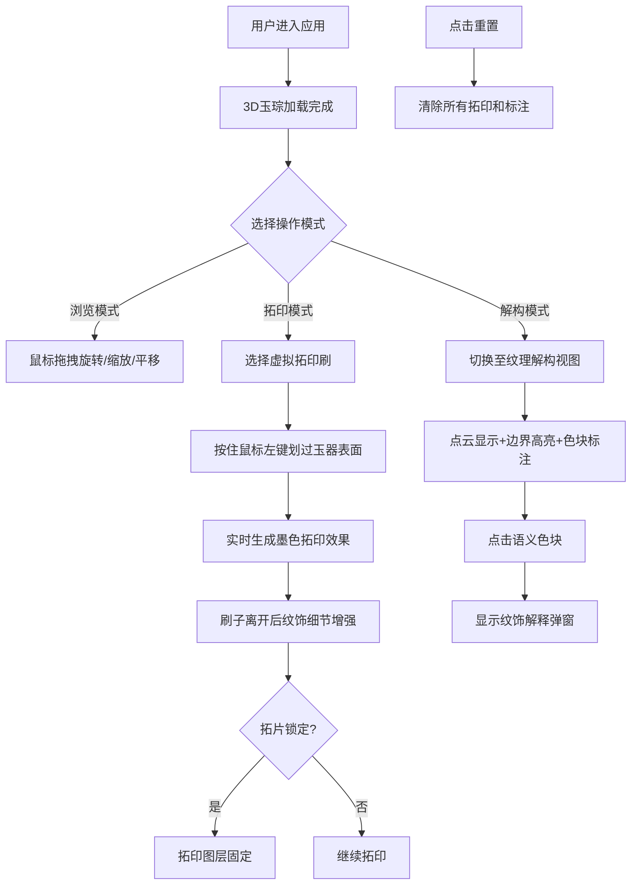

## 1. 产品概述
良渚玉璧纹饰拓印与解构是一款面向考古学研究者与古玉鉴赏爱好者的3D交互工具，解决古代玉器表面浮雕纹饰因年代久远、沁色包浆覆盖而难以辨识的问题，同时突破传统拓片只能展示二维平面纹理的局限。

- **核心价值**：通过虚拟拓印技术与三维纹理解构，让用户能够直观地观察、分析良渚玉器上的神人兽面纹、云雷纹等复杂纹饰
- **目标用户**：考古学研究者、古玉鉴赏家、文博专业学生、传统文化爱好者
- **市场定位**：专业考古辅助工具与文化科普应用的结合体

## 2. 核心特性

### 2.1 功能模块
1. **3D玉琮展示**：外方内圆的良渚玉琮模型，支持360度旋转、缩放和平移
2. **虚拟拓印刷**：棕刷模型，实时墨色拓印效果，纹饰细节自动增强
3. **纹理解构模式**：半透明点云显示、纹饰边界高亮、语义色块标注
4. **控制面板**：拓片锁定、纹饰标注开关、重置功能

### 2.2 页面详情
| 页面名称 | 模块名称 | 功能描述 |
|---------|----------|---------|
| 主界面 | 3D场景区 | 中央偏左展示玉琮模型，支持鼠标交互旋转缩放 |
| 主界面 | 右侧工具栏 | 拓印刷选择、纹理解构模式切换、相关参数调节 |
| 主界面 | 底部控制栏 | 拓片锁定、纹饰标注开关、重置按钮 |
| 主界面 | 纹饰信息弹窗 | 点击色块显示铭文解释和拓片小图 |

## 3. 核心流程

## 4. 用户界面设计

### 4.1 设计风格
- **主色调**：深赭色#3e2723背景，模拟考古工作台环境
- **UI元素**：半透明仿羊皮纸效果#f5e6c8（透明度0.9），圆角8px
- **交互反馈**：按钮悬停浅金色描边动画（0.2s缓入），点击凹陷阴影（0.1s）
- **字体**：标题使用古典衬线字体，正文使用清晰易读的无衬线字体
- **光影**：柔和环境光+左上角平行光（强度0.6），模拟考古灯效果
- **底座**：浅灰色圆盘#b0a090，直径20单位，高度1单位

### 4.2 玉器参数
- **形制**：外方内圆，高12单位，边宽8单位
- **纹饰**：四组神人兽面纹，凸起高度0.3单位
- **颜色**：主体鸡骨白#f0e6d6，局部褐色沁斑#8b5e3c
- **质感**：粗糙哑光（roughness 0.85, metalness 0.15）

### 4.3 拓印刷参数
- **模型**：棕刷，长20单位
- **颜色**：刷毛深棕色#4a3b32
- **墨色**：初始#1a1a1a，透明度0.6
- **增强**：纹饰细节灰度对比增强1.5倍

### 4.4 纹理解构参数
- **点云**：约8000点，颜色#d4c9b8，透明度0.3
- **边界线**：红色#cc3333，线宽1.5px
- **语义颜色**：
  - 神人面纹：金色#ffd700
  - 兽面纹：铜绿色#5b8c5a
  - 谷纹：淡蓝色#a0c4ff
  - 云雷纹：深灰色#8a8a8a

### 4.5 页面设计概览
| 页面名称 | 模块名称 | UI元素 |
|---------|----------|--------|
| 主界面 | 3D场景区 | 玉琮模型居中偏左，底座支撑，柔和光照 |
| 主界面 | 右侧工具栏 | 羊皮纸风格面板，垂直排列工具按钮，当前选中高亮 |
| 主界面 | 底部控制栏 | 横向排列控制按钮，状态指示清晰 |
| 主界面 | 信息弹窗 | 点击色块后显示，包含纹饰名称、解释文字、拓片缩略图 |

### 4.6 响应式设计
- **桌面优先**：主应用面向桌面端用户，需要精确的鼠标交互
- **性能要求**：60fps基础帧率，拓印实时渲染不低于30fps
- **操作响应**：所有按钮操作响应时间低于0.5秒

### 4.7 3D场景指导
- **环境**：深赭色背景，配合柔和环境光，营造专业考古氛围
- **光照**：环境光+左上角45度平行光，突出玉器表面纹理起伏
- **相机**：透视相机，初始距离适中，支持OrbitControls全向交互
- **交互**：鼠标左键旋转，滚轮缩放，右键平移，限制缩放范围0.5x-3x
- **后处理**：轻微抗锯齿，无过度特效，保持专业观察体验
- **性能**：合理控制几何体复杂度，拓印使用纹理贴图实现高效渲染
