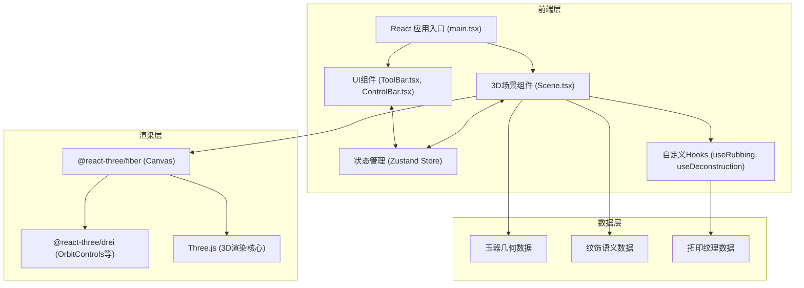

## 1. 架构设计



## 2. 技术描述

- **前端框架**：React 18 + TypeScript
- **构建工具**：Vite 5.x
- **3D引擎**：Three.js 0.160.x
- **React 3D绑定**：@react-three/fiber 8.15.x, @react-three/drei 9.92.x
- **状态管理**：Zustand 4.4.x
- **样式方案**：CSS Modules + CSS Variables
- **无后端**：纯前端应用，所有数据本地生成

## 3. 项目文件结构

```
.
├── package.json
├── index.html
├── vite.config.js
├── tsconfig.json
└── src/
    ├── main.tsx              # 应用入口
    ├── components/
    │   ├── Scene.tsx         # 3D场景主组件
    │   ├── ToolBar.tsx       # 右侧工具栏
    │   ├── ControlBar.tsx    # 底部控制栏
    │   ├── JadeCong.tsx      # 玉琮3D模型组件
    │   ├── RubbingBrush.tsx  # 拓印刷组件
    │   ├── PointCloud.tsx    # 点云解构组件
    │   └── PatternInfo.tsx   # 纹饰信息弹窗
    ├── store/
    │   └── useAppStore.ts    # Zustand状态管理
    ├── hooks/
    │   ├── useRubbing.ts     # 拓印逻辑Hook
    │   └── useRaycast.ts     # 射线检测Hook
    ├── data/
    │   └── patterns.ts       # 纹饰语义数据
    ├── utils/
    │   ├── geometry.ts       # 几何生成工具
    │   └── texture.ts        # 纹理处理工具
    └── styles/
        └── globals.css       # 全局样式与CSS变量
```

## 4. 状态管理设计

### 4.1 Store 状态定义

```typescript
interface AppState {
  // 视图控制
  cameraPosition: [number, number, number];
  zoomLevel: number;
  
  // 模式切换
  currentMode: 'browse' | 'rubbing' | 'deconstruction';
  
  // 拓印状态
  isRubbing: boolean;
  rubbingLocked: boolean;
  rubbingTexture: DataTexture | null;
  enhancementFactor: number;
  
  // 解构状态
  showBoundaries: boolean;
  showColorBlocks: boolean;
  selectedPattern: string | null;
  
  // 操作方法
  setMode: (mode: AppState['currentMode']) => void;
  startRubbing: () => void;
  stopRubbing: () => void;
  toggleRubbingLock: () => void;
  toggleBoundaries: () => void;
  toggleColorBlocks: () => void;
  selectPattern: (id: string | null) => void;
  resetAll: () => void;
}
```

## 5. 核心技术实现方案

### 5.1 玉琮几何生成
- 使用Three.js的CSG（构造实体几何）或手动构建外方内圆结构
- 四组神人兽面纹通过程序化生成或位移贴图实现凸起效果
- 沁斑使用噪声纹理随机分布

### 5.2 拓印实现
- **射线检测**：使用Three.js Raycaster检测鼠标与玉器表面交点
- **纹理绘制**：使用CanvasTexture动态更新拓印纹理，在UV坐标上绘制墨点
- **细节增强**：通过ShaderMaterial在片段着色器中实现灰度对比增强

### 5.3 纹理解构
- **点云生成**：在玉器表面采样8000个点，使用Points材质渲染
- **边界检测**：根据纹饰语义数据绘制LineSegments边界线
- **色块标注**：使用MeshBasicMaterial半透明材质覆盖对应区域，支持射线拾取

### 5.4 性能优化
- 拓印纹理使用固定分辨率（如1024x1024），避免过大纹理
- 点云使用BufferGeometry，高效渲染大量点
- 拓印绘制使用节流，确保30fps以上
- 合理使用材质克隆与共享，减少Draw Call

## 6. 纹饰数据模型

```typescript
interface Pattern {
  id: string;
  name: string;
  type: 'human' | 'beast' | 'grain' | 'cloud';
  color: string;
  description: string;
  rubbingImage: string;
  // UV坐标区域，用于色块覆盖和碰撞检测
  uvRegions: Array<{
    faceIndex: number;
    uvs: [number, number][];
  }>;
  // 边界点坐标（世界坐标）
  boundaryPoints: [number, number, number][];
}

// 纹饰类型颜色映射
const PATTERN_COLORS = {
  human: '#ffd700',      // 神人面纹 - 金色
  beast: '#5b8c5a',      // 兽面纹 - 铜绿色
  grain: '#a0c4ff',      // 谷纹 - 淡蓝色
  cloud: '#8a8a8a',      // 云雷纹 - 深灰色
};
```

## 7. 交互事件处理

| 事件 | 处理逻辑 |
|-----|---------|
| 鼠标左键按下 | 拓印模式：开始拓印；浏览模式：开始旋转 |
| 鼠标移动 | 拓印模式：连续绘制墨点；浏览模式：旋转模型 |
| 鼠标左键抬起 | 拓印模式：停止拓印，触发细节增强；浏览模式：停止旋转 |
| 滚轮 | 缩放视图（限制0.5x-3x） |
| 鼠标右键拖拽 | 平移视图 |
| 点击色块 | 显示纹饰信息弹窗 |
