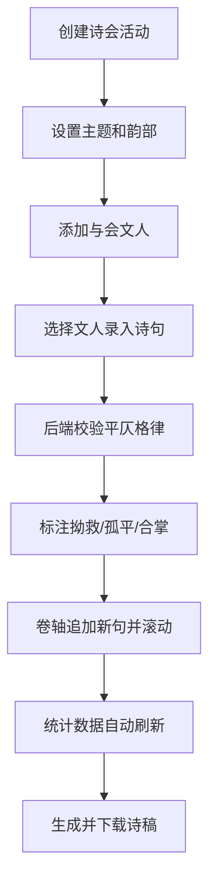

## 1. 产品概述

御街诗会录事是一款模拟北宋汴京文人诗会场景的全栈Web应用，用户扮演诗会录事，管理诗会活动、录入文人联句、自动校验平仄格律并生成精美的批注诗稿。

- 核心目标：为古典诗词爱好者提供沉浸式的诗会联句体验，结合平仄校验功能帮助用户学习传统诗词格律
- 目标用户：古典诗词爱好者、传统文化学习者、语文教育工作者
- 市场价值：将传统诗词文化与现代Web技术结合，打造独特的文化教育类应用

## 2. 核心功能

### 2.1 用户角色

| 角色 | 注册方式 | 核心权限 |
|------|----------|----------|
| 录事（用户） | 无需注册，直接使用 | 创建诗会、管理文人、录入诗句、校验格律、生成诗稿 |

### 2.2 功能模块

1. **诗会管理**：创建诗会活动、设置主题与韵部、添加与会文人
2. **联句录入**：选择文人、录入诗句、实时音效反馈、卷轴自动滚动
3. **平仄校验**：平仄谱检查、拗救/孤平/合掌检测、智能修正建议
4. **诗稿生成**：素笺样式展示、批注标注、一键下载/复制
5. **数据统计**：联句统计、文人排行、韵部分析、错误频次可视化

### 2.3 页面详情

| 页面名称 | 模块名称 | 功能描述 |
|---------|----------|----------|
| 主页面 | 诗会场景区 | 模拟北宋凉亭场景，展示素笺卷轴和诗句 |
| 主页面 | 操作面板区 | 文人筛选、诗句录入、校验结果、下载按钮 |
| 主页面 | 统计侧边栏 | 可收缩，展示数据统计和柱状图 |
| 主页面 | 诗会列表 | 展示已有诗会，支持创建新/切换诗会 |

## 3. 核心流程

用户创建诗会→添加文人名单→选择文人录入诗句→系统自动校验平仄→展示标注结果→生成诗稿卷轴→用户下载诗稿

## 4. 用户界面设计

### 4.1 设计风格

- **主色调**：米白(#faf0e6)、紫檀棕(#4a2e1b)、青石绿(#7a8b6e)、木柱棕(#8b5e3c)
- **辅助色**：红(#e74c3c拗救)、蓝(#3498db孤平)、绿(#2ecc71合掌)
- **字体**：宋体（诗句正文）、系统字体（界面文字）
- **按钮样式**：圆角8px，紫檀色背景，悬停加深，按压缩放0.95
- **布局风格**：横向双栏（左70%场景，右30%操作），响应式上下堆叠
- **特色元素**：素笺卷轴、木质轴头、水墨山水屏风、石印印章

### 4.2 页面设计概述

| 页面名称 | 模块名称 | UI元素 |
|---------|----------|--------|
| 主页面 | 凉亭场景区 | 青石基座、木柱、顶盖、山水屏风、石印、紫檀长案、素笺卷轴、木质轴头、诗句逐字显示、韵律标注 |
| 主页面 | 操作面板区 | 诗会标题、性情筛选标签、诗句输入框、校验结果展示、批注卡片、下载按钮 |
| 主页面 | 统计侧边栏 | 收缩/展开按钮、统计数据、柱状图（Canvas绘制）、淡入动画 |

### 4.3 响应式设计

- 桌面端（>768px）：横向双栏布局，左70%右30%
- 移动端（≤768px）：上下堆叠布局，场景区在上100%宽度，操作区在下100%宽度
- 诗会场景高度自动缩放，保持视觉比例
- 所有触摸元素尺寸≥44px，便于触控操作

### 4.4 动画与交互

- 卷轴滚动：0.4s缓动效果
- 批注卡片：2.5s显示后0.3s淡出
- 按钮按压：scale 0.95，0.1s过渡
- 标签选中：外发光0.3s过渡
- 统计刷新：淡入0.2s
- 标注悬停：放大1.1倍并显示tooltip
- 击节音效：AudioContext生成竹板声，时长0.15s
