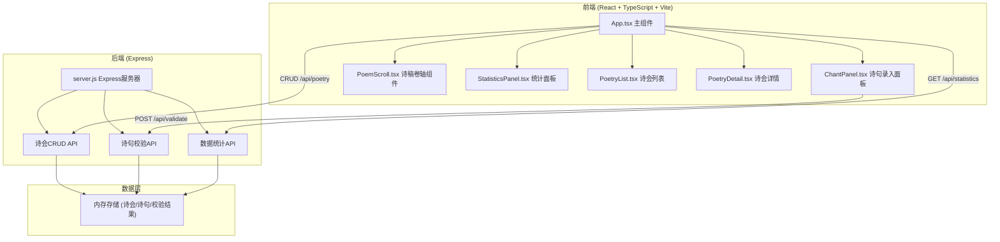
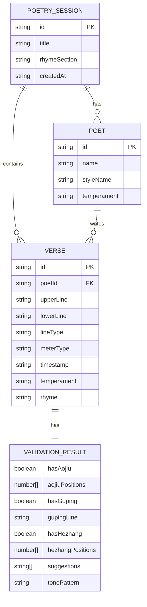

## 1. 架构设计



## 2. 技术描述

- **前端**：React@18 + TypeScript@5 + Vite@5 + @vitejs/plugin-react@4
- **后端**：Express@4 + cors@2
- **类型定义**：@types/react@18 + @types/react-dom@18
- **构建工具**：Vite（同时处理前端构建和代理后端请求）
- **状态管理**：React useState/useEffect（无需额外状态管理库）
- **数据存储**：后端内存存储（无需数据库）

## 3. 目录结构

```
d:\Solocoder\VersionFast\tasks\auto129\
├── package.json
├── vite.config.js
├── tsconfig.json
├── index.html
├── server.js
└── src/
    ├── App.tsx
    ├── main.tsx
    ├── index.css
    ├── types/
    │   └── index.ts
    ├── utils/
    │   ├── audio.ts
    │   └── download.ts
    └── components/
        ├── ChantPanel.tsx
        ├── PoemScroll.tsx
        ├── StatisticsPanel.tsx
        ├── PoetryList.tsx
        ├── PoetryDetail.tsx
        └── AnnotationCard.tsx
```

## 4. 路由定义

| 路由 | 用途 |
|------|------|
| / | 主页面，包含诗会场景区和操作面板 |

## 5. API 定义

### 5.1 诗会管理API

```typescript
// 类型定义
interface Poet {
  id: string;
  name: string;
  styleName: string;
  temperament: '豪放' | '婉约' | '闲适';
}

interface PoetrySession {
  id: string;
  title: string;
  rhymeSection: string;
  poets: Poet[];
  verses: Verse[];
  createdAt: string;
}

interface Verse {
  id: string;
  poetId: string;
  upperLine: string;
  lowerLine: string;
  lineType: 'five' | 'seven';
  meterType: 'seven-ze' | 'five-ping';
  timestamp: string;
  temperament: string;
  rhyme: string;
  validation: ValidationResult;
}

interface ValidationResult {
  hasAojiu: boolean;
  aojiuPositions: number[];
  hasGuping: boolean;
  gupingLine: 'upper' | 'lower' | null;
  hasHezhang: boolean;
  hezhangPositions: number[];
  suggestions: string[];
  tonePattern: string;
}

// GET /api/poetry
// 获取所有诗会列表
// Response: PoetrySession[]

// POST /api/poetry
// 创建新诗会
// Request: { title: string; rhymeSection: string; poets: Omit<Poet, 'id'>[] }
// Response: PoetrySession

// GET /api/poetry/:id
// 获取单个诗会详情
// Response: PoetrySession

// POST /api/poetry/:id/verses
// 添加诗句
// Request: { poetId: string; upperLine: string; lowerLine: string; lineType: 'five' | 'seven'; meterType: 'seven-ze' | 'five-ping' }
// Response: Verse

// POST /api/validate
// 校验诗句
// Request: { upperLine: string; lowerLine: string; lineType: 'five' | 'seven'; meterType: string; prevVerse?: Verse }
// Response: ValidationResult

// GET /api/statistics/:sessionId
// 获取诗会统计数据
// Response: StatisticsData

interface StatisticsData {
  totalVerses: number;
  topPoets: { poet: Poet; count: number }[];
  topRhymes: { rhyme: string; count: number }[];
  errorCounts: {
    aojiu: number;
    guping: number;
    hezhang: number;
  };
}
```

## 6. 数据模型

### 6.1 ER 图



## 7. 核心实现要点

### 7.1 平仄校验算法
- 基于常用字平仄字典（内置常见字的平仄标注）
- 支持七言仄起式和平起式、五言仄起式和平起式
- 拗救检测：检测当平用仄且后续有平声相救的情况
- 孤平检测：除韵脚外只有一个平声字且无救
- 合掌检测：相邻两句对应位置平仄相同

### 7.2 前端性能优化
- 诗句列表使用虚拟滚动（超过20条时）
- 校验结果缓存，避免重复请求
- Canvas柱状图使用requestAnimationFrame绘制
- 所有动画使用CSS transition保证60fps

### 7.3 Vite代理配置
- 将 `/api` 请求代理到 Express 服务器（端口3001）
- 前端和后端在同一端口运行（Vite端口5173）

### 7.4 启动命令
- `npm run dev`：同时启动Vite开发服务器和Express后端
