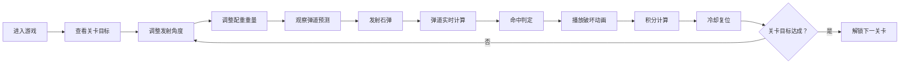

## 1. 产品概述

霹雳车攻城模拟是一款基于物理弹道的古代攻城器械模拟游戏，玩家扮演三国时期曹魏军中的霹雳车匠师，通过调整投石机参数将石弹准确抛向敌方城防设施。

- 核心玩法：调整发射角度、配重重量，把握释放时机，结合风向风速将石弹抛向目标
- 目标用户：对古代军事科技、物理模拟游戏感兴趣的玩家
- 市场价值：寓教于乐，结合历史知识与物理原理，提供沉浸式的古代战争体验

## 2. 核心功能

### 2.1 用户角色
| 角色 | 注册方式 | 核心权限 |
|------|----------|----------|
| 玩家 | 无需注册，直接进入游戏 | 操作投石机、调整参数、发射石弹、查看得分 |

### 2.2 功能模块
1. **主游戏场景**：CSS绘制的横版战场俯瞰图，包含草地、拒马军阵、城墙、护城河
2. **投石机操控**：拖拽调整角度、滑块控制配重、发射按钮触发石弹
3. **弹道可视化**：虚线轨迹、渐变圆点标记、粒子拖尾效果
4. **命中判定系统**：正中垛口、擦中侧面、完全偏离三种判定，不同破坏效果
5. **关卡进度系统**：积分累计、石弹限制、难度递增的攻城任务

### 2.3 页面详情
| 页面名称 | 模块名称 | 功能描述 |
|----------|----------|----------|
| 游戏主页面 | 顶部状态栏 | 显示当前关卡、累计得分、剩余石弹数 |
| 游戏主页面 | 战场场景 | 渲染军阵、拒马、城墙、护城河等静态元素 |
| 游戏主页面 | 投石机组件 | 可交互的投石机，支持拖拽调角、发射石弹 |
| 游戏主页面 | 底部工具栏 | 配重滑块、角度滑块、圆形发射按钮 |
| 游戏主页面 | 弹道系统 | 实时计算并可视化抛物线轨迹、粒子拖尾 |
| 游戏主页面 | 命中反馈 | 砖块崩落、箭楼倒塌、烟雾效果等动画 |

## 3. 核心流程

用户进入游戏后，首先查看当前关卡目标，通过拖拽投石机投掷臂或使用滑块调整发射角度，通过配重滑块调整投石机力道，观察弹道预测轨迹，确认后点击发射按钮或松开鼠标发射石弹。系统实时计算弹道（考虑风力影响），判断命中区域，播放破坏动画并计算得分。石弹发射后进入0.5秒冷却，投石臂自动复位。完成指定目标后解锁下一关卡。

## 4. 用户界面设计

### 4.1 设计风格
- **主色调**：暖黄土色调，模拟古战场氛围
- **背景渐变**：从#3a2a1a（地面）到#6b7b6b（天空）
- **色彩体系**：
  - 草地：#4a7a4a
  - 城墙：#6b7b6b（青砖色）
  - 木材：#5d3a1a、#4a2a1a、#6b4e3a
  - 配重：#555555
  - 金色文字：#ffd700
  - 石弹：#888888到#555555径向渐变
- **按钮风格**：圆形发射按钮，按下时有下沉效果（transform: scale）
- **字体**：数字使用Courier New，UI文字使用系统字体
- **布局**：横版战场俯瞰，顶部状态栏，底部工具栏

### 4.2 页面设计概述
| 页面名称 | 模块名称 | UI元素 |
|----------|----------|--------|
| 游戏主页面 | 顶部状态栏 | 深棕色(#4a2a1a)背景，高40px，金色得分(#ffd700)18px粗体，白色剩余石弹14px |
| 游戏主页面 | 战场场景 | 绿色草地(#4a7a4a)，三排拒马（菱形交叉细线），青砖城墙(#6b7b6b)高200px带垛口，护城河(#4a90d9)波纹动画 |
| 游戏主页面 | 投石机组件 | 人字支架(#5d3a1a)60度角高80px，投掷臂(#4a2a1a)长120px可旋转0-60度，配重箱(#555555)20x30px，皮弹兜(#d4a76a)半圆形，石弹径向渐变 |
| 游戏主页面 | 弹道可视化 | 橙色虚线(#ff6600)，渐变圆点(#ffaa00)透明度1→0.3，石弹自旋0.5圈/秒，烟尘粒子拖尾 |
| 游戏主页面 | 底部工具栏 | 木色(#6b4e3a)高60px，暗红色滑块轨道(#8b2500)，铜色滑块(#d4a017)，圆形发射按钮(#d4a76a) |
| 游戏主页面 | 命中效果 | 砖块崩落（#8b4513矩形坠落），土黄色烟雾圈(#c4a76a)，轨迹偏转折线 |

### 4.3 响应式设计
- **桌面端**（>768px）：底部工具栏一行布局，滑块在两侧，发射按钮居中
- **平板端**（768px-480px）：适当压缩间距
- **移动端**（≤480px）：底部工具栏两行布局，滑块上下排列，发射按钮居中；顶部状态栏两行布局
- **最小宽度**：360px，**最大宽度**：1920px
- **触摸优化**：滑块和按钮最小触摸区域48px

### 4.4 动画与交互
- 所有操作带0.2s ease-out过渡动画
- 投石机角度调整实时响应
- 石弹自旋动画（0.5圈/秒）
- 护城河水平波纹动画
- 砖块崩落坠落动画（0.5秒）
- 烟雾消散动画（0.3秒）
- 发射按钮:active下沉效果
