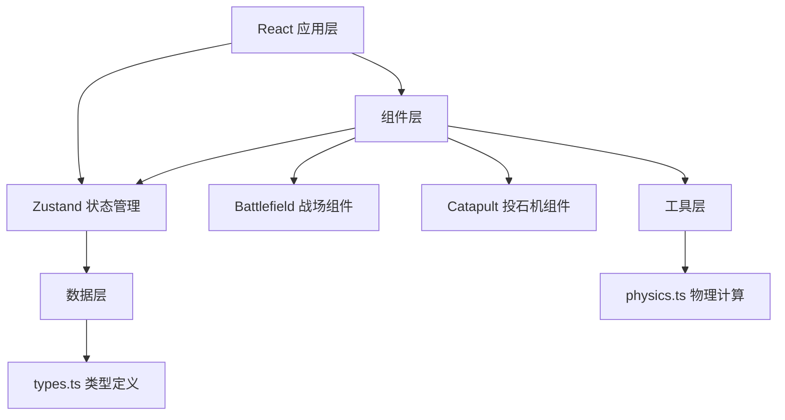

## 1. 架构设计



## 2. 技术描述

- **前端框架**：React@18 + TypeScript@5
- **构建工具**：Vite@5 + @vitejs/plugin-react@4
- **状态管理**：Zustand@4
- **样式方案**：CSS Modules + 内联样式（动态计算）
- **初始化方式**：手动配置项目结构

## 3. 项目结构

```
.
├── package.json
├── vite.config.js
├── tsconfig.json
├── index.html
└── src/
    ├── types.ts          # 数据模型定义
    ├── store.ts          # Zustand 全局状态
    ├── components/
    │   ├── Battlefield.tsx   # 主战场组件
    │   └── Catapult.tsx      # 投石机组件
    ├── utils/
    │   └── physics.ts        # 弹道物理计算
    ├── App.tsx
    ├── main.tsx
    └── index.css
```

## 4. 数据模型定义

### 4.1 核心类型定义（types.ts）

```typescript
// 城墙段类型
interface WallSegment {
  id: string;
  x: number;
  y: number;
  width: number;
  height: number;
  type: 'wall' | 'merlon' | 'gate';
  health: number;
  destroyed: boolean;
}

// 投石机状态
interface CatapultState {
  angle: number;          // 发射角度 10-60度
  counterweight: number;  // 配重 1-5石
  isDragging: boolean;    // 是否正在拖拽
  isCoolingDown: boolean; // 是否冷却中
  projectileLoaded: boolean; // 是否已装弹
}

// 弹道数据点
interface TrajectoryPoint {
  x: number;
  y: number;
  opacity: number;
  timestamp: number;
}

// 粒子数据
interface Particle {
  id: string;
  x: number;
  y: number;
  vx: number;
  vy: number;
  size: number;
  color: string;
  opacity: number;
  life: number;
}

// 风力数据
interface Wind {
  speed: number;     // 风速 0-10
  direction: number; // 风向 -1(左) 或 1(右)
}

// 投射物状态
interface Projectile {
  id: string;
  x: number;
  y: number;
  vx: number;
  vy: number;
  rotation: number;
  active: boolean;
  trail: Particle[];
}

// 命中类型
type HitType = 'direct' | 'glancing' | 'miss';

// 命中结果
interface HitResult {
  type: HitType;
  score: number;
  target: WallSegment | null;
}

// 关卡定义
interface Level {
  id: number;
  name: string;
  wallType: 'mud' | 'brick' | 'complex';
  targetScore: number;
  projectiles: number;
  windVariation: number;
}
```

## 5. 状态管理设计（store.ts）

使用 Zustand 管理全局状态：

```typescript
interface GameState {
  // 游戏状态
  currentLevel: number;
  score: number;
  remainingProjectiles: number;
  levels: Level[];
  
  // 投石机状态
  catapult: CatapultState;
  
  // 环境状态
  wind: Wind;
  
  // 弹道状态
  trajectory: TrajectoryPoint[];
  projectile: Projectile | null;
  
  // 城墙状态
  walls: WallSegment[];
  
  // 粒子效果
  particles: Particle[];
  
  // Actions
  setAngle: (angle: number) => void;
  setCounterweight: (weight: number) => void;
  setDragging: (isDragging: boolean) => void;
  fireProjectile: () => void;
  resetCatapult: () => void;
  updateProjectile: (dt: number) => void;
  calculateTrajectory: () => void;
  checkCollision: () => HitResult | null;
  addScore: (points: number) => void;
  useProjectile: () => void;
  nextLevel: () => void;
  resetGame: () => void;
  addParticles: (particles: Particle[]) => void;
  updateParticles: (dt: number) => void;
}
```

## 6. 物理计算模块（physics.ts）

```typescript
// 重力加速度
const GRAVITY = 9.8;
// 像素到米的转换
const PIXELS_PER_METER = 10;

/**
 * 生成抛物线运动轨迹
 * @param startX 起始X坐标
 * @param startY 起始Y坐标
 * @param angle 发射角度（度）
 * @param velocity 初速度
 * @param wind 风力数据
 * @param maxPoints 最大轨迹点数
 * @returns 轨迹点数组
 */
export function generateTrajectory(
  startX: number,
  startY: number,
  angle: number,
  velocity: number,
  wind: Wind,
  maxPoints: number = 100
): TrajectoryPoint[];

/**
 * 计算石弹下一帧位置
 * @param projectile 当前投射物状态
 * @param wind 风力数据
 * @param dt 时间步长
 * @returns 更新后的投射物
 */
export function updateProjectilePhysics(
  projectile: Projectile,
  wind: Wind,
  dt: number
): Projectile;

/**
 * 检测石弹与城墙垛口的碰撞
 * @param projectile 投射物位置
 * @param walls 城墙段数组
 * @returns 命中结果或null
 */
export function checkWallCollision(
  projectile: Projectile,
  walls: WallSegment[]
): HitResult | null;

/**
 * 生成粒子拖尾坐标
 * @param x 当前x坐标
 * @param y 当前y坐标
 * @param vx x方向速度
 * @param vy y方向速度
 * @param count 粒子数量
 * @returns 粒子数组
 */
export function generateTrailParticles(
  x: number,
  y: number,
  vx: number,
  vy: number,
  count: number
): Particle[];

/**
 * 根据配重计算初速度
 * @param counterweight 配重（石）
 * @param angle 发射角度
 * @returns 初速度（像素/秒）
 */
export function calculateInitialVelocity(
  counterweight: number,
  angle: number
): number;

/**
 * 生成砖块崩落粒子
 * @param x 位置x
 * @param y 位置y
 * @param count 砖块数量
 * @returns 粒子数组
 */
export function generateBrickParticles(
  x: number,
  y: number,
  count: number
): Particle[];

/**
 * 生成烟雾圈粒子
 * @param x 位置x
 * @param y 位置y
 * @returns 粒子数组
 */
export function generateSmokeParticles(
  x: number,
  y: number
): Particle[];
```

## 7. 性能优化要求

- 弹道计算单次执行时间 ≤ 2ms
- 交互帧率稳定 ≥ 50fps
- 使用 requestAnimationFrame 进行动画循环
- 轨迹点数量限制（最多100个点）
- 粒子对象池复用，避免频繁GC
- CSS transform 动画启用 GPU 加速
- 使用 useCallback/useMemo 避免不必要重渲染
- 拖拽操作使用节流（throttle）优化
