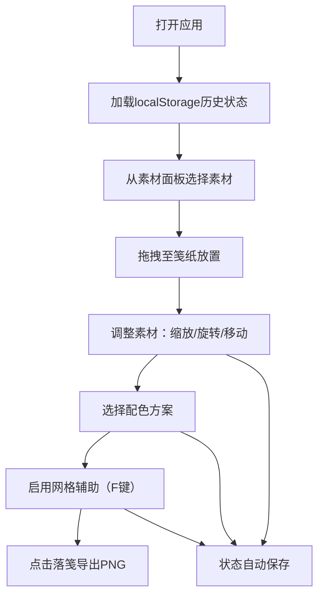

## 1. 产品概述

花草笺·花样排版与配色推演应用是一款在浏览器中模拟古代花草笺设计的交互工具。用户可以将干花、叶脉、草茎等自然素材按照个人审美拼贴组合，预览不同花材的色彩搭配和疏密布局，解决传统花草笺设计中缺乏实物素材库、难以预览效果的问题。

- **核心价值**：让用户在落笔前即可预览花草笺成品效果，降低试错成本
- **目标用户**：花草笺爱好者、手工艺人、设计师、传统文化学习者

## 2. 核心功能

### 2.1 功能模块

1. **素材面板**：展示20种花草笺素材，分为花瓣、叶片、草茎三类
2. **笺纸编辑区**：中央空白笺纸，支持素材拖拽放置、缩放、旋转
3. **配色方案面板**：5种预设配色方案，一键切换整体色调
4. **布局辅助系统**：网格吸附、统计信息展示
5. **作品导出系统**：PNG导出、localStorage状态持久化

### 2.2 页面详情

| 页面名称 | 模块名称 | 功能描述 |
|----------|----------|----------|
| 主编辑页 | 素材面板 | 20种圆形缩略图素材，分类展示，悬停放大显示文言名称 |
| 主编辑页 | 笺纸编辑区 | 600x400px米黄色笺纸，支持素材拖拽放置、8点缩放、旋转调整 |
| 主编辑页 | 配色面板 | 5种配色方案（春桃/夏荷/秋枫/冬梅/墨韵），点击应用变色动画 |
| 主编辑页 | 布局辅助 | F键切换网格显示，素材自动吸附，底部显示素材统计信息 |
| 主编辑页 | 导出功能 | "落笺"按钮导出PNG，状态自动保存至localStorage |

## 3. 核心流程

## 4. 用户界面设计

### 4.1 设计风格

**仿古书卷视觉风格**
- **主色调**：深褐色木纹背景 #8d6e63，米黄色笺纸 #f5e6c8
- **按钮样式**：毛笔字楷体，深褐色 #3e2723，点击下沉1px，0.2秒过渡
- **字体**：楷体/衬线字体，文言风格命名
- **布局风格**：笺纸居中，左侧素材面板（宣纸质感半透明），右上角配色面板（淡黄色折页）
- **材质质感**：宣纸半透明、木纹渐变、折页虚线边框

### 4.2 页面设计概述

| 页面名称 | 模块名称 | UI元素 |
|----------|----------|--------|
| 主编辑页 | 素材面板 | 圆形缩略图50px，悬停放大1.1倍，文言名称标签，三类色彩渐变 |
| 主编辑页 | 笺纸区域 | 米黄色600x400px，素材选中8个缩放节点，旋转手柄弧形箭头 |
| 主编辑页 | 配色面板 | 5个渐变色块，折页样式，虚线边框，点击应用0.5秒缓动动画 |
| 主编辑页 | 辅助网格 | 米白色#dcdcdc，透明度0.4，间距50px，10px吸附距离 |
| 主编辑页 | 状态栏 | 底部显示素材总数、平均饱和度、对比度得分 |

### 4.3 响应式适配

**桌面优先设计**
- **视口 < 768px**：笺纸缩小为350x250px，素材缩略图35px，网格间距30px，配色面板移至笺纸下方横向排列
- **视口 > 1200px**：笺纸扩大至750x500px，素材面板两列显示

### 4.4 交互动效

- **素材放置**：50ms短促"啪"声（AudioContext生成，400Hz-800Hz上升）
- **配色切换**：0.5秒颜色缓动动画，纹理保留
- **按钮点击**：下沉1px，底色变为浅褐色，0.2秒过渡
- **网格切换**：显示/隐藏动画不超过200ms
- **素材悬停**：放大至1.1倍，显示文言名称标签

## 5. 性能要求

- **拖拽响应**：每帧响应时间 ≤ 16ms（60fps稳定）
- **素材上限**：同时放置20个素材时无卡顿
- **动画流畅**：网格切换动画 ≤ 200ms
- **导出分辨率**：1200x800px PNG，半透明背景
