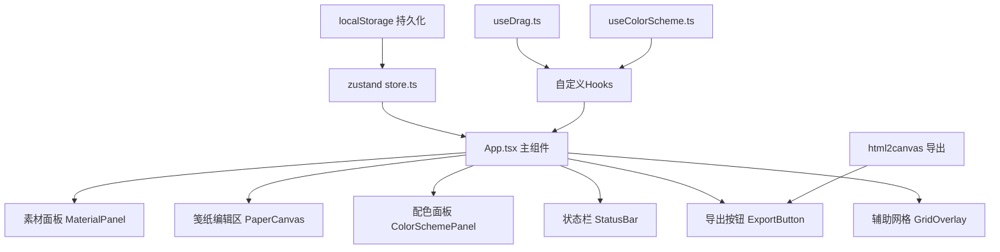

## 1. 架构设计



## 2. 技术描述

- **前端框架**：React@18 + TypeScript@5
- **构建工具**：Vite@5
- **状态管理**：zustand@4
- **导出工具**：html2canvas@1
- **类型定义**：@types/react、@types/react-dom
- **插件**：@vitejs/plugin-react@4

## 3. 目录结构

```
src/
├── App.tsx              # 主组件，组装各模块
├── store.ts             # zustand状态管理
├── hooks/
│   ├── useDrag.ts       # 拖拽hook（素材/缩放节点）
│   └── useColorScheme.ts # 配色映射hook
├── components/
│   ├── MaterialPanel.tsx    # 左侧素材面板
│   ├── PaperCanvas.tsx      # 中央笺纸编辑区
│   ├── ColorSchemePanel.tsx # 右上配色面板
│   ├── PlacedMaterial.tsx   # 已放置素材组件
│   ├── GridOverlay.tsx      # 辅助网格
│   ├── StatusBar.tsx        # 底部状态栏
│   └── ExportButton.tsx     # 落笺导出按钮
├── data/
│   └── materials.ts    # 20种素材定义（文言名称、颜色、SVG路径）
├── utils/
│   ├── colorUtils.ts   # 颜色处理工具（饱和度、对比度计算）
│   └── audioUtils.ts   # 音效生成工具
└── types/
    └── index.ts        # 类型定义
```

## 4. 数据模型

### 4.1 类型定义

```typescript
// 素材类型
type MaterialCategory = 'petal' | 'leaf' | 'stem';

interface Material {
  id: string;
  name: string;           // 文言名称
  category: MaterialCategory;
  baseColor: string;      // 原始颜色
  svgPath: string;        // SVG路径数据
}

// 已放置素材实例
interface PlacedMaterial {
  id: string;
  materialId: string;
  x: number;              // 相对笺纸的X坐标
  y: number;              // 相对笺纸的Y坐标
  scale: number;          // 缩放比例 0.5-3
  angle: number;          // 旋转角度 0-360
  currentColor: string;   // 当前映射后的颜色
}

// 配色方案
interface ColorScheme {
  id: string;
  name: string;           // 春桃/夏荷/秋枫/冬梅/墨韵
  startColor: string;
  endColor: string;
  paperBg: string;        // 笺纸匹配底色
}

// Store状态
interface AppState {
  materials: Material[];
  placedMaterials: PlacedMaterial[];
  selectedId: string | null;
  colorScheme: string;
  gridVisible: boolean;
  paperSize: { width: number; height: number };
  
  // Actions
  addMaterial: (materialId: string, x: number, y: number) => void;
  removeMaterial: (id: string) => void;
  updateMaterial: (id: string, updates: Partial<PlacedMaterial>) => void;
  selectMaterial: (id: string | null) => void;
  setColorScheme: (schemeId: string) => void;
  toggleGrid: () => void;
  setPaperSize: (width: number, height: number) => void;
  loadFromStorage: () => void;
}
```

## 5. 核心算法

### 5.1 配色映射算法

```typescript
// 将原始颜色HSL分量映射到目标配色方案的渐变色域
function mapColor(baseColor: string, scheme: ColorScheme): string {
  // 1. 解析baseColor为HSL
  // 2. 保留原始色相的相对位置
  // 3. 将饱和度和亮度映射到方案的渐变色阶
  // 4. 输出新的RGB颜色
}
```

### 5.2 网格吸附算法

```typescript
function snapToGrid(x: number, y: number, gridSize: number, snapDistance: number): { x: number; y: number } {
  const snapX = Math.round(x / gridSize) * gridSize;
  const snapY = Math.round(y / gridSize) * gridSize;
  return {
    x: Math.abs(x - snapX) <= snapDistance ? snapX : x,
    y: Math.abs(y - snapY) <= snapDistance ? snapY : y
  };
}
```

### 5.3 饱和度与对比度计算

```typescript
// 平均饱和度
function calculateAvgSaturation(colors: string[]): number

// 对比度得分（基于色相差）
function calculateContrastScore(colors: string[]): number
```

## 6. 自定义Hooks

### 6.1 useDrag.ts

```typescript
function useDrag(
  initialPosition: { x: number; y: number },
  onDragEnd?: (position: { x: number; y: number }) => void,
  constraints?: { minX?: number; maxX?: number; minY?: number; maxY?: number }
): {
  position: { x: number; y: number };
  isDragging: boolean;
  handlers: {
    onMouseDown: (e: React.MouseEvent) => void;
  };
}
```

### 6.2 useColorScheme.ts

```typescript
function useColorScheme(): {
  schemes: ColorScheme[];
  currentScheme: ColorScheme;
  applyScheme: (schemeId: string) => void;
  mapMaterialColor: (baseColor: string) => string;
  animateColor: (fromColor: string, toColor: string, duration: number) => string;
}
```

## 7. 性能优化策略

1. **React.memo**：包装PlacedMaterial组件，避免不必要重渲染
2. **useCallback**：缓存事件处理函数
3. **requestAnimationFrame**：拖拽时使用RAF保证60fps
4. **transform优化**：使用transform: translate/scale/rotate而非top/left
5. **will-change**：为拖拽元素添加will-change: transform提示
6. **批量更新**：配色切换时批量更新所有素材颜色
