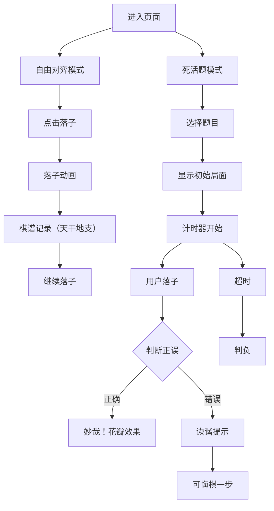

## 1. 产品概述

"谢安棋谱"是一款以魏晋时期会稽山阴为背景的围棋记谱与死活题推演小游戏。用户可以在虚拟的谢安别墅中，于石案上对弈，体验古风围棋的乐趣，同时学习经典死活题。

- **核心用途**：围棋对弈记谱、死活题练习、棋谱回顾
- **目标用户**：围棋爱好者、传统文化爱好者
- **产品价值**：将围棋与传统文化结合，提供沉浸式的古风围棋体验

## 2. 核心功能

### 2.1 功能模块

1. **自由对弈模式**：19路棋盘自由落子、提子、打劫，自动记谱
2. **死活题模式**：预设经典死活题（"两边皆急"、"金鸡独立"等），限定手数内找到正解
3. **棋谱记录**：古风竖排棋谱，天干地支编号，最多200步
4. **棋谱回放**：点击棋谱步骤可高亮显示对应落子位置

### 2.2 页面详情

| 页面名称 | 模块名称 | 功能描述 |
|-----------|-------------|---------------------|
| 主页面 | 棋盘区域 | Canvas绘制19路棋盘，支持落子、提子、动画效果 |
| 主页面 | 棋谱面板 | 竖排显示棋谱记录，支持滚动，点击高亮 |
| 主页面 | 模式切换 | 自由对弈/死活题模式切换 |
| 主页面 | 计时器 | 死活题模式漏刻计时，细楷字体显示 |
| 主页面 | 悔棋按钮 | 回退一着（仅限一步） |

## 3. 核心流程

### 3.1 自由对弈流程
用户进入页面 → 点击棋盘交叉点落子 → 棋子落下动画 → 棋谱自动记录（天干地支编号） → 循环落子直至结束

### 3.2 死活题流程
切换到死活题模式 → 选择题目 → 棋盘显示初始局面 → 计时器开始（漏刻：XX）→ 用户落子 → 判断正误 → 正确显示"妙哉！"花瓣效果 / 错误显示诙谐提示 → 可悔棋一步 → 超时判负

### 3.3 棋谱回放流程
点击棋谱中某一步 → 棋盘高亮显示该落子位置（白圈闪烁0.5秒）

## 4. 用户界面设计

### 4.1 设计风格
- **主色调**：淡黄色（绢帛）、浅褐色（木质）、老红木色（边框）
- **辅助色**：灰褐色（#8b7355坐标线）、深棕色（#5c4033星位）、半透明黑色（#1a1a1a alpha0.6交叉点）
- **字体**：细楷字体（棋谱、计时器），整体古风雅致
- **布局**：左侧棋盘70%，右侧棋谱面板20%，中间10%竖向竹帘纹装饰
- **特殊效果**：棋子落下动画（0.2秒ease-out）、"妙哉！"花瓣飘散、高亮白圈闪烁

### 4.2 页面设计概览

| 页面名称 | 模块名称 | UI元素 |
|-----------|-------------|-------------|
| 主页面 | 棋盘区域 | 浅黄色绢帛背景带斜纹和纤维斑点、19路坐标线、星位点、老红木边框、落子动画、黑白云子（黑子反光、白子半透絮状纹理） |
| 主页面 | 中间装饰 | 半透明#d2b48c竖向竹帘纹 |
| 主页面 | 棋谱面板 | 绢本质感、竖排天干地支编号、古风格式、滚动支持（最多200步） |
| 主页面 | 计时器 | 细楷字体、右侧显示"漏刻：XX" |
| 主页面 | 模式切换按钮 | 古风按钮样式、悬停效果 |
| 主页面 | 悔棋按钮 | 古风按钮样式、悬停效果 |

### 4.3 响应性
- 桌面端优先，自适应浏览器窗口大小
- 棋盘保持正方形比例，根据可用空间调整尺寸
- 棋谱面板固定宽度，支持内部滚动

### 4.4 性能要求
- 落子响应不超过50ms
- 棋谱滚动60fps不掉帧
- Canvas渲染优化，避免不必要的重绘
