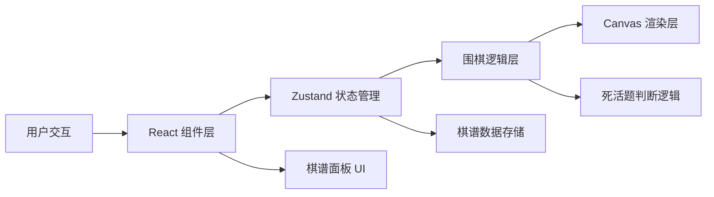

## 1. 架构设计



## 2. 技术描述

- **前端框架**：React 18 + TypeScript
- **构建工具**：Vite
- **状态管理**：Zustand
- **渲染方式**：Canvas 2D API（棋盘绘制）
- **样式方案**：原生 CSS（CSS 变量 + 类名）
- **无后端**：所有逻辑在浏览器端运行

## 3. 目录结构

```
src/
├── App.tsx              # 主应用组件
├── GameBoard.tsx        # 棋盘组件（Canvas渲染、落子交互、死活题逻辑）
├── RecordPanel.tsx      # 棋谱面板组件
├── types.ts             # TypeScript 类型定义
├── store/
│   └── useGameStore.ts  # Zustand 状态管理
└── utils/
    ├── goLogic.ts       # 围棋逻辑（气、提子、打劫）
    ├── tsumego.ts       # 死活题库与判断逻辑
    └── ganzhi.ts        # 天干地支转换工具
```

## 4. 数据模型

### 4.1 核心类型定义

```typescript
// 棋子颜色
type StoneColor = 'black' | 'white' | null;

// 棋盘位置
interface Position {
  x: number;  // 0-18 列
  y: number;  // 0-18 行
}

// 落子记录
interface MoveRecord {
  id: number;
  color: StoneColor;
  position: Position;
  coordinate: string;  // 如"小目"、"星位"
  capturedStones: Position[];  // 被提子位置
  timestamp: number;
}

// 死活题定义
interface Tsumego {
  id: string;
  name: string;  // 如"两边皆急"、"金鸡独立"
  description: string;
  initialStones: { position: Position; color: StoneColor }[];
  solution: Position[];  // 正确落子序列
  maxMoves: number;  // 限定手数
  timeLimit: number;  // 时间限制（秒）
  playerColor: StoneColor;  // 玩家执子颜色
}

// 动画状态
interface StoneAnimation {
  position: Position;
  color: StoneColor;
  progress: number;  // 0-1
  startTime: number;
}

// 游戏状态
interface GameState {
  board: StoneColor[][];  // 19x19 棋盘
  currentPlayer: StoneColor;
  moveHistory: MoveRecord[];
  koPosition: Position | null;  // 打劫禁着点
  gameMode: 'free' | 'tsumego';
  currentTsumego: Tsumego | null;
  tsumegoMoveIndex: number;  // 当前死活题步数
  timeRemaining: number;  // 剩余时间
  highlightPosition: Position | null;  // 高亮位置
  animations: StoneAnimation[];
  canUndo: boolean;  // 是否可悔棋
  showMessage: string | null;  // 提示信息
  petalEffect: boolean;  // 花瓣效果
}
```

## 5. 核心模块说明

### 5.1 围棋逻辑模块 (goLogic.ts)
- `countLiberties()`: 计算棋子/棋群的气
- `removeDeadStones()`: 移除无气的棋子
- `isValidMove()`: 检查落子是否合法（包括打劫判断）
- `getCoordinateName()`: 获取落子位置的古名（小目、星位等）

### 5.2 死活题模块 (tsumego.ts)
- 预设题库："两边皆急"、"金鸡独立"等经典题目
- `checkTsumegoMove()`: 检查死活题落子是否正确
- 诙谐错误提示库："此着不当，白输半目"等

### 5.3 天干地支模块 (ganzhi.ts)
- `getGanZhi()`: 将步数转换为天干地支（甲子、乙丑...）

### 5.4 Canvas 渲染优化
- 使用 `requestAnimationFrame` 进行动画
- 分层绘制：背景层 → 网格层 → 棋子层 → 动画层
- 仅在状态变化时重绘，避免不必要的渲染

### 5.5 性能优化
- 落子逻辑使用不可变数据结构
- 棋谱滚动使用 CSS `transform: translate3d` 启用硬件加速
- 使用 `useMemo` 和 `useCallback` 避免不必要的重渲染
- Canvas 背景使用离屏 canvas 预渲染

## 6. 状态管理 (Zustand)

```typescript
// actions:
- placeStone(position: Position)
- undoMove()
- switchMode(mode: 'free' | 'tsumego')
- selectTsumego(tsumegoId: string)
- highlightMove(moveIndex: number)
- resetGame()
```
