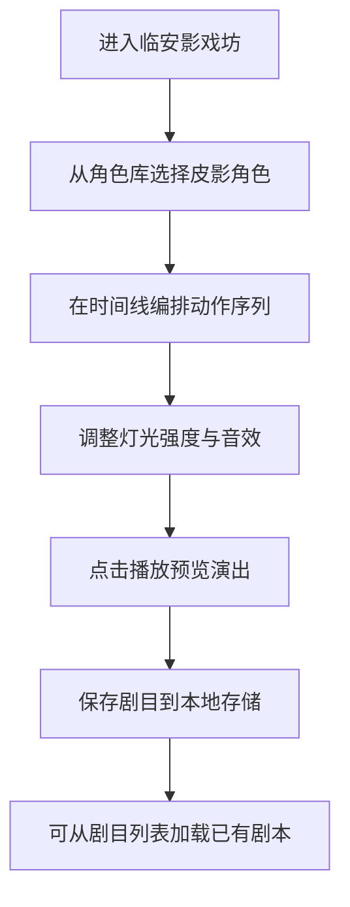

## 1. 产品概述

"临安影戏坊"是一款模拟南宋皮影戏表演编排的交互应用，让用户以临安勾栏影戏班主的身份设计皮影剧本、编排角色动作序列并实时控制灯光与音效。

- **核心目标**：还原宋代皮影戏的艺术魅力，通过数字化交互让用户体验传统戏剧编排的乐趣
- **目标用户**：传统文化爱好者、游戏玩家、教育工作者

## 2. 核心功能

### 2.1 功能模块

1. **角色管理区**：8个预设皮影角色库、角色选择与添加、角色属性展示
2. **动作编排区**：时间线编辑、动作序列拖拽排序、动作类型选择、片段复制/粘贴/删除
3. **舞台演出区**：Canvas实时渲染、角色动作播放、法术特效、灯光渐变效果
4. **灯光音效区**：油灯光影滑块控制、背景音效播放、动作音效联动、音效开关
5. **剧目管理区**：剧目保存（JSON）、本地存储加载、剧目列表展示
6. **播放控制区**：进度拖拽、速度控制（0.5x/1x/2x/4x）、暂停/继续

### 2.2 页面详情

| 页面名称 | 模块名称 | 功能描述 |
|-----------|-------------|---------------------|
| 主编排界面 | 角色库 | 8个预设皮影纸偶展示，点击添加到时间线 |
| 主编排界面 | 动作时间线 | 横向滚动帧序列，支持拖拽排序、动作类型选择 |
| 主编排界面 | 舞台Canvas | 800x600px实时渲染，角色动画、法术特效、灯光效果 |
| 主编排界面 | 灯光控制 | 0-100%滑块控制油灯光晕半径和透明度 |
| 主编排界面 | 播放控制条 | 进度拖拽、速度切换、暂停/继续、帧数显示 |
| 剧目管理弹窗 | 剧目列表 | 最多10个剧目展示，点击加载恢复全部状态 |

## 3. 核心流程

用户从角色库选择白蛇、青蛇等角色添加到时间线，为每一帧选择待机、行走、施法或打斗动作，调整灯光营造氛围，然后播放观看完整皮影戏表演，最后保存剧目以便日后修改或重演。

## 4. 用户界面设计

### 4.1 设计风格

- **设计主题**：南宋古风，仿古纸色#f5e6c8主背景
- **主色调**：仿古纸黄#f5e6c8、深木色#5c3a29、深红#8b0000、墨蓝#1a1a2e
- **角色主题色**：白蛇#9acd32、青蛇#2e8b57、许仙#8b4513、法海#daa520
- **卡片样式**：圆角4px，角色类型渐变底色（仙类#f0e6d6、妖类#e0f0e6、人类#f5deb3）
- **按钮样式**：圆形播放按钮直径32px，深红#8b0000，悬停亮红#cc0000
- **字体**：使用宋体/楷体类衬线字体搭配清晰无衬线字体，营造古典韵味
- **动效**：所有交互transition: all 0.2s ease，卡片悬停上浮3px

### 4.2 页面设计概述

| 页面名称 | 模块名称 | UI元素 |
|-----------|-------------|-------------|
| 主编排界面 | 舞台区域 | 深色木框6px包裹、四角铜钱装饰、Canvas 800x600px |
| 主编排界面 | 左侧控制面板 | 宽度280px，角色卡片120x160px，选中左侧3px主题色边框 |
| 主编排界面 | 动作时间线 | 每帧60x30px，显示动作缩写和帧数，选中帧半透明主题色 |
| 主编排界面 | 灯光滑块 | 轨道渐变#1a1a2e到#fff8e7，两端"幽暗"/"明亮"标注 |
| 主编排界面 | 播放控制条 | 高50px，圆形播放按钮，右下角显示"第X/Y帧" |

### 4.3 响应式设计

- **桌面端**：左侧控制面板280px，舞台居中，底部播放条
- **移动端（<768px）**：控制面板收窄为200px并置底，Canvas宽度100vw按比例缩放，播放按钮放大至48px

## 5. 性能约束

- Canvas渲染帧率≥55fps，8角色同时施法特效≥30fps
- 时间线拖拽排序响应≤80ms
- 音效触发延迟≤100ms
