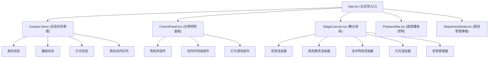

## 1. 架构设计



## 2. 技术描述

- **前端框架**：React 18 + TypeScript 5
- **构建工具**：Vite 5
- **状态管理**：Zustand 4
- **动画库**：Framer Motion 11
- **渲染技术**：HTML5 Canvas 2D API
- **音频处理**：Web Audio API
- **数据存储**：LocalStorage
- **包管理器**：npm

## 3. 目录结构

```
src/
├── App.tsx                    # 主应用组件
├── main.tsx                   # 应用入口
├── index.css                  # 全局样式
├── types/
│   └── index.ts               # TypeScript类型定义
├── store/
│   └── useShadowPlayStore.ts  # Zustand全局状态管理
├── components/
│   ├── StageCanvas.tsx        # 舞台Canvas渲染
│   ├── ControlPanel.tsx       # 左侧控制面板
│   ├── PlaybackBar.tsx        # 底部播放控制条
│   ├── CharacterLibrary.tsx   # 角色库
│   ├── ActionTimeline.tsx     # 动作时间线
│   ├── LightControl.tsx       # 灯光控制滑块
│   └── RepertoireModal.tsx    # 剧目管理弹窗
├── hooks/
│   ├── useCanvasRenderer.ts   # Canvas渲染Hook
│   ├── useAudioManager.ts     # 音效管理Hook
│   └── useAnimationFrame.ts   # 动画帧Hook
└── utils/
    ├── characterData.ts       # 角色预设数据
    ├── audioUtils.ts          # 音频工具函数
    └── storageUtils.ts        # 本地存储工具
```

## 4. 核心数据模型

### 4.1 TypeScript类型定义

```typescript
// 角色类型
type CharacterType = 'immortal' | 'demon' | 'human' | 'monk';

// 动作类型
type ActionType = 'idle' | 'walk' | 'cast' | 'fight';

// 角色定义
interface Character {
  id: string;
  name: string;
  type: CharacterType;
  themeColor: string;
  gradientColors: [string, string];
  layer: number; // 渲染层级
  spriteSheet: SpriteData;
}

// 动作帧
interface ActionFrame {
  id: string;
  characterId: string;
  actionType: ActionType;
  duration: number; // 持续帧数
  startFrame: number;
}

// 舞台角色实例
interface StageCharacter {
  id: string;
  characterId: string;
  x: number;
  y: number;
  currentFrame: number;
  currentAction: ActionType;
  actionFrames: ActionFrame[];
  isCasting: boolean;
  castEffectTime: number;
}

// 法术特效
interface SpellEffect {
  id: string;
  characterId: string;
  type: ActionType;
  position: { x: number; y: number };
  startTime: number;
  duration: number;
  color: string;
}

// 剧目数据
interface Repertoire {
  id: string;
  name: string;
  savedAt: string;
  stageCharacters: StageCharacter[];
  lightIntensity: number;
  soundEnabled: boolean;
  totalFrames: number;
}

// 全局状态
interface ShadowPlayState {
  currentRepertoire: Repertoire | null;
  isPlaying: boolean;
  currentFrame: number;
  totalFrames: number;
  playbackSpeed: number;
  lightIntensity: number;
  soundEnabled: boolean;
  selectedCharacterId: string | null;
  selectedFrameId: string | null;
  stageCharacters: StageCharacter[];
  spellEffects: SpellEffect[];
  repertoires: Repertoire[];
  
  // Actions
  addCharacter: (charId: string) => void;
  removeCharacter: (instanceId: string) => void;
  addActionFrame: (charInstanceId: string, action: ActionType, duration: number) => void;
  removeActionFrame: (frameId: string) => void;
  reorderFrames: (fromIndex: number, toIndex: number) => void;
  setLightIntensity: (value: number) => void;
  toggleSound: () => void;
  play: () => void;
  pause: () => void;
  seekToFrame: (frame: number) => void;
  setPlaybackSpeed: (speed: number) => void;
  saveRepertoire: () => void;
  loadRepertoire: (id: string) => void;
  deleteRepertoire: (id: string) => void;
  selectCharacter: (id: string | null) => void;
  selectFrame: (id: string | null) => void;
}
```

## 5. 核心组件职责

### 5.1 StageCanvas.tsx
- 维护Canvas 2D上下文
- 实现requestAnimationFrame渲染循环
- 按层级渲染：背景→景物→角色→法术特效→灯光
- 处理角色精灵动画帧切换（每100ms）
- 管理油灯光晕径向渐变渲染
- 帧率监控与性能优化

### 5.2 ControlPanel.tsx
- 角色库：8个预设角色卡片，支持点击添加
- 时间线：横向滚动，拖拽排序，动作类型下拉选择
- 灯光滑块：0-100%范围控制，实时反馈到舞台

### 5.3 useShadowPlayStore.ts
- 管理剧目状态、播放进度、灯光强度
- 维护角色动作队列与当前帧索引
- 实现时间线编辑操作（增删改、拖拽排序）
- 处理剧目保存/加载的本地存储交互

### 5.4 useAudioManager.ts
- 预加载背景音效（流水潺潺）
- 使用Web Audio API生成施法风啸声和打斗撞击声
- 实现音效低延迟触发（<100ms）
- 支持音效开关控制

## 6. 性能优化策略

1. **Canvas渲染优化**
   - 使用离屏Canvas预渲染静态背景
   - 角色精灵使用requestAnimationFrame批量绘制
   - 法术特效使用对象池复用粒子对象
   - 灯光渐变使用缓存的RadialGradient

2. **时间线拖拽优化**
   - 使用CSS transform进行拖拽预览，避免重排
   - 拖拽结束时才更新Store状态
   - 使用requestAnimationFrame节流位置更新

3. **内存管理**
   - 法术特效结束后及时清理粒子对象
   - Canvas渲染循环中避免创建新对象
   - 音效AudioBuffer复用，避免重复解码

4. **渲染帧率控制**
   - 目标帧率60fps，使用deltaTime控制动画速度
   - 角色动作帧固定100ms切换，与渲染帧率解耦
   - 移动端自动降级渲染复杂度
