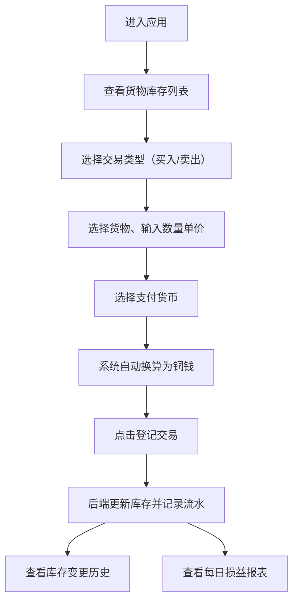

## 1. 产品概述

西市胡商账簿是一款模拟唐代长安西市粟特商人经营的全栈Web应用，让用户沉浸式体验丝绸之路贸易中的货物管理与账目核算。用户扮演粟特商人，管理波斯锦、胡椒、乳香等西域珍奇货物，记录每笔交易，自动换算不同货币，并生成每日损益报表。

- 核心价值：通过游戏化的历史模拟，让用户了解唐代丝绸之路贸易的运作方式
- 目标用户：历史爱好者、经营模拟游戏玩家、教育场景用户

## 2. 核心 Features

### 2.1 用户角色

| 角色 | 登录方式 | 核心权限 |
|------|---------|---------|
| 粟特商人 | 直接进入 | 货物管理、交易登记、报表查看、库存盘点 |

### 2.2 功能模块

1. **货物库存管理**：左侧卡片式货物列表，显示名称、库存、单价，低库存预警
2. **交易登记面板**：右侧主区域，支持买入/卖出交易，多货币选择，自动换算
3. **库存变更历史**：展示每种货物最近5笔库存变更记录
4. **每日损益报表**：汇总交易额、税额、净利润，7天利润趋势图
5. **货币换算系统**：支持铜钱、波斯银币、拜占庭金币三种货币实时换算

### 2.3 页面详情

| 页面名称 | 模块名称 | 功能描述 |
|---------|---------|---------|
| 主应用页面 | 侧边栏货物列表 | 卡片展示货物，圆形缩略图，低库存红色闪烁提示 |
| 主应用页面 | 交易面板 | 交易类型选择、货物选择、数量单价输入、货币选择、自动换算、登记交易 |
| 主应用页面 | 库存视图 | 所有货物详细库存、变更历史、进度条可视化 |
| 主应用页面 | 报表视图 | 当日损益表、税额计算、净利润、7天利润柱状图 |
| 主应用页面 | 底部切换栏 | 交易/库存/报表视图切换按钮 |

## 3. 核心流程

用户进入应用后，首先看到左侧货物库存列表和右侧交易面板。用户选择交易类型、货物、数量、单价和货币，系统自动换算总金额。确认后点击登记交易，后端更新库存并记录交易流水。用户可随时切换到库存视图查看变更历史，或切换到报表视图查看每日损益。

## 4. 用户界面设计

### 4.1 设计风格

- **主色调**：土黄#daa520、赭石#8b4513，营造唐代西市的历史氛围
- **辅助色**：波斯锦#a83232、胡椒#8b4513、乳香#f5deb3、青铜色#b87333
- **按钮风格**：青铜色按钮，磨砂质感，轻微阴影，hover时微亮
- **卡片风格**：羊皮纸纹理背景（CSS渐变模拟），古朴边框，圆角适中
- **字体**：衬线体（Georgia、"Times New Roman"）模拟楷书效果
- **布局风格**：桌面端左侧固定300px侧边栏，移动端抽屉菜单
- **动效**：交易成功轻微放大动画，低库存红色闪烁，数据更新平滑过渡

### 4.2 页面设计概述

| 页面名称 | 模块名称 | UI元素 |
|---------|---------|--------|
| 主应用页面 | 侧边栏货物列表 | 羊皮纸卡片、圆形彩色缩略图、库存数量、单价、低库存红色边框闪烁 |
| 主应用页面 | 交易面板 | 表单纵向排列、下拉选择器、数字输入框、货币换算显示、青铜色提交按钮 |
| 主应用页面 | 库存视图 | 货物详细信息、进度条、变更历史列表（时间、类型、变化、余额） |
| 主应用页面 | 报表视图 | 数据卡片、税额计算、净利润、纯CSS柱状图（7天利润趋势） |
| 主应用页面 | 底部切换栏 | 三个青铜色按钮，选中状态高亮 |

### 4.3 响应式设计

- **桌面端**（>768px）：左侧固定300px侧边栏，右侧主区域自适应
- **平板端**（768px-1024px）：侧边栏可折叠，主区域全屏
- **移动端**（<768px）：侧边栏转为抽屉菜单，交易表单纵向排列，按钮全屏宽度
- **触控优化**：按钮最小高度44px，点击区域充足，避免误触

### 4.4 性能优化

- 使用React.memo优化货物卡片组件，避免不必要重渲染
- 状态管理使用Zustand，精确订阅避免全量更新
- 柱状图使用纯CSS实现（不超过10个div），无图表库依赖
- 列表更新使用key优化，流畅无闪烁
