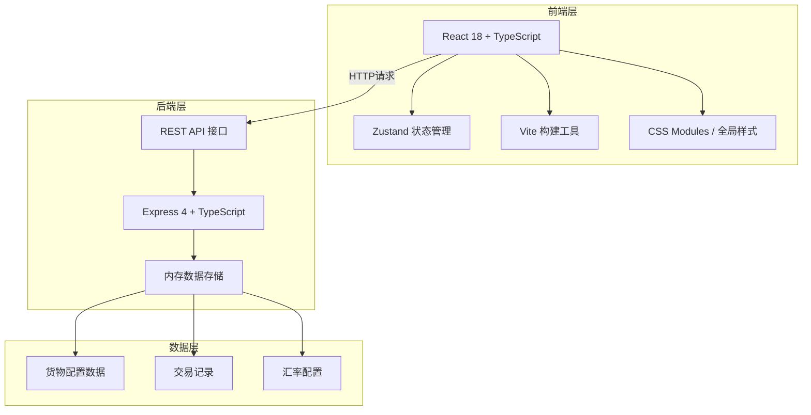
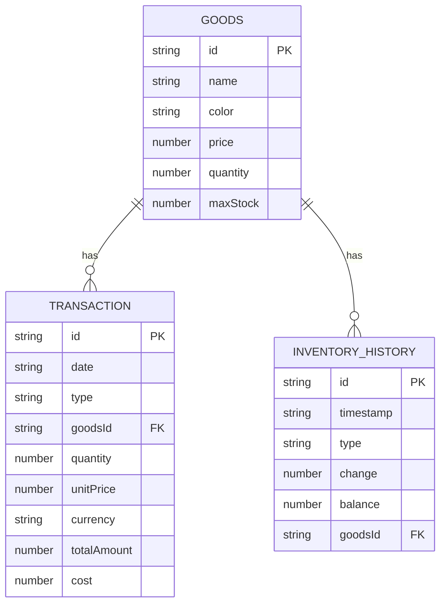

## 1. 架构设计



## 2. 技术栈说明

- **前端框架**：React 18 + TypeScript 5
- **状态管理**：Zustand 4
- **构建工具**：Vite 5 + @vitejs/plugin-react
- **后端框架**：Express 4 + TypeScript
- **代码规范**：TypeScript严格模式
- **开发模式**：前后端分离，Vite代理API请求到Express后端

## 3. 目录结构

```
auto136/
├── package.json
├── vite.config.js
├── tsconfig.json
├── index.html
├── src/
│   ├── App.tsx
│   ├── store.ts
│   ├── types.ts
│   └── components/
│       ├── TradePanel.tsx
│       ├── InventoryView.tsx
│       ├── DailyReport.tsx
│       ├── GoodsCard.tsx
│       └── Sidebar.tsx
└── server/
    └── index.ts
```

## 4. 路由定义

| 路由 | 用途 |
|------|------|
| / | 应用主页面（SPA单页） |
| GET /api/goods | 获取所有货物列表及库存 |
| POST /api/transactions | 登记新交易 |
| GET /api/report | 获取每日损益报表 |

## 5. API 定义

### 5.1 类型定义

```typescript
// 货物类型
interface Goods {
  id: string;
  name: string;
  color: string;
  price: number; // 铜钱单价
  quantity: number;
  maxStock: number;
  history: InventoryHistory[];
}

// 货币类型
type Currency = 'copper' | 'persian' | 'byzantine';

// 交易类型
type TradeType = 'buy' | 'sell';

// 交易记录
interface Transaction {
  id: string;
  date: string;
  type: TradeType;
  goodsId: string;
  goodsName: string;
  quantity: number;
  unitPrice: number;
  currency: Currency;
  totalAmount: number; // 换算为铜钱
  cost?: number; // 进货成本（卖出时）
}

// 库存变更历史
interface InventoryHistory {
  id: string;
  timestamp: string;
  type: TradeType;
  change: number;
  balance: number;
}

// 汇率配置
interface ExchangeRate {
  persian: number; // 1波斯银币 = ?铜钱
  byzantine: number; // 1拜占庭金币 = ?铜钱
}

// 日报表
interface DailyReport {
  date: string;
  totalRevenue: number;
  totalCost: number;
  tax: number;
  netProfit: number;
  weeklyTrend: { date: string; profit: number }[];
}
```

### 5.2 GET /api/goods

**响应**：
```json
{
  "success": true,
  "data": [
    {
      "id": "persian-silk",
      "name": "波斯锦",
      "color": "#a83232",
      "price": 500,
      "quantity": 20,
      "maxStock": 100,
      "history": [...]
    }
  ]
}
```

### 5.3 POST /api/transactions

**请求体**：
```json
{
  "type": "sell",
  "goodsId": "persian-silk",
  "quantity": 2,
  "unitPrice": 500,
  "currency": "persian"
}
```

**响应**：
```json
{
  "success": true,
  "data": {
    "id": "tx-123",
    "date": "2026-06-10",
    "totalAmount": 2000
  }
}
```

### 5.4 GET /api/report

**响应**：
```json
{
  "success": true,
  "data": {
    "date": "2026-06-10",
    "totalRevenue": 15000,
    "totalCost": 8000,
    "tax": 300,
    "netProfit": 6700,
    "weeklyTrend": [
      { "date": "06-04", "profit": 5000 },
      { "date": "06-05", "profit": 6200 },
      ...
    ]
  }
}
```

## 6. 数据模型

### 6.1 ER图



### 6.2 初始数据配置

```typescript
// 初始货物配置
const initialGoods: Goods[] = [
  {
    id: 'persian-silk',
    name: '波斯锦',
    color: '#a83232',
    price: 500,
    quantity: 20,
    maxStock: 100,
    history: []
  },
  {
    id: 'pepper',
    name: '胡椒',
    color: '#8b4513',
    price: 80,
    quantity: 50,
    maxStock: 200,
    history: []
  },
  {
    id: 'frankincense',
    name: '乳香',
    color: '#f5deb3',
    price: 200,
    quantity: 30,
    maxStock: 150,
    history: []
  },
  {
    id: 'jade',
    name: '和田玉',
    color: '#90ee90',
    price: 1000,
    quantity: 10,
    maxStock: 50,
    history: []
  },
  {
    id: 'spice',
    name: '藏红花',
    color: '#ff6347',
    price: 300,
    quantity: 15,
    maxStock: 80,
    history: []
  }
];

// 汇率配置（固定牌价）
const exchangeRates: ExchangeRate = {
  persian: 10,   // 1波斯银币 = 10铜钱
  byzantine: 50  // 1拜占庭金币 = 50铜钱
};
```
